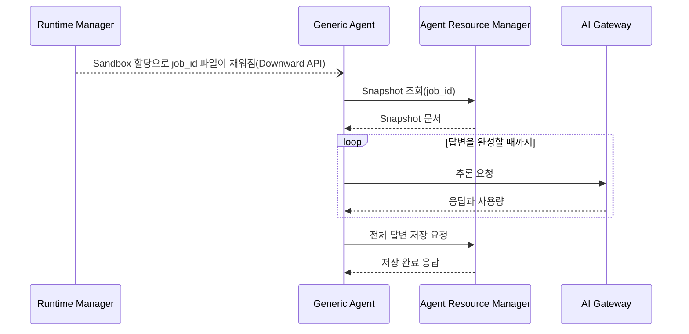
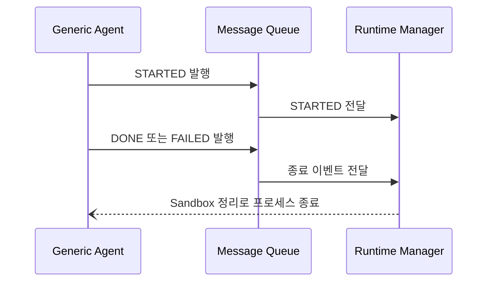
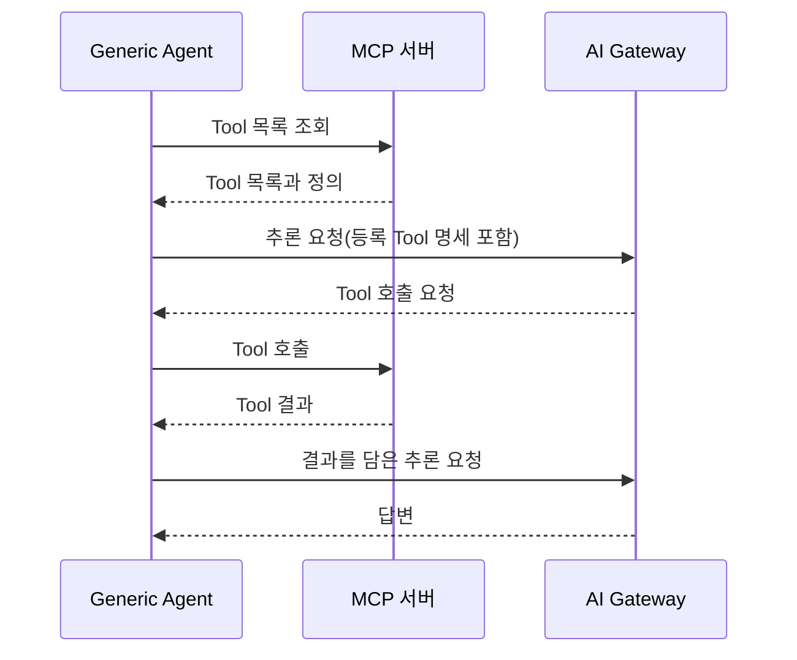
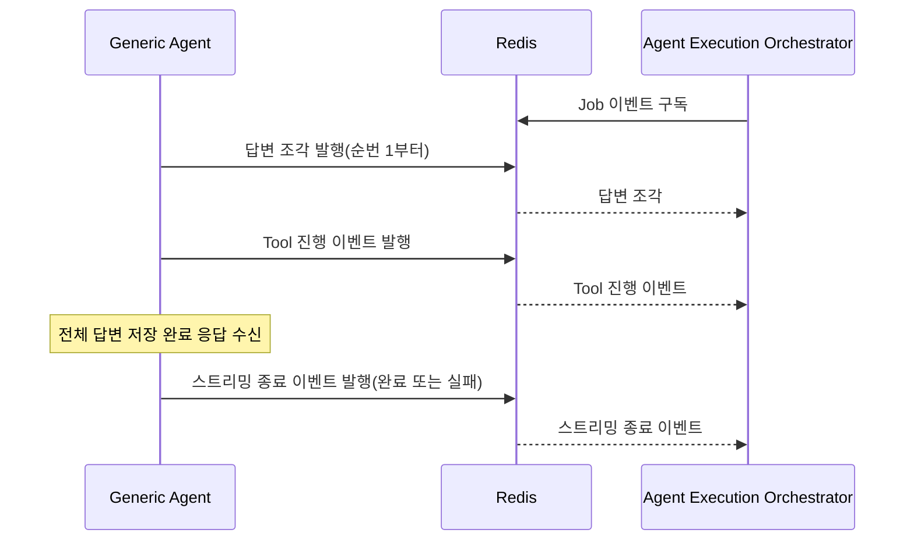
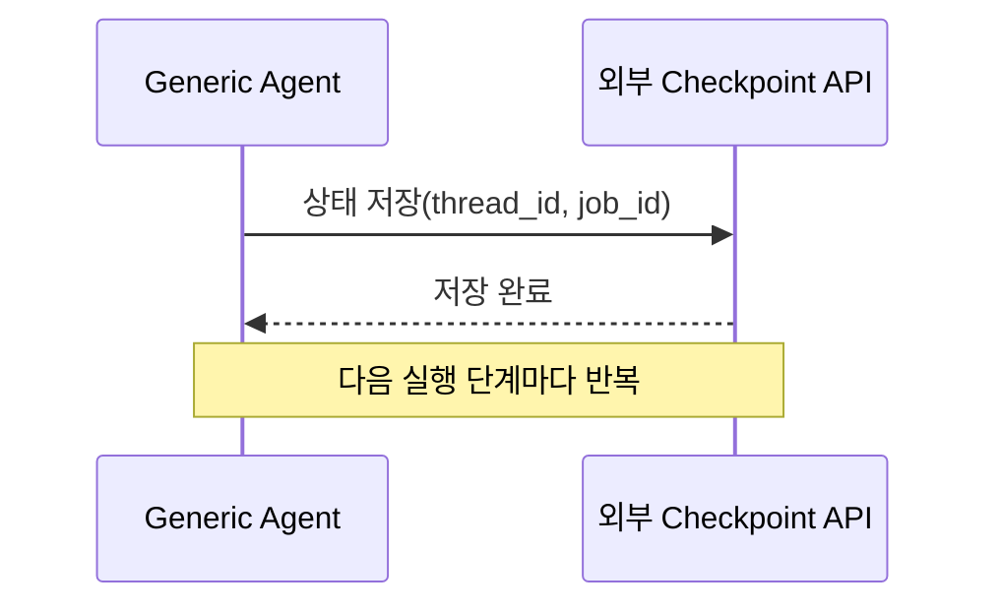

# Generic Agent PRD

## 문서 정보

| 항목 | 내용 |
|---|---|
| 서비스 | Generic Agent |
| 서비스 코드 | GAGENT |
| 문서 ID | generic-agent |
| 목표 릴리스 | MVP |
| 책임자 | Generic Agent 담당 |
| 상태 | 초안 |
| 개정일 | 2026-09-30 |

---

## 1. 서비스 목표와 범위

### 해결할 문제

Agent Framework 실행 계층은 Agent Execution Orchestrator가 실행 구성을 Snapshot으로 고정하고, Runtime Manager가 Agent Sandbox를 할당해 `job_id`를 전달하는 데까지 정해져 있다. 그러나 Sandbox 안에서 그 Snapshot으로 Agent를 조립·실행하고 답변과 실행 상태를 돌려주는 주체는 아직 없다. `generic-agent` 저장소에는 구현 코드가 없다.

업무마다 Agent를 따로 구현하지 않고, Agent별 모델·지시문·Skill·Tool 설정만 바꿔 서로 다른 업무를 하나의 실행 구조에서 처리해야 한다. 이를 위해 Snapshot 조회, 자원 준비, 상태·결과 전달을 공통 처리로 두고 Deep Agent 조립·실행을 그 위의 독립된 구성 요소로 둔다(설계서 1장).

이번 릴리스에서는 Deep Agent 한 종류의 조립과 실행까지 해결한다. 고정 실행 절차와 그 조합은 다루지 않는다.

### 목표

- Agent 정의의 모델·지시문·Skill·Tool을 바꾸는 것만으로 서로 다른 업무를 같은 실행 모듈이 처리한다.
- Runtime Manager가 실행 시작·완료·실패를 이벤트로 받아 Sandbox 수명을 판단한다.
- 요청자가 실행 중에는 생성되는 답변을 실시간으로 받고, 종료 후에는 저장된 전체 답변을 조회한다.
- 중단된 실행을 저장된 그래프 상태에서 재개한다.

### 성공 기준

| ID | 성공으로 판단할 결과 | 목표 또는 판정 조건 | 확인 방법 |
|---|---|---|---|
| GAGENT-SC-01 | Snapshot 구성대로 조립된 Agent가 질문에 답하고 전체 답변이 저장된다 | 모델·지시문·Skill·MCP Tool·Python 구현형 Tool(이하 Python Tool)을 모두 담은 Snapshot 실행 1건에서 적용된 네 구성이 Snapshot과 일치하고 전체 답변 1건이 저장된다 | 모델 요청에 실린 모델 식별자·지시문·Skill 목록·노출 Tool 목록과 저장 결과를 Snapshot과 대조 |
| GAGENT-SC-02 | Runtime Manager가 실행마다 종료 상태를 받는다 | 정상 종료·준비 실패·실행 실패 세 경로 각각에서 종료 이벤트가 정확히 1건이고 누락이 0건이다 | 경로별로 실행한 뒤 Message Queue에서 받은 상태 이벤트 수 확인 |
| GAGENT-SC-03 | 준비 단계에서 실패하면 실행을 시작하지 않는다 | Snapshot 조회·Skill 준비·Tool 준비 실패를 각각 주입했을 때 모델 추론 요청 0건, 전체 답변 저장 요청 0건 | 실패 주입 후 AI Gateway 요청 수와 저장 요청 수 확인 |
| GAGENT-SC-04 | 요청자가 생성 중인 답변을 실시간으로 받는다 | 실행 1건에서 전체 답변 저장 요청보다 먼저 발행된 답변 조각이 1건 이상이고, 순번이 1부터 누락 0건이다 | Redis 구독으로 받은 조각의 순번·수신 시각을 저장 요청 시각과 비교 |
| GAGENT-SC-05 | 실행 단계마다 재개할 지점이 저장된다 | 실행 단계 2개를 지난 실행 1건에서 외부 Checkpoint API가 받은 저장 요청이 2건 이상이고, 저장 완료 응답 전에 시작한 다음 단계가 0건이다. 중단된 실행의 재개는 이번 릴리스에서 제외한다 | Checkpoint API 대역의 저장 요청 수와 단계 시작 시점 확인 |

### 포함 범위

- Downward API로 전달된 `job_id` 감지와 Agent Resource Manager를 통한 Snapshot 조회·해석
- AI Gateway 모델 연결, Snapshot 지시문, Deep Agent 기본 Tool을 적용한 Deep Agent 조립과 실행
- 전체 답변 저장 요청과 모델 사용량 집계
- 실행 시작·완료·실패 상태 이벤트(`STARTED`·`DONE`·`FAILED`)의 Message Queue 발행
- Snapshot의 Skill 본문을 Agent 상태의 파일 데이터로 제공
- Snapshot의 MCP — Model Context Protocol 연결 정보로 MCP Tool을 구성해 Sandbox에서 직접 호출
- Snapshot에 지정한 Python Tool(`default_tools`)의 코드를 Sandbox 이미지 안에서 찾아 Sandbox 안에서 실행하는 Tool로 구성하고 호출. Code Interpreter는 쓰지 않는다 (인터뷰 확정 사항)
- 생성 중인 답변 조각과 Tool 진행 이벤트의 Redis 발행
- 외부 Checkpoint API를 통한 그래프 상태 저장·조회와 재개

### 제외 범위

- 사용자 요청에 따른 실행 중지와 `STOPPED` 이벤트. 사용자 취소는 Runtime Manager가 Sandbox를 정리해 끝낸다(Governance API §5.5)
- Subagent 구성과 작업 위임 Tool, 셸 명령 실행 Tool (설계서 1.2·3.3.2)
- 고정 실행 절차의 조립·실행과 Deep Agent와의 조합 (설계서 1)
- 사용자 등록 Tool(`custom_tools`) (설계서 1.2·3.3.1, 인터뷰 확정 사항)
- Code Interpreter·Code Connector를 통한 코드 실행과 모델이 만든 코드의 실행 (설계서 3.3.2, 인터뷰 확정 사항)
- 개별 Python Tool의 업무 기능 구현 (설계서 3.3.1 — 플랫폼이 별도로 개발한다)
- 별도 자격이 필요한 Python Tool. 자격이 필요한 외부 연동은 MCP Tool로 제공한다 (인터뷰 확정 사항)
- 사용자 등록 Skill과 Skill 부속 파일(스크립트·참고자료) (설계서 4.4)
- 출처 수집과 인용 표기, 산출 파일 업로드와 내려받기 주소 발급
- 요청 첨부 파일의 Agent 전달, 실행 이력 기록(Governance API C-04), 중간 저장본 저장(Governance 저장소 §3.5). Governance가 이 모듈에 기대하지만 설계서 MVP 범위(1.2)에 없다
- Sandbox 격리 환경, Agent Resource Manager, AI Gateway, MCP 서버, 외부 Checkpoint API의 구현 (각 담당 구성 요소)
- Snapshot 조립·기록과 `job_id` 발급 (Agent Execution Orchestrator)
- Job 상태 저장, Sandbox 할당·해제, 실행 Timeout과 재시도 (Runtime Manager)
- Skill·Tool 이름의 형식 검증과 중복 검사 (등록 단계)
- Snapshot 스키마 버전 검사

### 서비스 책임 경계

| 구분 | 내용 |
|---|---|
| 이 서비스가 책임지는 결과 | Snapshot 해석의 정확성, 모델·지시문·Skill·Tool의 적용, Python Tool 코드의 Sandbox 안 실행, Deep Agent 실행, 답변 조각 발행, 전체 답변 저장 요청, 상태 이벤트 발행, Checkpoint 저장·조회 요청 |
| 다른 서비스가 책임지는 결과 | Snapshot 조립·기록과 `job_id` 발급(Agent Execution Orchestrator), Job 상태 반영·Sandbox 수명·Timeout·재시도(Runtime Manager), 저장소 접근과 결과 보관(Agent Resource Manager), Checkpoint 보관과 보존 정책(외부 Checkpoint API), 모델 접근과 사용량 관리(AI Gateway), Tool 기능 수행(MCP 서버), Python Tool 업무 기능 구현(플랫폼 Tool 개발), Skill·Tool 이름 형식과 중복 검증(등록 단계) |
| 책임이 전환되는 지점 | `job_id` 파일이 채워진 시점부터 종료 이벤트(`DONE` 또는 `FAILED`)를 발행한 시점까지 |

### 기술 책임 범위

| 항목 | 내용 |
|---|---|
| 실행 단위 | Sandbox Pod 안의 Generic Agent Worker 프로세스 1개. Pod 하나에 Worker 하나, Sandbox 하나에 활성 Job 하나. Python Tool은 Worker가 띄우는 분리된 프로세스에서 실행한다(GAGENT-BR-07-09) |
| 영향 저장소 | `generic-agent` |
| 외부 진입점 | Downward API가 투영한 `job_id` 파일. 인바운드 포트는 열지 않는다 |
| 데이터 책임 | 실행 중 메모리에 두는 내부 설정·그래프 상태·사용량 집계와, Worker 재기동을 판별하는 감지·발행 기록(GAGENT-BR-01-14). 결과와 그래프 상태의 저장은 외부 인터페이스에 요청한다 |
| 연결 대상 | Agent Resource Manager(사용), AI Gateway(사용), MCP 서버(사용), 외부 Checkpoint API(사용), Message Queue(발행), Redis(발행) |
| 기술적 제외 범위 | Sandbox 격리 구현, 저장소 스키마와 보존 정책, Runtime Manager의 상태 전이, Agent Resource Manager의 트랜잭션 |
| 필수 제약 | 저장소에 직접 접속하지 않는다. 인바운드 포트를 열지 않는다. 모델 제공자 자격을 두지 않는다 |

## 2. 공통 기술 컨텍스트

### 기술 기준

| 항목 | 내용 | 기준·상세 자료 |
|---|---|---|
| 언어·버전 | Python 3.11.x | Governance 아키텍처 §3.2 실행 환경 기준 |
| 주요 프레임워크 | deepagents(Deep Agent 조립·실행), LangGraph(그래프 실행·Checkpoint 연동), MCPAdapter(MCP Tool 연결). 버전은 미정 | 설계서 2.4·2.6·4.2, GAGENT-DEP-10 |
| 데이터베이스 | 직접 연결하지 않는다 | 설계서 1.1, Governance 아키텍처 §2.1 |
| 메시징·캐시 | RabbitMQ OSS 4.x(상태 이벤트 발행), Redis(답변 조각·진행 이벤트 발행) | 설계서 1.1·2.7, Governance 아키텍처 §3.2 |
| 실행 환경 | Kubernetes Sandbox Pod의 Linux 컨테이너. agent-sandbox가 WarmPool에서 할당한다 | Governance 아키텍처 §3 |
| 패키지·빌드 도구 | uv | 인터뷰 확정 사항 |
| 테스트 도구 | pytest | 인터뷰 확정 사항 |
| 배포 환경 | Kubernetes. Sandbox 이미지로 배포한다 | Governance 아키텍처 §3.1 |

### 저장소와 코드 구조

| 항목 | 내용 |
|---|---|
| 영향 저장소 | `generic-agent` |
| 주요 소스 위치 | `src/generic_agent/` (인터뷰 확정 사항) |
| 테스트 위치 | `test/<대상과 같은 구조>/<파일>.test.py`. pytest 수집 설정을 이 이름에 맞춘다 (Governance 개발 규약의 테스트 배치, 인터뷰 확정 사항) |
| 계약·스키마 위치 | 외부 계약은 Governance `architecture/mvp/api.md`와 각 담당 구성 요소의 연동 규격이 갖는다 |
| 저장소 실행 지침 | `generic-agent/CLAUDE.md` |

### 환경과 접속 정보

| 환경 | 용도 | 주소·진입점 | 설정 원본 | 접근·주의 사항 |
|---|---|---|---|---|
| 로컬 | 개발과 단위 테스트 | 로컬 프로세스 | `generic-agent/CLAUDE.md`의 검증 명령 | Agent Resource Manager·AI Gateway·Message Queue·Redis·MCP 서버·외부 Checkpoint API를 테스트 대역으로 대체한다 |
| 개발 | 사내 개발 클러스터의 Sandbox에서 통합 확인 | 문서에 적지 않는다 | 미정 (GAGENT-DEP-08) | 사내망 접속이 필요하다. Runtime Manager·Agent Resource Manager·AI Gateway가 함께 배포되어 있어야 한다 |

비밀값과 내부망 주소는 이 문서에 적지 않는다.

### 확정된 기술 제약

- Sandbox는 DB 접속 문자열, 객체 스토리지 장기 자격, 모델 제공자 자격을 갖지 않는다. 데이터 조회와 저장은 외부 제공 인터페이스로 한다 (설계서 1.1·2.5.2, Governance 아키텍처 §2.1).
- Sandbox는 인바운드 포트를 열지 않는다. 실행 대상은 Downward API가 투영한 파일로만 받는다 (Governance 아키텍처 §2.2, API §7.8).
- Sandbox가 갖는 자격은 Job 범위 단기 토큰 하나이며(단, MVP 동안 AI Gateway(LiteLLM) 호출 키를 실행 환경변수로 받는다 — GAGENT-BR-01-04, GAGENT-DEP-17), Message Queue 자격으로 닿는 범위는 공통 Event Queue 하나다 (Governance 아키텍처 §2.1).
- 실행 구성은 Snapshot 1건으로 고정한다. 실행 중 정의 원본을 다시 읽지 않는다 (설계서 2.3.3).
- Snapshot 문서 크기 상한은 256 KiB이며 Skill 본문을 포함한 전체 문서가 대상이다. 상한 검사는 Snapshot 조립 단계가 한다 (설계서 2.3.3, Governance API §10.4).
- Skill 본문을 Sandbox 디스크 파일로 만들지 않는다 (설계서 4).
- Skill·Tool 이름의 형식 검증과 중복 방지는 등록 단계가 수행한다. 이 서비스는 같은 검사를 다시 하지 않는다 (인터뷰 확정 사항).
- 이번 릴리스에서는 Snapshot 스키마 버전을 검사하지 않는다. 필수 항목 누락만 실패로 처리한다 (인터뷰 확정 사항).
- Snapshot에는 자격증명 참조와 Tool 소스 본문을 담지 않는다 (설계서 2.3.3).
- Python Tool은 Sandbox 안에서 Worker와 분리된 프로세스로 실행하고, Worker의 자격을 그 프로세스에 넘기지 않는다. 이번 릴리스에서는 Code Interpreter를 쓰지 않는다 (인터뷰 확정 사항).
- Python Tool 코드는 프로젝트 저장소에 두고 Sandbox 이미지에 포함한다. 실행 중 외부에서 코드를 받지 않는다 (인터뷰 확정 사항).

## 3. 사용자와 사용 맥락

| 사용자·역할 | 하려는 일 | 필요한 결과 |
|---|---|---|
| Runtime Manager | Sandbox 안 실행이 어디까지 갔는지 판단하고 Sandbox를 회수한다 | 실행 시작·완료·실패 이벤트, 실패 단계와 사유 |
| Agent Execution Orchestrator | 생성 중인 답변을 요청자에게 중계하고 종료 후 결과를 조회한다 | 순번이 붙은 답변 조각과 진행 이벤트, 저장된 전체 답변 |
| Agent 운영자 | 업무에 맞게 등록한 Agent 정의가 실행에 반영되게 한다 | 등록한 모델·지시문·Skill·Tool이 그대로 적용된 실행 |
| 최종 사용자 | 질문 한 건에 대한 답을 받는다 | 실시간 답변과 종료 후 다시 볼 수 있는 전체 답변 |

## 4. 기능 명세 목록

| SPEC ID | 기능명 | 사용자에게 제공할 결과 | 우선순위 | 선행 SPEC | 관련 성공 기준 |
|---|---|---|---|---|---|
| GAGENT-SPEC-01 | 질문 실행과 결과 저장 | `job_id` 하나로 Snapshot 구성대로 조립된 Agent가 질문에 답하고 전체 답변이 저장된다 | P1 | 없음 | GAGENT-SC-01, GAGENT-SC-03 |
| GAGENT-SPEC-02 | 실행 상태 알림 | Runtime Manager가 실행 시작·완료·실패와 실패 단계를 안다 | P1 | GAGENT-SPEC-01 | GAGENT-SC-02 |
| GAGENT-SPEC-03 | Skill 적용 | 모델이 Skill 목록을 보고 필요한 본문을 읽어 지침대로 작업한다 | P1 | GAGENT-SPEC-01 | GAGENT-SC-01, GAGENT-SC-03 |
| GAGENT-SPEC-04 | MCP Tool 사용 | Snapshot에 지정된 MCP Tool만 Agent가 호출한다 | P1 | GAGENT-SPEC-01 | GAGENT-SC-01, GAGENT-SC-03 |
| GAGENT-SPEC-05 | 답변 실시간 전달 | 생성 중인 답변과 Tool 진행이 순번대로 요청자 쪽에 전달된다 | P1 | GAGENT-SPEC-01 | GAGENT-SC-04 |
| GAGENT-SPEC-06 | Checkpoint 저장과 복구 | 실행 단계마다 그래프 상태가 같은 `thread_id`로 저장된다. 재개는 이번 릴리스에서 제외한다 | P2 | GAGENT-SPEC-01 | GAGENT-SC-05 |
| GAGENT-SPEC-07 | Python Tool 사용 | Snapshot에 지정한 Python Tool이 Sandbox 안에서 실행되어 Agent가 호출할 수 있다 | P1 | GAGENT-SPEC-01 | GAGENT-SC-01, GAGENT-SC-03 |

선행 SPEC에는 동작에 먼저 필요한 SPEC만 적었다. GAGENT-SPEC-03·04·06·07의 준비 실패를 Runtime Manager에 알리는 동작은 GAGENT-SPEC-02의 발행 규칙을 쓰므로, 각 SPEC의 기능 범위 표에 동작 단위 선행 조건으로 GAGENT-SPEC-02를 적었다.

---

## 5. 기능 명세

### GAGENT-SPEC-01: 질문 실행과 결과 저장

#### 사용자 결과

- 대상 사용자·호출자: 최종 사용자, Agent 운영자, Agent Execution Orchestrator(결과 조회)
- 기대 결과: `job_id` 하나로 Snapshot의 모델·지시문과 기본 Tool이 적용된 Deep Agent가 질문을 처리하고, 전체 답변이 저장되어 종료 후 조회할 수 있다
- 우선순위: P1
- 우선순위 이유: 이 SPEC이 없으면 답변이 만들어지지 않고 나머지 SPEC이 붙을 실행이 없다
- 관련 성공 기준: GAGENT-SC-01, GAGENT-SC-03
- 선행 SPEC: 없음

#### 기능 범위

포함하는 동작:

| 동작 | 외부에서 얻는 결과 | 우선순위 | 선행 조건 |
|---|---|---|---|
| 실행 대상 감지 | `job_id` 파일이 채워지면 그 Job의 실행 준비가 시작된다 | P1 | 없음 |
| Snapshot 조회와 해석 | 실행 구성 1건을 확보하고 지시문·모델·실행 제한·Skill·Tool이 다음 단계로 넘어간다 | P1 | 실행 대상 감지 |
| 모델 연결 준비 | Snapshot의 모델과 옵션으로 AI Gateway에 추론을 요청할 준비가 된다 | P1 | Snapshot 조회와 해석 |
| Deep Agent 조립과 실행 | 지시문·모델·기본 Tool이 적용된 Agent가 질문을 처리해 답변을 만든다 | P1 | 모델 연결 준비 |
| 전체 답변 저장 | 종료 후 전체 답변 1건을 조회할 수 있다 | P1 | Deep Agent 조립과 실행 |
| 준비 실패 시 실행 중단 | 준비 단계에서 진행할 수 없으면 모델 추론 요청과 저장 요청이 일어나지 않는다 | P1 | Snapshot 조회와 해석 |
| 사용량 집계 | 입력·출력 토큰 사용량이 실행 단위로 집계되어 전체 답변 저장 요청에 실린다 | P2 | Deep Agent 조립과 실행 |
| 재기동 시 재실행 방지 | Worker가 재기동해도 같은 Job의 모델 호출과 저장 요청이 중복되지 않는다 | P2 | 실행 대상 감지 |

포함하지 않음:

- 상태 이벤트 발행 (GAGENT-SPEC-02)
- Skill 적용, MCP Tool 연결, Python Tool 실행 (GAGENT-SPEC-03, GAGENT-SPEC-04, GAGENT-SPEC-07)
- 답변 조각의 실시간 발행 (GAGENT-SPEC-05)
- Checkpoint 저장 (GAGENT-SPEC-06)
- Snapshot 조립·기록과 정의 원본 조회 (Agent Execution Orchestrator, Agent Resource Manager)
- 모델 제공자 자격과 모델 접근 정책 관리 (AI Gateway)

#### 사용 시나리오

사전 조건:

- Worker가 기동해 `job_id` 파일을 감시하고 있다. 할당 전에는 파일이 비어 있다.
- Agent Resource Manager·AI Gateway 접근 경로, AI Gateway(LiteLLM) 호출 키와 Job 범위 단기 토큰이 실행 환경 설정으로 준비되어 있다.
- 해당 Job의 Snapshot이 기록되어 있다.

기본 흐름:

1. Runtime Manager가 Sandbox를 할당하면 `job_id` 파일이 채워지고, 서비스가 그 값을 실행 대상으로 확보한다.
2. 서비스가 `job_id`로 Agent Resource Manager에 Snapshot을 요청해 받는다.
3. 서비스가 Snapshot의 지시문·모델·실행 제한·Skill·Tool을 내부 설정으로 해석한다.
4. 서비스가 모델 식별자로 AI Gateway의 모델 엔드포인트 정보를 조회해 활성 여부와 실제 모델을 확인하고, 호출 옵션과 함께 AI Gateway에 연결되는 모델 호출 구성을 준비한다.
5. 서비스가 지시문·모델·기본 Tool을 적용해 Deep Agent를 조립하고, Snapshot의 질문을 사용자 입력으로 전달해 실행한다.
6. Deep Agent가 AI Gateway에 추론을 요청하고 Tool 호출과 관찰을 반복해 답변을 만든다.
7. 실행이 끝나면 서비스가 전체 답변을 Agent Resource Manager의 저장 인터페이스로 저장 요청하고 저장 완료 응답을 받는다.

대체 흐름:

- 2~4단계에서 진행할 수 없으면 Deep Agent를 조립하지 않고 실행을 끝낸다.
- Tool 호출이 오류를 반환하면 오류 내용을 그 호출의 결과로 모델에 돌려주고 실행을 이어 간다.
- 모델 응답에 사용량 정보가 없으면 그 호출을 미확인으로 집계한다.

완료 상태:

- 전체 답변 1건이 저장되었고, 서비스가 저장 완료 응답을 확인했다.

상호작용 흐름:

#### 기능 요구사항

| ID | 요구사항 | 관련 흐름·규칙 |
|---|---|---|
| GAGENT-FR-01-01 | 서비스는 `job_id` 파일이 비어 있지 않은 값으로 바뀌면 그 값을 실행 대상 `job_id`로 확보해야 한다. | 기본 흐름 1 |
| GAGENT-FR-01-02 | 서비스는 확보한 `job_id`로 Agent Resource Manager에 Snapshot을 Job당 1회 요청해야 한다. | 기본 흐름 2, GAGENT-BR-01-01 |
| GAGENT-FR-01-03 | 서비스는 Snapshot의 지시문을 Deep Agent의 지시문으로 적용해야 한다. | 기본 흐름 5 |
| GAGENT-FR-01-04 | 서비스는 Snapshot의 모델 식별자와 호출 옵션으로 AI Gateway를 호출하는 모델 호출 구성을 만들어야 한다. | 기본 흐름 4, GAGENT-BR-01-03 |
| GAGENT-FR-01-05 | 서비스는 Snapshot의 질문을 사용자 입력으로 Deep Agent에 전달해야 한다. | 기본 흐름 5 |
| GAGENT-FR-01-06 | 서비스는 모델 추론 요청을 AI Gateway로만 보내야 한다. | GAGENT-BR-01-04 |
| GAGENT-FR-01-07 | 서비스는 파일 목록 조회, 파일 읽기, 파일 작성, 파일 수정, 경로 패턴 검색, 내용 검색 6개 기본 Tool을 Deep Agent에 노출해야 한다. | GAGENT-BR-01-06 |
| GAGENT-FR-01-08 | 서비스는 셸 명령 실행 Tool과 Subagent 작업 위임 Tool을 노출하지 않아야 한다. | GAGENT-BR-01-06 |
| GAGENT-FR-01-09 | 서비스는 실행이 끝나면 전체 답변을 Agent Resource Manager의 저장 인터페이스로 저장 요청하고 저장 완료 응답을 확인해야 한다. | 기본 흐름 7, GAGENT-BR-01-05 |
| GAGENT-FR-01-10 | 서비스는 같은 전체 답변 저장 요청을 다시 보낼 때 최초와 같은 멱등 키를 써야 한다. | GAGENT-EDGE-01-07 |
| GAGENT-FR-01-11 | 서비스는 Snapshot 조회·해석 또는 모델 호출 구성에 실패하면 Deep Agent를 조립하지 않고 모델 추론 요청을 보내지 않아야 한다. | 대체 흐름 |
| GAGENT-FR-01-12 | 서비스는 실행 중에 Snapshot을 다시 조회하지 않아야 한다. | GAGENT-BR-01-01 |
| GAGENT-FR-01-13 | 서비스는 Snapshot이 지정한 모델·옵션·자원을 쓸 수 없을 때 다른 버전이나 다른 값으로 대체하지 않아야 한다. | GAGENT-BR-01-03 |
| GAGENT-FR-01-14 | 서비스는 Tool 호출 오류를 그 호출의 결과로 모델에 돌려주고 실행을 이어 가야 한다. | 대체 흐름 |
| GAGENT-FR-01-15 | 서비스는 실행 중 모델 호출이 실패하면 오류 유형에 따라 재시도하고, 복구할 수 없으면 실행을 실패로 끝내야 한다. | GAGENT-BR-01-08 |
| GAGENT-FR-01-16 | 서비스는 실행이 실패로 끝나면 그때까지 생성된 답변을 저장하지 않아야 한다. 빈 답변 실패는 GAGENT-BR-01-16을 따른다. | GAGENT-BR-01-05, GAGENT-BR-01-16 |
| GAGENT-FR-01-17 | 서비스는 모델 응답의 사용량 정보로 입력·출력 토큰을 실행 단위로 집계해야 한다. | 기본 흐름 6 |
| GAGENT-FR-01-18 | 서비스는 사용량 정보가 없는 모델 응답을 0으로 집계하지 않고 미확인 호출로 구분해야 한다. | 대체 흐름 |
| GAGENT-FR-01-19 | 서비스는 해석한 내부 설정과 Snapshot 내용을 실행 중 메모리에만 두고 Sandbox 디스크에 기록하지 않아야 한다. | GAGENT-BR-01-02 |
| GAGENT-FR-01-20 | 서비스는 Tool 호출 없이 끝난 마지막 모델 응답의 텍스트를 전체 답변으로 저장해야 한다. 그 텍스트가 비어 있으면(공백만 있는 경우 포함) 재시도하지 않고 실행을 실패로 처리하며, 모델 텍스트 대신 재질문 안내문을 실패 결과로 저장해야 한다. | GAGENT-BR-01-11, GAGENT-BR-01-16, GAGENT-EDGE-01-15 |
| GAGENT-FR-01-21 | 서비스는 재기동 뒤 이미 감지했던 `job_id`를 다시 감지하면 그 Job의 실행을 다시 시작하지 않아야 한다. | GAGENT-EDGE-01-11 |
| GAGENT-FR-01-22 | 서비스는 Job 범위 단기 토큰을 재발급하지 않고, 만료로 요청이 거부되면 그 단계의 실패로 처리해야 한다. | GAGENT-BR-01-12 |

#### 업무 규칙

- GAGENT-BR-01-01: 실행 구성의 근거는 조회한 Snapshot 1건이다. 실행 도중 Agent·Skill·Tool의 새 버전이 등록되어도 진행 중인 실행에 반영하지 않는다 (설계서 2.3.3).
- GAGENT-BR-01-02: 해석한 설정은 실행 중 메모리에 두고 다음 구성 단계로 넘긴다. 실제 연결과 자원 준비는 이후 단계에서 한다 (설계서 3.1).
- GAGENT-BR-01-03: 모델 식별자와 호출 옵션은 Snapshot에 고정된 값을 쓴다. 사용할 수 없는 모델이나 지원하지 않는 옵션을 다른 값으로 대체하지 않는다 (설계서 2.5.2).
- GAGENT-BR-01-04: 모델 제공자 자격은 AI Gateway가 관리하며 Sandbox에 두지 않는다. Sandbox가 AI Gateway에 접근하는 인증 정보는 모델 제공자 자격과 구분한다 (설계서 2.5.2). 이번 릴리스에서는 AI Gateway(LiteLLM) 호출 키를 Sandbox 실행 환경변수로 받는다. 이 키는 모델 제공자 자격이 아니며, 로그·오류 메시지·파일에 남기지 않는다 (인터뷰 확정 사항, GAGENT-DEP-17).
- GAGENT-BR-01-05: 결과 계층의 완료 근거는 전체 답변 저장 완료 응답이다. 실행이 실패로 끝나면 그때까지의 답변을 저장하지 않는다 (Governance 개요 §5.4, 인터뷰 확정 사항). 예외는 빈 답변 실패 하나이며, 모델 텍스트가 아닌 재질문 안내문을 실패 결과로 저장한다(GAGENT-BR-01-16).
- GAGENT-BR-01-06: 기본 Tool은 파일 목록 조회·읽기·작성·수정·경로 패턴 검색·내용 검색 여섯 가지를 노출하고, 셸 명령 실행과 Subagent 위임은 노출하지 않는다. 파일·디렉터리 삭제와 작업 계획 목록 관리의 제공 여부는 미정이다 (설계서 3.3.2).
- GAGENT-BR-01-07: 모델 호출 구성과 실제 추론 요청을 구분한다. 추론 요청은 Deep Agent 실행 중에만 보낸다 (설계서 2.5.2).
- GAGENT-BR-01-08: 모델 호출 재시도 횟수, 호출 제한 시간, 재시도 대상 오류 유형은 AI Gateway 연동 규격에서 정한다. 정해질 때까지 미정이다 (설계서 2.5.3).
- GAGENT-BR-01-09: 실행 제한(`max_iterations`·`max_wall_seconds`·`max_tokens`)의 적용 범위, 측정 기준, 초과 시 동작은 미정이다 (설계서 2.3.2·2.5.3).
- GAGENT-BR-01-10: 이번 릴리스에서는 Snapshot 스키마 버전을 검사하지 않는다. 필수 항목이 없을 때만 준비 실패로 처리한다. 필수 항목은 모델 식별자 하나이고, 그 밖의 항목과 Tool·Skill 목록은 없으면 없는 대로 실행한다 (인터뷰 확정 사항).
- GAGENT-BR-01-11: 전체 답변은 Tool 호출 없이 끝난 마지막 모델 응답의 텍스트다. 그 앞의 모델 응답에 담긴 중간 텍스트는 실시간으로 전달하되 전체 답변에 넣지 않는다 (인터뷰 확정 사항).
- GAGENT-BR-01-12: 서비스는 Job 범위 단기 토큰을 재발급하지 않는다. 토큰 수명은 Runtime Manager의 최대 실행 시간보다 길게 발급되어야 하며(GAGENT-DEP-08), 만료로 요청이 거부되면 그 단계의 실패로 처리한다 (인터뷰 확정 사항).
- GAGENT-BR-01-13: 실행 단위로 집계한 사용량은 전체 답변 저장 요청의 `usage`로 전달한다. 미확인 호출이 1건이라도 있으면 입력·출력 토큰은 `null`로 보내고, 측정 기준이 정해지지 않은 `iterations`도 `null`로 보낸다 (설계서 2.5.3, 인터뷰 확정 사항).
- GAGENT-BR-01-14: 감지한 `job_id`와 종료 이벤트 발행 사실(GAGENT-BR-02-07)은 Worker 재기동 뒤에도 남는 기록으로 둔다. 이 기록에는 Snapshot 내용을 담지 않는다(GAGENT-FR-01-19).
- GAGENT-BR-01-15: 모델 엔드포인트 정보 조회 응답의 실제 모델은 정확히 1개여야 한다. 조회 실패, `status` 거짓, JSON이 아닌 응답, 엔드포인트 비활성, 실제 모델 0개 또는 2개 이상은 모델 호출 구성 실패로 처리한다. 성공 상태 코드만으로 성공을 판정하지 않는다 — 없는 모델 값에도 200과 HTML이 올 수 있다 (인터뷰 확정 사항).
- GAGENT-BR-01-16: 마지막 모델 응답의 텍스트가 비어 있으면(공백만 있는 경우 포함) 모델을 다시 호출하지 않고 실행을 실패로 처리한다. 전체 답변 저장 요청은 `outcome`을 `FAILED`로, 결과 내용을 재질문 안내문 「답변을 만들지 못했습니다. 질문을 조금 바꿔서 다시 입력해 주세요.」로, 종료 사유를 `error`로, 오류 코드를 `model_error`로, 세부 사유를 `empty_answer`로 보낸다. 모델 응답의 종료 사유는 로그에 남기고 모델 텍스트는 남기지 않는다. 안내 문구는 서비스 한 곳에 둔다. 오류 세부 정보는 `{code, message}` 형식이고, 결과 조회는 `FAILED`일 때도 안내문을 함께 돌려주며 대화 이력에는 `INCOMPLETE`로 반영된다 (Governance API §11.2, Agent Resource Manager 확인, 인터뷰 확정 사항).

#### 예외와 경계 조건

| ID | 발생 조건 | 기대 동작 | 외부에서 관찰되는 결과 | 관련 요구사항 |
|---|---|---|---|---|
| GAGENT-EDGE-01-01 | `job_id` 파일이 비어 있다 | 실행을 시작하지 않고 파일 감시를 계속한다 | Snapshot 조회 요청 0건 | GAGENT-FR-01-01 |
| GAGENT-EDGE-01-02 | Snapshot 조회가 거부되거나(토큰 만료·권한 없음) Agent Resource Manager가 응답하지 않는다 | Deep Agent를 조립하지 않는다 | 모델 추론 요청 0건, 전체 답변 저장 요청 0건 | GAGENT-FR-01-11 |
| GAGENT-EDGE-01-03 | Snapshot에 모델 식별자가 없다 | Deep Agent를 조립하지 않는다 | 모델 추론 요청 0건 | GAGENT-BR-01-10 |
| GAGENT-EDGE-01-04 | 첫 추론 요청이 제공하지 않는 모델이라는 이유로 거부된다 | 다른 모델로 대체하지 않고 실행을 실패로 끝낸다 | 다른 모델 식별자로 보낸 요청 0건, 전체 답변 저장 요청 0건 | GAGENT-FR-01-13 |
| GAGENT-EDGE-01-05 | 실행 중 AI Gateway가 응답하지 않거나 오류를 반환한다 | 재시도 규칙에 따라 재시도하고, 복구할 수 없으면 실행을 실패로 끝낸다 | 전체 답변 저장 요청 0건 | GAGENT-FR-01-15 |
| GAGENT-EDGE-01-06 | Tool 호출 1건이 오류를 반환한다 | 오류를 그 호출의 결과로 모델에 돌려주고 실행을 이어 간다 | 실행이 계속되고, 답변이 완성되면 전체 답변 1건이 저장된다 | GAGENT-FR-01-14 |
| GAGENT-EDGE-01-07 | 저장 요청의 응답을 받지 못해 같은 요청을 다시 보낸다 | 최초와 같은 멱등 키를 쓴다 | 두 요청의 멱등 키가 같은 값 1개다 | GAGENT-FR-01-10 |
| GAGENT-EDGE-01-08 | 전체 답변 저장이 재시도 한도를 넘겨 실패한다 | 실행을 실패로 끝낸다 | 저장 완료 응답 0건 | GAGENT-FR-01-09 |
| GAGENT-EDGE-01-09 | 모델 응답에 사용량 정보가 없다 | 0으로 집계하지 않는다 | 실행 단위 집계의 미확인 호출 수가 1 이상 | GAGENT-FR-01-18 |
| GAGENT-EDGE-01-10 | 실행 중 같은 Agent의 새 버전이 등록된다 | 진행 중인 실행에 반영하지 않는다 | 적용된 Agent 버전 변경 0회 | GAGENT-BR-01-01 |
| GAGENT-EDGE-01-11 | Worker가 재기동해 이미 감지했던 `job_id`를 다시 감지한다 | 실행을 다시 시작하지 않는다. 실패 알림은 GAGENT-FR-02-12를 따른다 | 모델 추론 요청 0건, 전체 답변 저장 요청 0건이 추가된다 | GAGENT-FR-01-21 |
| GAGENT-EDGE-01-12 | 실행이 Snapshot의 실행 제한 값을 넘긴다 | 미정 | 미정 | GAGENT-BR-01-09 |
| GAGENT-EDGE-01-13 | 실행 중 Job 범위 단기 토큰이 만료되어 요청이 거부된다 | 토큰을 재발급하지 않고, 거부된 요청을 그 단계의 실패로 처리한다 | 토큰 재발급 요청 0건, 실행이 실패로 끝난다 | GAGENT-FR-01-22 |
| GAGENT-EDGE-01-14 | 모델 엔드포인트 정보 조회 응답이 JSON이 아니거나, `status`가 거짓이거나, 실제 모델이 정확히 1개가 아니다 | Deep Agent를 조립하지 않는다 | 모델 추론 요청 0건, 전체 답변 저장 요청 0건 | GAGENT-FR-01-11, GAGENT-BR-01-15 |
| GAGENT-EDGE-01-15 | 마지막 모델 응답의 텍스트가 비어 있다(공백만 있는 경우 포함) | 재시도하지 않고 실행을 실패로 처리한다. 재질문 안내문을 `FAILED` 결과로 저장하고, 실패 단계는 Agent 실행이며, 모델 응답의 종료 사유를 로그에 남긴다 | 모델 재호출 0건, `FAILED` 결과 저장 1건(내용은 안내문, 오류 코드 `model_error`) | GAGENT-FR-01-20, GAGENT-BR-01-16 |

#### 필요한 데이터와 상태

| 개체·상태 | 제품 관점의 의미 | 필요한 정보·규칙 | 소유 서비스 |
|---|---|---|---|
| 실행 구성 고정본(Snapshot) | 이 실행에 쓸 Agent 구성 전체와 질문 | `job_id`로 조회, 실행 중 변경 없음, 크기 상한 256 KiB | Agent Resource Manager |
| 내부 설정 | Snapshot을 조립 단계가 쓰는 형태로 해석한 값 | 실행 중 메모리에만 보관, 디스크 기록 없음 | Generic Agent |
| 사용량 집계 | 이 실행이 쓴 토큰의 양 | 입력·출력 토큰과 미확인 호출 수를 실행 단위로 누적 | Generic Agent |
| 전체 답변 | 이 실행의 최종 결과 | 저장 인터페이스로 1건 저장, 멱등 키로 중복 저장 차단 | Agent Resource Manager |

#### 다른 서비스·외부 시스템과의 연결

| ID | 방향 | 상대 서비스·시스템 | 필요한 기능·사건·정보 | 기대 결과 | 실패 시 기대 동작 | 상세 자료 |
|---|---|---|---|---|---|---|
| GAGENT-IF-01-01 | 사용 | Runtime Manager(Kubernetes Downward API 경유) | 할당된 Sandbox에 `job_id` 전달 | 실행할 Job을 식별한다 | 파일이 비어 있으면 실행하지 않고 감시를 계속한다 | Governance API §7.7·§7.8 |
| GAGENT-IF-01-02 | 사용 | Agent Resource Manager | `job_id` 기준 Snapshot 조회 | 실행 구성과 질문 1건을 받는다 | Deep Agent를 조립하지 않고 준비 실패로 끝낸다 | 설계서 2.3.2와 응답 최상위 `question`·`assistant_message_id`·`thread_id` (인터뷰 확정 사항). 키 경로는 `agent.agent_id`·`agent.agent_version`·`agent.instruction`·`agent.limits`, 최상위 `model.model_id`·`model.options`, 최상위 `assistant_message_id`다(Agent Resource Manager 확인). `assistant_message_id`는 Agent Execution Orchestrator가 Snapshot 기록(C-03) 때 담고 Runtime Manager의 `execution_context.message_ids.assistant`와 같은 값이다. `model.model_id`는 AI Gateway 모델 엔드포인트 식별자다(Agent Execution Orchestrator 확인). Governance API §7.1 갱신 필요 |
| GAGENT-IF-01-03 | 사용 | AI Gateway | 추론 요청, 스트리밍 응답, Tool 호출 형식, 사용량 | 지정한 모델의 응답과 사용량을 받는다 | 재시도 후 복구할 수 없으면 실행을 실패로 끝낸다 | 모델 엔드포인트 정보 조회(`GET ?id=<model_id>`, 응답 `{status, data}`)로 활성 여부·실제 모델·기본 호출 주소(`proxyBaseUrl`)를 얻고, LiteLLM(OpenAI 호환)에 실제 모델의 `realModels[].modelName`을 모델 값으로 보낸다. 로컬 실행에서는 기준 주소를 실행 환경 설정값으로 덮어쓴다. 호출 키는 실행 환경변수로 받는다(MVP 한정, GAGENT-DEP-17) (인터뷰 확정 사항). 주소와 키는 이 문서에 적지 않는다 |
| GAGENT-IF-01-04 | 사용 | Agent Resource Manager | 전체 답변 저장 | 저장 완료 응답을 받는다 | 재시도 한도를 넘기면 실행을 실패로 끝낸다 | Governance API §7.3. `message_id`는 Snapshot의 `assistant_message_id` (인터뷰 확정 사항). `result_hash`는 `"sha256:"` 뒤에 `result.content` 문자열을 UTF-8로 바꾼 SHA-256 소문자 16진수 64자를 붙인 값이다. 해시를 계산한 뒤에는 `content`를 바꾸지 않고(공백 제거·줄바꿈 변환 없음) 그대로 보내며, `content`가 없는 결과는 빈 문자열로 계산한다. 받는 쪽은 받은 `content`로 다시 계산해 다르면 422로 거부하며, 이 거부는 다시 보내도 같으므로 재시도하지 않는다(Agent Resource Manager 확인). 받는 쪽은 `message_id`가 Snapshot 값과 다르거나 멱등 키의 `job_id`가 경로와 다르면 422, 같은 멱등 키에 다른 본문이면 409로 거부하고, 같은 키·같은 본문이면 기존 응답을 돌려준다. `through_sequence` `0`과 `usage.tokens` `null`을 받는다(Agent Resource Manager 확인) |

#### 기술 영향 범위

| 구분 | 영향 또는 제약 |
|---|---|
| 영향 저장소·구성 요소 | `generic-agent`의 실행 준비·조립·실행·결과 저장 경로 |
| 공개 계약 | Snapshot 조회와 결과 저장 요청·응답을 Agent Resource Manager와, 추론 요청 형식을 AI Gateway와 맞춘다 |
| 데이터 | 외부 저장소에 이 서비스가 소유하는 데이터는 없다. 재기동 판별용 기록만 Sandbox 안에 남긴다 (GAGENT-BR-01-14) |
| 실행·배포 | `job_id` 투영 파일, Agent Resource Manager·AI Gateway 주소와 인증 정보(LiteLLM 호출 키 포함), 로컬 실행용 LiteLLM 기준 주소(선택)를 실행 환경 설정으로 받는다. 재기동 판별 기록은 Worker 컨테이너가 재기동해도 남는 위치에 둔다 |
| 영향 없음 | 등록 스키마, Snapshot 조립 절차, AI Gateway의 모델 접근 정책은 바꾸지 않는다 |

#### 품질 요구사항

| ID | 영역 | 적용 조건 | 기대 수준 | 검증 조건 |
|---|---|---|---|---|
| GAGENT-NFR-01-01 | 보안·권한 | 모델 호출 | 모델 제공자 자격이 컨테이너 환경변수·파일·Snapshot에 0건 있다 | 실행 환경 변수와 파일, 조회한 Snapshot 내용 점검 |
| GAGENT-NFR-01-02 | 보안·권한 | 구성 보관 | Snapshot 내용을 담은 파일이 컨테이너 파일 시스템에 0건 남는다 | 정상 종료 1건 후 파일 시스템에서 Snapshot 지시문 문자열 검색 |
| GAGENT-NFR-01-03 | 보안·권한 | 오류·로그 출력 | Job 범위 단기 토큰과 AI Gateway 인증 정보(LiteLLM 호출 키 포함)가 로그와 오류 메시지에 0건 나타난다 | 알아볼 수 있는 시험용 토큰 값을 넣고 오류 경로를 지나게 한 뒤 로그와 오류 직렬화 결과 검색 |
| GAGENT-NFR-01-04 | 성능 | 실행 준비 | Snapshot 조회 요청이 Job당 1건이다 | 실행 1건에서 Snapshot 조회 요청 수 확인 |

#### 수용 기준

1. GAGENT-AC-01-01: **Given** 기록된 Snapshot과 할당 전 Worker, **When** `job_id` 파일이 채워지면, **Then** Snapshot 조회가 `1`회 일어나고 전체 답변 저장 요청 `1`건이 저장 완료 응답을 받는다.
2. GAGENT-AC-01-02: **Given** 지시문과 모델 식별자를 담은 Snapshot, **When** 실행하면, **Then** 첫 추론 요청의 지시문과 모델 식별자가 Snapshot 값과 같고 다른 모델 식별자로 보낸 요청은 `0`건이다.
3. GAGENT-AC-01-03: **Given** Agent Resource Manager가 Snapshot 조회를 거부하는 상태, **When** `job_id` 파일이 채워지면, **Then** 모델 추론 요청 `0`건, 전체 답변 저장 요청 `0`건이다.
4. GAGENT-AC-01-04: **Given** 조립을 마친 Deep Agent, **When** 모델에 노출된 Tool 목록을 확인하면, **Then** 기본 Tool `6`개가 있고 셸 명령 실행 Tool과 Subagent 위임 Tool은 `0`개다.
5. GAGENT-AC-01-05: **Given** Tool 호출 1건이 오류를 반환하는 실행, **When** 모델이 답변을 완성하면, **Then** 전체 답변 `1`건이 저장되고 오류 내용이 그 호출의 결과로 모델 입력에 `1`회 들어간다.
6. GAGENT-AC-01-06: **Given** 실행 중 AI Gateway가 응답하지 않는 상태, **When** 재시도 한도를 넘기면, **Then** 전체 답변 저장 요청이 `0`건이다.
7. GAGENT-AC-01-07: **Given** 사용량 정보가 없는 모델 응답 1건을 포함한 실행, **When** 실행이 끝나면, **Then** 미확인 호출 수가 `1`이고 그 호출의 토큰이 `0`으로 집계되지 않는다.
8. GAGENT-AC-01-08: **Given** 응답을 받지 못한 저장 요청 1건, **When** 같은 요청을 다시 보내면, **Then** 두 요청에 실린 멱등 키가 같은 값 `1`개다.
9. GAGENT-AC-01-09: **Given** Tool 호출 전에 중간 텍스트를 낸 뒤 마지막 응답에서 답을 낸 실행, **When** 전체 답변을 저장하면, **Then** 저장된 전체 답변이 마지막 모델 응답의 텍스트와 같고 중간 텍스트는 `0`건 들어간다.
10. GAGENT-AC-01-10: **Given** 실행 도중 재기동한 Worker, **When** 같은 `job_id`를 다시 감지하면, **Then** 모델 추론 요청과 전체 답변 저장 요청이 각각 `0`건 추가된다.
11. GAGENT-AC-01-11: **Given** 전체 답변 저장 전에 만료된 Job 범위 단기 토큰, **When** 저장 요청이 만료로 거부되면, **Then** 토큰 재발급 요청이 `0`건이고 저장 완료 응답도 `0`건이다.
12. GAGENT-AC-01-12: **Given** 마지막 모델 응답의 텍스트가 비어 있는 실행, **When** 실행이 끝나면, **Then** 모델 재호출이 `0`건이고, `outcome`이 `FAILED`이며 결과 내용이 재질문 안내문과 같은 저장 요청이 `1`건이고, 오류 코드가 `model_error`다.

---

### GAGENT-SPEC-02: 실행 상태 알림

#### 사용자 결과

- 대상 사용자·호출자: Runtime Manager
- 기대 결과: Sandbox 안 실행이 시작·완료·실패했는지와 실패한 단계를 이벤트로 알고 Sandbox 수명을 판단한다
- 우선순위: P1
- 우선순위 이유: 종료 이벤트가 없으면 Sandbox가 Timeout까지 회수되지 않고, 준비 실패의 원인이 밖에서 보이지 않는다
- 관련 성공 기준: GAGENT-SC-02
- 선행 SPEC: GAGENT-SPEC-01

#### 기능 범위

포함하는 동작:

| 동작 | 외부에서 얻는 결과 | 우선순위 | 선행 조건 |
|---|---|---|---|
| 실행 시작 알림 | `STARTED` 1건 | P1 | GAGENT-SPEC-01 |
| 정상 완료 알림 | 전체 답변 저장 뒤 `DONE` 1건 | P1 | 실행 시작 알림 |
| 실패 알림 | `FAILED` 1건과 실패 단계·오류 코드·오류 메시지 | P1 | GAGENT-SPEC-01 |
| 발행 실패 재전송 | 최초와 같은 `event_id`로 다시 전달된다 | P1 | 실행 시작 알림 |
| 재기동 알림 | 종료 이벤트를 내기 전에 재기동했으면 Worker 재기동을 나타내는 `FAILED` 1건 | P2 | 실패 알림 |

포함하지 않음:

- 사용자 요청에 따른 중지와 `STOPPED` (제외 범위)
- 모델·Tool 호출별 상세 진행 이벤트의 Message Queue 발행 (설계서 2.7.1이 향후 확장으로 둔다. Redis 진행 이벤트는 GAGENT-SPEC-05)
- Job 상태 저장과 Sandbox 정리 (Runtime Manager)

#### 사용 시나리오

사전 조건:

- Message Queue 접속 정보가 실행 환경 설정으로 주입되어 있다.
- 서비스가 `job_id`를 확보했다.

기본 흐름:

1. 서비스가 Deep Agent 조립을 마치고 사용자 입력을 전달하는 시점에 `STARTED`를 발행한다.
2. Runtime Manager가 `STARTED`를 받아 Job을 실행 중으로 반영한다.
3. 서비스가 전체 답변 저장 완료 응답을 받고 스트리밍 종료 이벤트 발행과 연결 정리를 마친 뒤 `DONE`을 발행한다.
4. Runtime Manager가 `DONE`을 받아 Job을 완료로 반영하고 Sandbox를 정리한다.

대체 흐름:

- 준비 단계에서 진행할 수 없으면 `STARTED` 없이 실패 단계를 담은 `FAILED`를 발행한다.
- 실행이나 저장 단계에서 복구할 수 없는 오류로 끝나면 `FAILED`를 발행한다.
- 발행에 실패하면 최초와 같은 `event_id`로 재전송한다.

완료 상태:

- 하나의 Job에 종료 이벤트(`DONE` 또는 `FAILED`) 1건이 전달되었고, 그 뒤로 같은 Job의 새 상태 이벤트가 발행되지 않는다.

상호작용 흐름:

#### 기능 요구사항

| ID | 요구사항 | 관련 흐름·규칙 |
|---|---|---|
| GAGENT-FR-02-01 | 서비스는 Deep Agent에 사용자 입력을 전달하는 시점에 `STARTED`를 1건 발행해야 한다. | 기본 흐름 1 |
| GAGENT-FR-02-02 | 서비스는 전체 답변 저장 완료 응답을 확인한 뒤에만 `DONE`을 발행해야 한다. | GAGENT-BR-02-02 |
| GAGENT-FR-02-03 | 서비스는 복구할 수 없는 오류로 Job을 끝낼 때 실패 단계·오류 코드·오류 메시지를 담은 `FAILED`를 1건 발행해야 한다. | GAGENT-BR-02-03 |
| GAGENT-FR-02-04 | 서비스는 준비 단계에서 실패하면 `STARTED` 없이 `FAILED`를 발행해야 한다. | 대체 흐름 |
| GAGENT-FR-02-05 | 서비스는 모든 상태 이벤트에 `job_id`·`event_id`·이벤트 종류·발생 시각을 담아야 한다. | GAGENT-BR-02-05 |
| GAGENT-FR-02-06 | 서비스는 `DONE`에 저장된 전체 답변을 조회할 수 있는 식별 정보를 담아야 한다. | GAGENT-BR-02-05 |
| GAGENT-FR-02-07 | 서비스는 재전송하는 이벤트에 최초 발행과 같은 `event_id`를 써야 한다. | GAGENT-BR-02-01 |
| GAGENT-FR-02-08 | 서비스는 종료 이벤트를 발행하기 전에 필요한 저장, 스트리밍 종료 이벤트 발행, 연결 정리를 끝내야 한다. | GAGENT-BR-02-02 |
| GAGENT-FR-02-09 | 서비스는 `DONE` 발행에 실패했다는 이유만으로 작업 결과를 실패로 바꾸거나 `FAILED`를 발행하지 않아야 한다. | GAGENT-BR-02-04 |
| GAGENT-FR-02-10 | 서비스는 Agent가 오류를 받고도 처리를 이어 간 Tool 호출을 Job 실패로 알리지 않아야 한다. | GAGENT-FR-01-14 |
| GAGENT-FR-02-11 | 서비스는 상태 이벤트에 답변 본문·Skill 본문·자격 정보를 담지 않아야 한다. | GAGENT-BR-02-06 |
| GAGENT-FR-02-12 | 서비스는 재기동 뒤 이미 감지했던 `job_id`를 다시 감지하면, 그 Job의 종료 이벤트를 발행한 기록이 없을 때만 실패 단계 Agent 실행과 재기동 오류 코드를 담은 `FAILED`를 1건 발행해야 한다. | GAGENT-EDGE-02-08 |
| GAGENT-FR-02-13 | 서비스는 종료 이벤트를 발행한 사실을 Worker 재기동 뒤에도 확인할 수 있게 기록해야 한다. | GAGENT-BR-02-07 |

#### 업무 규칙

- GAGENT-BR-02-01: 하나의 Job에서 종료 이벤트는 `DONE` 또는 `FAILED` 중 1건만 발행한다. 종료 이벤트를 발행한 뒤에는 같은 Job의 새 상태 이벤트를 발행하지 않고, 재전송은 같은 `event_id`로만 한다 (설계서 2.7.3).
- GAGENT-BR-02-02: `DONE`은 전체 답변 저장, Checkpoint를 쓰는 실행의 마지막 Checkpoint 저장, 스트리밍 종료 이벤트 발행(발행을 멈추지 않은 경우)을 마친 뒤 발행한다. `FAILED`도 실패 스트리밍 종료 이벤트 발행 뒤에 발행한다. Runtime Manager가 종료 이벤트를 받으면 Sandbox를 정리할 수 있으므로 필요한 작업과 정리는 발행 전에 끝낸다 (설계서 2.7.1·2.7.3).
- GAGENT-BR-02-03: 실패 단계는 여덟 값이다 — Snapshot 조회(조회·해석·필수 항목 확인), 모델 준비(모델 호출 구성), Tool 준비, Skill 준비, Checkpoint 준비(`thread_id` 확인 포함. 재개 대상 조회는 이번 릴리스 제외), Agent 조립, Agent 실행(실행 중 모델 호출 실패와 Checkpoint 저장 실패 포함), 결과 저장. 실행 중 Checkpoint 저장 실패는 Agent 실행 단계로 보내고 오류 코드로 구분한다. 값의 영문 표기는 Runtime Manager와 협의한다 (인터뷰 확정 사항).
- GAGENT-BR-02-04: 이벤트 전달 실패와 Agent 작업 실패를 구분한다. 전체 답변 저장이나 Checkpoint 저장이 재시도 후에도 실패하면 `FAILED`를 발행한다 (설계서 2.7.3).
- GAGENT-BR-02-05: 전달 경로는 Generic Agent → Agent Event Exchange → Runtime Manager Event Queue → Runtime Manager다. Exchange·Queue 이름, Routing Key, 필드명과 필수 여부는 Runtime Manager와의 연동 규격에서 확정한다 (설계서 2.7·2.7.2).
- GAGENT-BR-02-06: 상태 이벤트에는 답변 본문을 싣지 않는다. 답변은 Redis 발행과 전체 답변 저장 경로로만 전달한다 (설계서 2.7.2).
- GAGENT-BR-02-07: 재기동을 알리는 `FAILED`의 실패 단계는 Agent 실행이다. 종료 이벤트를 발행한 사실은 Worker 재기동 뒤에도 남도록 기록하고, 이미 종료 이벤트를 발행한 Job에는 재기동 `FAILED`를 발행하지 않는다. 이 규칙으로 종료 이벤트 1건 원칙(GAGENT-BR-02-01)을 지킨다 (인터뷰 확정 사항).

#### 예외와 경계 조건

| ID | 발생 조건 | 기대 동작 | 외부에서 관찰되는 결과 | 관련 요구사항 |
|---|---|---|---|---|
| GAGENT-EDGE-02-01 | Message Queue에 접속할 수 없거나 발행이 거부된다(자격 오류 포함) | 재전송 정책에 따라 같은 `event_id`로 다시 발행한다 | 재전송한 이벤트의 `event_id`가 최초와 같다 | GAGENT-FR-02-07 |
| GAGENT-EDGE-02-02 | 재전송 한도를 넘겨도 종료 이벤트를 전달하지 못한다 | 작업 결과를 실패로 바꾸지 않는다. 재전송 종료 후 처리는 미정이다 | `FAILED` 추가 발행 0건 | GAGENT-FR-02-09 |
| GAGENT-EDGE-02-03 | 같은 이벤트가 두 번 이상 전달된다 | 최초와 같은 `event_id`를 유지한다 | 두 전달의 `event_id`가 같다 | GAGENT-FR-02-07 |
| GAGENT-EDGE-02-04 | 전체 답변 저장은 성공했으나 `DONE` 발행이 실패한다 | 작업 결과를 실패로 바꾸지 않는다 | 저장된 전체 답변 1건 유지, `FAILED` 0건 | GAGENT-FR-02-09 |
| GAGENT-EDGE-02-05 | 전체 답변 저장이 재시도 후에도 실패한다 | `DONE`을 발행하지 않고 `FAILED`를 발행한다 | `DONE` 0건, 실패 단계가 결과 저장인 `FAILED` 1건 | GAGENT-BR-02-04 |
| GAGENT-EDGE-02-06 | Tool 호출 1건이 오류를 반환했으나 Agent가 답변을 완성한다 | Job 실패로 알리지 않는다 | `DONE` 1건, `FAILED` 0건 | GAGENT-FR-02-10 |
| GAGENT-EDGE-02-07 | `job_id`를 확보하기 전에 오류가 발생한다 | 대상 Job을 식별할 수 없으므로 상태 이벤트를 발행하지 않는다 | 상태 이벤트 0건 | GAGENT-FR-02-05 |
| GAGENT-EDGE-02-08 | Worker가 재기동해 이미 감지했던 `job_id`를 다시 감지한다 | 실행을 다시 시작하지 않는다. 종료 이벤트를 발행한 기록이 없으면 실패 단계 Agent 실행과 재기동 오류 코드를 담은 `FAILED`를 발행하고, 기록이 있으면 아무것도 발행하지 않는다 | 기록이 없던 Job은 `FAILED` 1건, 기록이 있던 Job은 추가 상태 이벤트 0건. 두 경우 모두 `STARTED` 추가 발행 0건 | GAGENT-FR-02-12 |

#### 필요한 데이터와 상태

| 개체·상태 | 제품 관점의 의미 | 필요한 정보·규칙 | 소유 서비스 |
|---|---|---|---|
| 상태 이벤트 | 실행이 어느 지점을 지났다는 사실 | `job_id`로 Job을, `event_id`로 개별 이벤트를 구분. 재전송 시 같은 `event_id` 유지. 답변 본문 없음 | Generic Agent |
| 실패 단계 | 어느 준비·실행 단계에서 끝났는지 | `FAILED`에만 담는다. 값 목록은 GAGENT-BR-02-03 | Generic Agent |

#### 다른 서비스·외부 시스템과의 연결

| ID | 방향 | 상대 서비스·시스템 | 필요한 기능·사건·정보 | 기대 결과 | 실패 시 기대 동작 | 상세 자료 |
|---|---|---|---|---|---|---|
| GAGENT-IF-02-01 | 제공 | Runtime Manager | 실행 시작·완료·실패 상태 이벤트 | 실행 1건마다 종료 이벤트 1건을 받는다 | 종료 이벤트가 오지 않으면 Runtime Manager의 Timeout 절차가 정리한다 | 미정 (GAGENT-DEP-01). Governance API §7.6과 필드가 다르다 |
| GAGENT-IF-02-02 | 사용 | Message Queue(RabbitMQ) | Agent Event Exchange 발행 | 발행이 받아들여진 것을 확인한다 | 같은 `event_id`로 재전송한다 | 미정 (GAGENT-DEP-01) |

#### 기술 영향 범위

| 구분 | 영향 또는 제약 |
|---|---|
| 영향 저장소·구성 요소 | `generic-agent`의 상태 이벤트 발행 경로 |
| 공개 계약 | 상태 이벤트 필드명·필수 여부·실패 단계 값을 Runtime Manager와 맞춘다 |
| 데이터 | 외부 저장소에 저장하는 데이터는 없다. 종료 이벤트 발행 기록만 Sandbox 안에 남긴다 (GAGENT-BR-01-14) |
| 실행·배포 | Message Queue 접속 정보를 SandboxTemplate이 주입한다 (Governance 아키텍처 §2.1) |
| 영향 없음 | Runtime Manager의 상태 전이 규칙과 Sandbox 정리 절차는 바꾸지 않는다 |

#### 품질 요구사항

| ID | 영역 | 적용 조건 | 기대 수준 | 검증 조건 |
|---|---|---|---|---|
| GAGENT-NFR-02-01 | 복구·관측 | 상태 이벤트 발행 실패 | 재전송 한도까지 같은 `event_id`로 다시 발행한다. 한도 값은 미정 | Message Queue를 중단한 상태에서 실행하고 재전송 횟수와 `event_id` 확인 |
| GAGENT-NFR-02-02 | 보안·권한 | 모든 상태 이벤트 | 답변 본문·Skill 본문·자격 정보가 0건 포함된다 | 발행한 이벤트의 필드 목록과 값 대조 |
| GAGENT-NFR-02-03 | 복구·관측 | 실패 종료 | 실패 이벤트만으로 실패 단계를 구분할 수 있다 | 단계별 실패를 주입하고 실패 단계 값 확인 |

#### 수용 기준

1. GAGENT-AC-02-01: **Given** 조립을 마친 Deep Agent, **When** 사용자 입력을 전달하면, **Then** `STARTED`가 1건 발행되고 `job_id`가 확보한 값과 같다.
2. GAGENT-AC-02-02: **Given** Snapshot 조회가 실패하는 상태, **When** 실행을 준비하면, **Then** `STARTED`는 0건이고 실패 단계가 Snapshot 조회인 `FAILED`가 1건이다.
3. GAGENT-AC-02-03: **Given** 정상 종료한 실행, **When** 종료 이벤트를 확인하면, **Then** `DONE` 1건의 발생 시각이 전체 답변 저장 완료 응답 시각보다 늦고 `FAILED`는 0건이다.
4. GAGENT-AC-02-04: **Given** 한 번 발행에 실패한 `DONE`, **When** 재전송하면, **Then** 재전송한 이벤트의 `event_id`가 최초 값과 같다.
5. GAGENT-AC-02-05: **Given** 전체 답변 저장이 재시도 후에도 실패한 실행, **When** 종료 처리하면, **Then** `DONE`은 0건이고 실패 단계가 결과 저장인 `FAILED`가 1건이다.
6. GAGENT-AC-02-06: **Given** Tool 호출 1건이 오류를 반환했지만 답변이 완성된 실행, **When** 종료 처리하면, **Then** `DONE` 1건, `FAILED` 0건이다.
7. GAGENT-AC-02-07: **Given** 모델 호출 구성에 실패하는 Snapshot, **When** 실행을 준비하면, **Then** `STARTED`는 0건이고 실패 단계가 모델 준비인 `FAILED`가 1건이다.
8. GAGENT-AC-02-08: **Given** 종료 이벤트를 발행하기 전에 재기동한 Worker, **When** 같은 `job_id`를 다시 감지하면, **Then** 실패 단계가 Agent 실행이고 재기동 오류 코드를 담은 `FAILED`가 `1`건 발행되며 `STARTED`는 추가로 `0`건이다.
9. GAGENT-AC-02-09: **Given** `DONE`을 발행한 뒤 정리 중에 재기동한 Worker, **When** 같은 `job_id`를 다시 감지하면, **Then** 추가로 발행된 상태 이벤트가 `0`건이다.

---

### GAGENT-SPEC-03: Skill 적용

#### 사용자 결과

- 대상 사용자·호출자: Agent 운영자, 최종 사용자
- 기대 결과: 등록한 업무 지침이 실행에 반영되어 모델이 필요한 Skill을 골라 그 절차대로 작업한다
- 우선순위: P1
- 우선순위 이유: Skill이 적용되지 않으면 업무별 Agent를 구분하는 지침이 실행에 닿지 않는다
- 관련 성공 기준: GAGENT-SC-01, GAGENT-SC-03
- 선행 SPEC: GAGENT-SPEC-01

#### 기능 범위

포함하는 동작:

| 동작 | 외부에서 얻는 결과 | 우선순위 | 선행 조건 |
|---|---|---|---|
| 본문 해석과 논리 경로 구성 | Skill마다 `/skills/{name}/SKILL.md` 논리 경로가 하나씩 생긴다 | P1 | GAGENT-SPEC-01 |
| 파일 데이터 제공 | 모델이 본문을 파일처럼 읽는다 | P1 | 본문 해석과 논리 경로 구성 |
| Skill 목록 노출 | 모델이 이름과 설명만 보고 필요한 Skill을 고른다 | P1 | 파일 데이터 제공 |
| Skill 준비 실패 알림 | 조립을 중단하고 실패 단계 Skill 준비로 알린다 | P1 | GAGENT-SPEC-02 |

포함하지 않음:

- Skill 등록·버전 관리와 본문 보관 (Agent Resource Manager)
- 사용자 등록 Skill과 스크립트·참고자료 부속 파일 (제외 범위)
- Skill 본문에 적힌 Tool의 자동 등록과 권한 부여

#### 사용 시나리오

사전 조건:

- Snapshot 해석이 끝나 Skill 본문 텍스트를 확보했다.

기본 흐름:

1. 서비스가 Snapshot의 Skill마다 본문 텍스트를 가져온다.
2. 서비스가 본문 맨 앞의 YAML frontmatter에서 name과 description을 추출한다. 두 값 중 하나라도 누락되거나 비어 있어 Skill 탐색 정보를 구성할 수 없으면 Skill 준비 실패로 처리한다.
3. 서비스가 본문을 Agent 상태의 파일 데이터로 바꿔 `/skills/{name}/SKILL.md` 논리 경로에 대응시킨다.
4. 서비스가 Deep Agent에 Skill 탐색 경로 `/skills/`를 설정하고, 실행 입력에 파일 데이터를 함께 전달한다.
5. 모델이 이름과 설명을 보고 필요한 Skill을 골라 파일 읽기 Tool로 본문을 읽고 지침에 따라 작업한다.

대체 흐름:

- 모델이 고르지 않은 Skill의 본문은 모델 입력에 들어가지 않는다.
- 본문 열람은 전달한 파일 데이터로 하며 외부 저장소를 다시 부르지 않는다.

완료 상태:

- Skill마다 논리 경로가 하나씩 대응되어 있고, 모델이 그 경로로 본문을 읽을 수 있다.

#### 기능 요구사항

| ID | 요구사항 | 관련 흐름·규칙 |
|---|---|---|
| GAGENT-FR-03-01 | 서비스는 각 Skill 본문 맨 앞 frontmatter에서 name과 description을 추출하고, name을 사용해 /skills/{name}/SKILL.md 논리 경로에 대응시켜야 한다. 본문이 비어 있거나 두 값 중 하나라도 비어 있거나 추출할 수 없으면 Skill 준비 실패로 처리해야 한다. | 기본 흐름 2~3, GAGENT-BR-03-01 |
| GAGENT-FR-03-02 | 서비스는 Skill 본문을 Sandbox 디스크 파일로 만들지 않고 Agent 상태의 파일 데이터로 제공해야 한다. | GAGENT-BR-03-01 |
| GAGENT-FR-03-03 | 서비스는 Snapshot에 Skill이 1건 이상 있으면 Deep Agent에 Skill 탐색 경로 `/skills/`를 설정해야 한다. Skill 목록이 비어 있으면 탐색 경로를 설정하지 않는다. | 기본 흐름 4 |
| GAGENT-FR-03-04 | 서비스는 Skill이 1건 이상 있으면 실행 입력에 준비한 Skill 파일 데이터를 함께 전달해야 한다. Skill 목록이 비어 있으면 Skill 파일 데이터를 넣지 않는다. | 기본 흐름 4 |
| GAGENT-FR-03-05 | 서비스는 초기 모델 입력에 Skill의 이름과 설명만 싣고 본문은 싣지 않아야 한다. | GAGENT-BR-03-02 |
| GAGENT-FR-03-06 | 서비스는 Skill 본문의 `allowed-tools`나 본문에 적힌 Tool을 자동으로 등록하거나 권한을 부여하지 않아야 한다. | GAGENT-BR-03-03 |
| GAGENT-FR-03-07 | 서비스는 `skill_id`를 frontmatter의 `name`과 같은 값으로 가정하지 않아야 한다. | GAGENT-BR-03-01 |
| GAGENT-FR-03-08 | 서비스는 Skill 본문의 해석 또는 변환에 실패하면 Deep Agent 조립을 중단해야 한다. | GAGENT-EDGE-03-01 |
| GAGENT-FR-03-09 | 서비스는 Skill 본문 열람 때 외부 저장소를 다시 호출하지 않아야 한다. | 대체 흐름 |
| GAGENT-FR-03-10 | 서비스는 Snapshot에 담긴 Skill과 버전을 실행 중 다른 버전으로 바꾸지 않아야 한다. | GAGENT-BR-03-04 |
| GAGENT-FR-03-11 | 서비스는 Skill 논리 경로(`/skills/` 아래)의 파일에 대한 모델의 작성·수정 요청을 오류로 돌려주고 본문을 바꾸지 않아야 한다. | GAGENT-BR-03-07 |

#### 업무 규칙

- GAGENT-BR-03-01: 논리 경로의 부모 디렉터리 이름은 frontmatter의 `name`이다. `skill_id`와 `version`은 경로에 쓰지 않는다. 논리 경로는 실제 디스크 경로가 아니며 Skill 내용은 Agent 상태에서 관리한다 (설계서 4.1.2·4.2).
- GAGENT-BR-03-02: 초기 모델 입력에는 이름과 설명만 싣는다. 본문 전체는 모델이 그 Skill을 열람할 때 입력에 들어간다 (설계서 4.3).
- GAGENT-BR-03-03: Skill 본문에 Tool이 언급되어 있어도 등록 대상과 권한은 Snapshot의 Tool 설정만으로 정한다 (설계서 4.1.2·4.4).
- GAGENT-BR-03-04: Snapshot에 담긴 Skill과 버전을 그대로 적용하며 실행 중 최신 버전으로 바꾸지 않는다 (설계서 4.4).
- GAGENT-BR-03-05: Skill 파일 데이터는 Agent 상태에 포함되어 Checkpoint로 저장·복원될 수 있으므로 보존과 삭제는 Checkpoint 정책을 따른다 (설계서 4.4).
- GAGENT-BR-03-06: Skill 이름의 형식 검증과 중복 방지는 등록 단계가 수행한다. 이 서비스는 같은 검사를 다시 하지 않되, 이름을 추출할 수 없거나 논리 경로가 겹쳐 진행할 수 없으면 조립을 중단한다 (인터뷰 확정 사항).
- GAGENT-BR-03-07: Skill 논리 경로(`/skills/` 아래)는 읽기 전용이다. 모델의 작성·수정 요청은 오류로 돌려주고 본문을 바꾸지 않는다 (인터뷰 확정 사항).

#### 예외와 경계 조건

Skill 준비는 외부 호출이 없으므로 의존 서비스 실패는 GAGENT-EDGE-01-02(Snapshot 조회 실패)가 다룬다.

| ID | 발생 조건 | 기대 동작 | 외부에서 관찰되는 결과 | 관련 요구사항 |
|---|---|---|---|---|
| GAGENT-EDGE-03-01 | 본문이 비어 있거나 frontmatter가 없거나 name 또는 description을 추출할 수 없거나 비어 있다 | 조립을 중단한다 | 적용된 Skill 0건, 모델 추론 요청 0건 | GAGENT-FR-03-01, GAGENT-FR-03-08 |
| GAGENT-EDGE-03-02 | 두 Skill의 `name`이 같아 논리 경로가 겹친다 | 덮어쓰지 않고 조립을 중단한다 | 적용된 Skill 0건, 모델 추론 요청 0건 | GAGENT-BR-03-06 |
| GAGENT-EDGE-03-03 | 본문의 `allowed-tools`에 Snapshot에 없는 Tool이 적혀 있다 | 그 Tool을 등록하지 않는다 | 추가로 등록된 Tool 0건 | GAGENT-FR-03-06 |
| GAGENT-EDGE-03-04 | Snapshot의 Skill 목록이 비어 있다 | Skill 없이 조립을 계속한다 (인터뷰 확정 사항) | Skill 준비 실패 0건, Skill 논리 경로 0개, Skill 탐색 경로 설정 0건, 실행 입력의 Skill 파일 데이터 0건, 첫 추론 요청의 Skill 정보 0건 | GAGENT-FR-03-03, GAGENT-FR-03-04 |
| GAGENT-EDGE-03-05 | 모델이 존재하지 않는 Skill 경로를 읽으려 한다 | 본문을 만들어 주지 않는다 | 읽기 실패 1건이 Tool 결과로 반환되고 실행은 계속된다 | GAGENT-FR-03-02 |
| GAGENT-EDGE-03-06 | 모델이 Skill 논리 경로의 파일을 작성하거나 수정하려 한다 | 요청을 오류로 돌려주고 본문을 바꾸지 않는다 | 오류 1건이 Tool 결과로 반환되고 본문 변경 0건, 실행은 계속된다 | GAGENT-FR-03-11 |
| GAGENT-EDGE-03-07 | Skill 준비 실패로 조립을 중단한다 | 실패 단계를 Skill 준비로 알린다 | `STARTED` 0건, `FAILED` 1건 | GAGENT-FR-02-04 |

#### 필요한 데이터와 상태

| 개체·상태 | 제품 관점의 의미 | 필요한 정보·규칙 | 소유 서비스 |
|---|---|---|---|
| Skill 본문 | 업무를 처리하는 절차를 적은 지침 | Snapshot에서 받은 텍스트 그대로 사용, 논리 경로로 식별, 디스크 파일로 만들지 않음 | Agent Resource Manager가 보관하고 Generic Agent가 실행 중 사용 |

#### 다른 서비스·외부 시스템과의 연결

| ID | 방향 | 상대 서비스·시스템 | 필요한 기능·사건·정보 | 기대 결과 | 실패 시 기대 동작 | 상세 자료 |
|---|---|---|---|---|---|---|
| GAGENT-IF-03-01 | 사용 | Agent Resource Manager | Snapshot에 실린 Skill 식별자·버전·본문 | 본문을 그대로 받아 논리 경로에 대응시킨다 | 본문을 얻지 못하면 조립을 중단한다 | Governance API §7.1. 본문 필드명의 확정은 미정 (GAGENT-DEP-02) |

#### 기술 영향 범위

| 구분 | 영향 또는 제약 |
|---|---|
| 영향 저장소·구성 요소 | `generic-agent`의 Skill 준비 경로 |
| 공개 계약 | Snapshot의 Skill 항목 필드명을 Agent Resource Manager와 맞춘다. 응답이 `content`를 쓰면 입력 변환 단계에서 `body`로 맞춘다 (설계서 4.2.1) |
| 데이터 | 파일 데이터가 그래프 상태에 포함되어 Checkpoint로 저장될 수 있다 |
| 실행·배포 | 추가 저장소나 볼륨이 필요하지 않다 |
| 영향 없음 | 등록 스키마의 Skill 정의와 본문 보관 방식은 바꾸지 않는다 |

#### 품질 요구사항

| ID | 영역 | 적용 조건 | 기대 수준 | 검증 조건 |
|---|---|---|---|---|
| GAGENT-NFR-03-01 | 성능 | Skill 본문 열람 | 열람 때 외부 저장소 호출이 0건이다 | 본문 열람을 포함한 실행에서 외부 호출 수 확인 |
| GAGENT-NFR-03-02 | 보안·권한 | Skill 적용 | 본문에 적힌 Tool이 자동으로 등록되는 경우가 0건이다 | Snapshot에 없는 Tool을 적은 본문으로 실행하고 노출 Tool 목록 확인 |

#### 수용 기준

1. GAGENT-AC-03-01: **Given** frontmatter에 유효한 name과 description이 있는 Skill 본문 2건, **When** 실행을 준비하면, **Then** 논리 경로가 `2`개 만들어지고 Sandbox 디스크의 SKILL.md 파일은 `0`건이다.
2. GAGENT-AC-03-02: **Given** Skill 2건이 적용된 실행, **When** 모델에 첫 추론 요청을 보내면, **Then** 요청에 담긴 Skill 정보가 이름·설명 `2`쌍이고 본문은 `0`건이다.
3. GAGENT-AC-03-03: **Given** 모델이 특정 Skill을 고른 상태, **When** 본문을 읽으면, **Then** 본문 `1`건이 모델 입력에 들어가고 외부 저장소 호출은 `0`건이다.
4. GAGENT-AC-03-04: **Given** Snapshot에 없는 Tool을 `allowed-tools`에 적은 Skill 본문, **When** 실행을 준비하면, **Then** 추가로 등록된 Tool이 `0`건이다.
5. GAGENT-AC-03-05: **Given** `name`이 같은 Skill 2건이 담긴 Snapshot, **When** 실행을 준비하면, **Then** 모델 추론 요청이 `0`건이고 실패 단계가 Skill 준비인 `FAILED`가 1건이다.
6. GAGENT-AC-03-06: **Given** Skill이 적용된 실행, **When** 모델이 `/skills/` 아래 파일을 수정하려 하면, **Then** 오류 `1`건이 결과로 돌아오고 본문 변경은 `0`건이다.

---

### GAGENT-SPEC-04: MCP Tool 사용

#### 사용자 결과

- 대상 사용자·호출자: Agent 운영자, 최종 사용자
- 기대 결과: Snapshot에 지정한 MCP Tool만 Agent가 호출할 수 있고, Tool 준비에 실패하면 실행이 시작되지 않는다
- 우선순위: P1
- 우선순위 이유: 온톨로지 검색처럼 외부 조회가 필요한 업무는 Tool 없이 답을 만들 수 없다
- 관련 성공 기준: GAGENT-SC-01, GAGENT-SC-03
- 선행 SPEC: GAGENT-SPEC-01

#### 기능 범위

포함하는 동작:

| 동작 | 외부에서 얻는 결과 | 우선순위 | 선행 조건 |
|---|---|---|---|
| 연결 설정 변환과 Tool 목록 조회 | MCP 서버에서 Tool 목록과 정의를 받는다 | P1 | GAGENT-SPEC-01 |
| 등록 대상 선택과 전달 | Snapshot에 지정된 Tool만 Agent에 노출된다 | P1 | 연결 설정 변환과 Tool 목록 조회 |
| 실행 중 Tool 호출 | 모델이 고른 Tool이 MCP 서버에서 실행되고 결과가 모델에 돌아간다 | P1 | 등록 대상 선택과 전달 |
| 연결 유지와 정리 | 실행이 끝나면 MCP 연결이 남지 않고, 실행 중 끊긴 연결은 다음 호출 때 다시 맺어진다 | P1 | 연결 설정 변환과 Tool 목록 조회 |
| 지원하지 않는 Tool 처리 | 연결 방식이 `mcp`도 Python Tool(GAGENT-SPEC-07)도 아닌 Tool을 호출하면 지원하지 않는 Tool이라는 오류가 돌아온다 | P2 | 등록 대상 선택과 전달 |
| Tool 준비 실패 알림 | 실행을 시작하지 않고 실패 단계 Tool 준비로 알린다 | P1 | GAGENT-SPEC-02 |

포함하지 않음:

- Tool 정의 등록과 버전 관리 (등록 단계)
- Python Tool의 준비와 호출 (GAGENT-SPEC-07), 사용자 등록 Tool (제외 범위)
- Deep Agent 기본 Tool 노출 (GAGENT-SPEC-01)
- MCP 서버 구현과 서버 쪽 권한 판정 (MCP 서버)

#### 사용 시나리오

사전 조건:

- Snapshot 해석이 끝나 Tool 메타정보와 MCP 연결 설정을 확보했다.
- Sandbox에서 Snapshot에 담긴 MCP 서버로 나가는 통신이 허용되어 있다.

기본 흐름:

1. 서비스가 Snapshot의 `tools`에서 등록 대상과 MCP 연결 설정을 가져온다.
2. 서비스가 연결 설정을 MCPAdapter 구성 형식으로 바꾼다.
3. 서비스가 MCP 서버에서 Tool 목록과 정의를 받는다.
4. 서비스가 Snapshot에 지정된 대상에 해당하는 Tool만 골라 Deep Agent에 하나의 목록으로 등록한다.
5. 실행 중 모델이 Tool을 고르면 서비스가 MCP 서버에 호출하고 결과를 모델에 돌려준다.
6. 실행이 끝나면 서비스가 MCP 연결을 정리한다.

대체 흐름:

- MCP 서버가 Snapshot에 없는 Tool을 함께 제공하면 그 Tool은 등록하지 않는다.
- 준비 단계에서는 목록과 정의만 가져오고 업무를 수행하는 Tool 호출은 하지 않는다.
- 플랫폼의 Tool 이름과 MCP 서버의 Tool 이름이 다르면 Snapshot의 매핑 정보로 대응시킨다.

완료 상태:

- 등록된 MCP Tool 수가 Snapshot의 등록 대상 수와 같고, 실행이 끝난 뒤 남은 MCP 연결이 0건이다.

상호작용 흐름:

#### 기능 요구사항

| ID | 요구사항 | 관련 흐름·규칙 |
|---|---|---|
| GAGENT-FR-04-01 | 서비스는 Snapshot의 MCP 연결 설정을 MCPAdapter 구성 형식으로 바꿔 MCP 서버에서 Tool 목록과 정의를 받아야 한다. | 기본 흐름 1~3, GAGENT-BR-04-06 |
| GAGENT-FR-04-02 | 서비스는 MCP 서버에서 받은 Tool 중 Snapshot에 지정된 대상만 Deep Agent에 등록해야 한다. | 기본 흐름 4, GAGENT-BR-04-01 |
| GAGENT-FR-04-03 | 서비스는 준비 단계에서 Tool 목록과 정의만 가져오고 업무를 수행하는 Tool 호출을 하지 않아야 한다. | 대체 흐름 |
| GAGENT-FR-04-04 | 서비스는 필요한 MCP 연결 또는 Tool 구성에 실패하면 Deep Agent 실행을 시작하지 않아야 한다. | GAGENT-EDGE-04-01 |
| GAGENT-FR-04-05 | 서비스는 준비한 Tool 객체를 중첩하지 않은 하나의 목록으로 Deep Agent에 전달해야 한다. | 기본 흐름 4 |
| GAGENT-FR-04-06 | 서비스는 MCP 연결을 Tool 실행에 필요한 동안 유지하고, 정상 종료와 실패 종료 모두에서 실행 종료 시점에 정리해야 한다. | GAGENT-BR-04-03 |
| GAGENT-FR-04-07 | 서비스는 플랫폼 Tool 이름과 MCP 서버 Tool 이름이 다르면 Snapshot의 매핑 정보로 대응시켜야 한다. | GAGENT-BR-04-04 |
| GAGENT-FR-04-08 | 서비스는 연결 방식이 `mcp`도 Python Tool(GAGENT-SPEC-07)도 아닌 Tool을 모델에 노출하되, 호출되면 지원하지 않는 Tool이라는 오류를 그 호출의 결과로 돌려줘야 한다. | GAGENT-BR-04-08 |
| GAGENT-FR-04-09 | 서비스는 실행 중 Tool 호출이 Snapshot의 호출 제한 시간을 넘기면 그 호출만 오류로 끝내고 결과를 모델에 돌려줘야 한다. | GAGENT-EDGE-04-05 |
| GAGENT-FR-04-10 | 서비스는 모델에 노출하는 MCP Tool의 설명과 입력 규격으로 MCP 서버의 정의를 써야 한다. | GAGENT-BR-04-04 |
| GAGENT-FR-04-11 | 서비스는 실행 중 MCP 서버 연결이 끊기면 진행 중이던 호출만 오류로 모델에 돌려주고, 그 서버의 다음 호출 때 다시 연결해야 한다. | GAGENT-EDGE-04-08 |

#### 업무 규칙

- GAGENT-BR-04-01: 등록 대상과 연결 설정의 근거는 Snapshot의 `tools`다. MCP 서버가 더 많은 Tool을 제공해도 대상을 늘리지 않는다 (설계서 2.4.3).
- GAGENT-BR-04-02: 연결 방식은 Snapshot의 `kind`로 판단한다. 입력이 이전 플랫폼의 `connector_type`으로 오면 입력 변환 단계에서 이름을 맞춘다 (설계서 3.3.3).
- GAGENT-BR-04-03: MCP 연결은 실행 종료와 함께 정리한다. 실패로 끝나는 경로에서도 같은 정리를 한다 (설계서 2.4.3·3.3.4).
- GAGENT-BR-04-04: 모델에 노출하는 MCP Tool의 이름은 Snapshot의 `name`이고, 설명과 입력 규격은 MCP 서버의 정의를 쓴다. 플랫폼 이름과 MCP 서버 Tool 이름이 다르면 Snapshot의 매핑 정보로 잇는다 (설계서 3.3.3, 인터뷰 확정 사항).
- GAGENT-BR-04-05: 한 Snapshot 안에서 Tool 이름이 겹치지 않게 하는 것은 등록 단계 책임이다. 실행 시점에 이름이 겹치면 진행할 수 없는 것으로 보아 조립을 중단한다 (인터뷰 확정 사항).
- GAGENT-BR-04-06: Sandbox는 S-02로 받은 Snapshot의 MCP 연결 정보로 MCPAdapter를 구성해 그 목적지에 직접 연결한다. Agent Resource Manager에 Tool 정보를 추가로 조회하거나 호출을 위임하지 않는다. 목적지는 Snapshot 값이 정한다 (설계서 2.4·3.3.4, 인터뷰 확정 사항). Governance 경계 개정은 GAGENT-DEP-11이다.
- GAGENT-BR-04-07: `timeout_seconds`와 `enabled`가 없을 때의 기본값은 미정이다 (설계서 3.3.3).
- GAGENT-BR-04-08: 연결 방식이 `mcp`도 Python Tool(GAGENT-SPEC-07)도 아닌 Tool(`http`·`code`)은 Snapshot의 이름·설명·입력 규격으로 모델에 노출하고, 호출되면 외부로 요청을 보내지 않고 지원하지 않는 Tool이라는 오류를 결과로 돌려준다 (인터뷰 확정 사항). Python Tool의 `kind` 값은 `builtin`이다(GAGENT-BR-07-08).

#### 예외와 경계 조건

| ID | 발생 조건 | 기대 동작 | 외부에서 관찰되는 결과 | 관련 요구사항 |
|---|---|---|---|---|
| GAGENT-EDGE-04-01 | Snapshot이 지정한 Tool이 MCP 서버 목록에 없다 | 실행을 시작하지 않는다 | 모델 추론 요청 0건 | GAGENT-FR-04-04 |
| GAGENT-EDGE-04-02 | MCP 서버가 연결이나 인증을 거부한다 | 실행을 시작하지 않는다 | 모델 추론 요청 0건, 거부 응답 코드가 오류 정보에 남는다 | GAGENT-FR-04-04 |
| GAGENT-EDGE-04-03 | 이름이 겹치는 Tool이 실행 시점에 들어온다 | 어느 쪽을 부를지 가릴 수 없으므로 조립을 중단한다 | 등록된 Tool 0건, 모델 추론 요청 0건 | GAGENT-BR-04-05 |
| GAGENT-EDGE-04-04 | MCP 서버가 준비 단계에서 응답하지 않는다 | 실행을 시작하지 않는다 | 모델 추론 요청 0건 | GAGENT-FR-04-04 |
| GAGENT-EDGE-04-05 | 실행 중 Tool 호출이 호출 제한 시간을 넘긴다 | 그 호출만 오류로 끝내고 결과를 모델에 돌려준다 | 해당 호출 1건이 오류를 반환하고 실행은 계속된다 | GAGENT-FR-04-09 |
| GAGENT-EDGE-04-06 | Snapshot에 연결 방식이 `mcp`도 Python Tool도 아닌 Tool(`http` 등)이 들어 있다 | 모델에 노출하고, 호출되면 지원하지 않는 Tool이라는 오류를 결과로 돌려준다 | 해당 호출 1건이 오류를 반환하고 외부로 나간 요청 0건, 실행은 계속된다 | GAGENT-FR-04-08 |
| GAGENT-EDGE-04-07 | Snapshot의 Tool 목록이 비어 있다 | 기본 Tool만으로 조립을 계속한다 (인터뷰 확정 사항) | Tool 준비 실패 0건, MCP 연결 0건, 등록된 MCP Tool 0건 | GAGENT-FR-04-02 |
| GAGENT-EDGE-04-08 | 실행 중 MCP 서버 연결이 끊긴다 | 진행 중이던 호출만 오류로 모델에 돌려주고, 그 서버의 다음 호출 때 다시 연결한다 | 끊긴 호출 1건만 오류를 반환하고, 다음 호출은 다시 연결해 결과를 받는다 | GAGENT-FR-04-11 |
| GAGENT-EDGE-04-09 | Tool 준비 실패로 실행을 시작하지 않는다 | 실패 단계를 Tool 준비로 알린다 | `STARTED` 0건, `FAILED` 1건 | GAGENT-FR-02-04 |

#### 필요한 데이터와 상태

| 개체·상태 | 제품 관점의 의미 | 필요한 정보·규칙 | 소유 서비스 |
|---|---|---|---|
| Tool 메타정보 | 모델이 무엇을 호출할 수 있는지 | 식별자·버전·이름·설명·입력 규격·호출 제한 시간·연결 방식. 모델에는 Snapshot의 이름과 MCP 서버의 설명·입력 규격만 제공한다. MCP가 아닌 Tool은 Snapshot의 이름·설명·입력 규격을 쓴다 | Agent Resource Manager가 보관하고 Generic Agent가 실행 중 사용 |
| MCP 연결 설정 | 어느 서버의 어떤 Tool에 닿는지 | Snapshot에서만 받고 실행 중 메모리에만 보관. 실행 종료 시 연결 정리 | Generic Agent |

#### 다른 서비스·외부 시스템과의 연결

| ID | 방향 | 상대 서비스·시스템 | 필요한 기능·사건·정보 | 기대 결과 | 실패 시 기대 동작 | 상세 자료 |
|---|---|---|---|---|---|---|
| GAGENT-IF-04-01 | 사용 | MCP 서버 | Tool 목록과 정의 조회, 실행 중 Tool 호출 | 등록 대상 Tool을 확보하고 호출 결과를 받는다 | 준비 단계 실패는 실행을 시작하지 않고, 실행 중 실패는 그 호출만 오류로 모델에 돌려준다 | MCPAdapter를 통한 MCP `tools/list`·`tools/call`. Snapshot 연결 항목의 키 이름은 GAGENT-DEP-05 |

#### 기술 영향 범위

| 구분 | 영향 또는 제약 |
|---|---|
| 영향 저장소·구성 요소 | `generic-agent`의 Tool 준비와 호출 경로 |
| 공개 계약 | Snapshot의 MCP 연결 설정과 대상 Tool 항목 구조를 Agent Resource Manager와 맞춘다 |
| 데이터 | 이 서비스가 저장하는 데이터는 없다 |
| 실행·배포 | Sandbox에서 MCP 서버로 나가는 통신이 허용되어야 한다 |
| 영향 없음 | MCP 서버의 구현과 Tool 정의 등록 절차는 바꾸지 않는다 |

#### 품질 요구사항

| ID | 영역 | 적용 조건 | 기대 수준 | 검증 조건 |
|---|---|---|---|---|
| GAGENT-NFR-04-01 | 보안·권한 | MCP 연결 | Snapshot에 담긴 서버 밖의 MCP 목적지로 나가는 연결이 0건이다 | 실행 중 아웃바운드 목적지를 Snapshot의 서버 목록과 대조 |
| GAGENT-NFR-04-02 | 복구·관측 | 실행 종료 | 종료 후 남은 MCP 연결이 0건이다 | 정상 종료와 실패 종료 각각에서 연결 수 확인 |
| GAGENT-NFR-04-03 | 보안·권한 | Tool 노출 범위 | 모델에 노출된 MCP Tool이 Snapshot의 등록 대상과 같고 그 밖의 MCP Tool은 0건이다 | 서버가 추가 Tool을 제공하는 상태에서 노출 목록 확인 |

#### 수용 기준

1. GAGENT-AC-04-01: **Given** Snapshot에 MCP Tool 2건이 지정되고 MCP 서버가 Tool 5건을 제공하는 상태, **When** 실행을 준비하면, **Then** Deep Agent에 등록된 MCP Tool이 `2`건이다.
2. GAGENT-AC-04-02: **Given** MCP 서버가 응답하지 않는 상태, **When** 실행을 준비하면, **Then** 모델 추론 요청이 `0`건이고 실패 단계가 Tool 준비인 `FAILED`가 1건이다.
3. GAGENT-AC-04-03: **Given** 준비를 마친 MCP Tool 2건, **When** 준비 단계가 끝난 시점을 확인하면, **Then** 업무를 수행하는 Tool 호출이 `0`건이다.
4. GAGENT-AC-04-04: **Given** 호출 제한 시간을 넘기는 Tool 호출 1건, **When** 실행을 이어 가면, **Then** 그 호출만 오류로 반환되고 전체 답변 `1`건이 저장된다.
5. GAGENT-AC-04-05: **Given** 실패로 끝난 실행 1건, **When** 종료 뒤 연결을 확인하면, **Then** 남은 MCP 연결이 `0`건이다.
6. GAGENT-AC-04-06: **Given** 연결 방식이 `http`인 Tool 1건이 담긴 Snapshot, **When** 모델이 그 Tool을 호출하면, **Then** 지원하지 않는 Tool이라는 오류 `1`건이 결과로 돌아오고 외부로 나간 요청은 `0`건이다.
7. GAGENT-AC-04-07: **Given** Snapshot과 설명·입력 규격이 다른 MCP 서버 Tool 1건, **When** 실행을 준비하면, **Then** 모델에 노출된 그 Tool의 이름은 Snapshot 값과 같고 설명·입력 규격은 서버 정의와 달라지는 곳이 `0`건이다.
8. GAGENT-AC-04-08: **Given** 실행 중 연결이 한 번 끊긴 MCP 서버, **When** 모델이 그 서버의 Tool을 다시 호출하면, **Then** 끊긴 호출 `1`건만 오류로 반환되고 다음 호출은 다시 연결해 결과를 받는다.

---

### GAGENT-SPEC-05: 답변 실시간 전달

#### 사용자 결과

- 대상 사용자·호출자: Agent Execution Orchestrator, 최종 사용자
- 기대 결과: 실행 중에 생성되는 답변과 Tool 진행 상황이 순번대로 전달되어 요청자 화면에 바로 보인다
- 우선순위: P1
- 우선순위 이유: 실시간 답변은 이번 릴리스 목표이며, 없으면 요청자가 종료 때까지 결과를 볼 수 없다
- 관련 성공 기준: GAGENT-SC-04
- 선행 SPEC: GAGENT-SPEC-01

#### 기능 범위

포함하는 동작:

| 동작 | 외부에서 얻는 결과 | 우선순위 | 선행 조건 |
|---|---|---|---|
| 답변 조각 발행 | 생성 중인 답변이 순번과 함께 전달된다 | P1 | GAGENT-SPEC-01 |
| Tool 진행 이벤트 발행 | 어떤 Tool을 호출했고 성공했는지가 전달된다 | P2 | GAGENT-SPEC-01 |
| 스트리밍 종료 알림 | 실행이 끝나면 완료 또는 실패 종료 이벤트 1건이 마지막으로 전달된다 | P2 | 답변 조각 발행 |
| 발행 실패 처리 | 발행 실패가 순번 공백이나 중복을 만들지 않는다 | P1 | 답변 조각 발행 |

포함하지 않음:

- 요청자 화면 중계와 재접속 처리 (Agent Execution Orchestrator)
- 대화 이력 반영 (Agent Resource Manager)
- 중간 저장본 저장과 산출 파일 생성 이벤트 (제외 범위)
- 완료 판정 (GAGENT-SPEC-01·02. 스트리밍 종료는 완료 근거가 아니다)

#### 사용 시나리오

사전 조건:

- Deep Agent 실행이 시작되었다.
- Redis 접속 경로가 실행 환경 설정으로 준비되어 있다.
- Agent Execution Orchestrator가 해당 Job의 이벤트를 구독하고 있다.

기본 흐름:

1. 모델이 답변을 생성하면 서비스가 받은 순서대로 답변 조각을 Redis에 발행한다.
2. 모델이 Tool을 호출하면 서비스가 호출 시작과 완료를 진행 이벤트로 발행한다.
3. Agent Execution Orchestrator가 구독한 이벤트를 요청자에게 중계한다.
4. 전체 답변 저장 완료 응답을 받으면 서비스가 완료 스트리밍 종료 이벤트 1건을 발행한다.

대체 흐름:

- 실행이 실패로 끝나면 실패 스트리밍 종료 이벤트 1건을 발행한다.
- 이벤트 발행이 실패하면 같은 순번으로 다시 보내고, 재시도 한도를 넘기면 그 Job의 실시간 발행을 멈춘다. 실행과 전체 답변 저장은 계속한다.
- 구독자가 없어도 발행은 계속한다.

완료 상태:

- 실행 동안 발행된 이벤트의 순번이 1부터 빠짐없이 이어지고, 스트리밍 종료 이벤트가 마지막 이벤트로 발행되었다. 발행을 멈춘 Job은 멈춘 지점까지의 순번만 남는다.

상호작용 흐름:

#### 기능 요구사항

| ID | 요구사항 | 관련 흐름·규칙 |
|---|---|---|
| GAGENT-FR-05-01 | 서비스는 모든 모델 응답의 텍스트 조각을 생성 순서대로 Redis에 발행해야 한다. | 기본 흐름 1, GAGENT-BR-05-05 |
| GAGENT-FR-05-02 | 서비스는 발행하는 이벤트마다 Job 안에서 1부터 1씩 증가하는 순번을 붙여야 한다. | GAGENT-BR-05-01 |
| GAGENT-FR-05-03 | 서비스는 Tool 호출의 시작과 완료를 진행 이벤트로 발행해야 한다. | 기본 흐름 2 |
| GAGENT-FR-05-04 | 서비스는 진행 이벤트에 호출한 Tool의 식별 정보와 성공·실패 여부만 담고 호출 인자와 결과 본문을 담지 않아야 한다. | GAGENT-BR-05-02 |
| GAGENT-FR-05-05 | 서비스는 Redis 발행에 실패해도 실행과 전체 답변 저장을 계속해야 한다. | GAGENT-BR-05-03 |
| GAGENT-FR-05-06 | 서비스는 답변 스트리밍이 끝난 것만으로 실행을 완료로 판정하지 않아야 한다. | GAGENT-BR-01-05 |
| GAGENT-FR-05-07 | 서비스는 발행에 실패한 이벤트를 같은 순번으로 다시 보내고, 재시도 한도를 넘기면 그 Job의 실시간 발행을 멈춰야 한다. | GAGENT-BR-05-06 |
| GAGENT-FR-05-08 | 서비스는 전체 답변 저장 완료 응답을 받은 뒤 Redis에 완료 스트리밍 종료 이벤트를 1건 발행해야 한다. | 기본 흐름 4, GAGENT-BR-05-07 |
| GAGENT-FR-05-09 | 서비스는 실행이 실패로 끝나면 Redis에 실패 스트리밍 종료 이벤트를 1건 발행해야 한다. | 대체 흐름, GAGENT-BR-05-07 |
| GAGENT-FR-05-10 | 서비스는 스트리밍 종료 이벤트를 발행한 뒤 그 Job의 이벤트를 더 발행하지 않아야 한다. | GAGENT-BR-05-07 |

#### 업무 규칙

- GAGENT-BR-05-01: 순번은 Job 안에서만 유효하다. 같은 Job에서 순번을 1부터 다시 붙이지 않는다 (Governance API §6.2).
- GAGENT-BR-05-02: 진행 이벤트에는 어떤 Tool을 호출했다는 사실과 성공·실패 여부만 담는다. 호출 인자와 결과 본문은 이벤트 크기 상한을 넘을 수 있고 민감 정보를 담을 수 있으므로 싣지 않는다 (Governance API §6.4).
- GAGENT-BR-05-03: 실시간 전달·저장·조회 세 경로는 서로 독립이다. Redis에 장애가 나도 실행과 저장은 계속된다 (Governance 개요 §5.3).
- GAGENT-BR-05-04: 답변 조각과 진행 이벤트는 Sandbox가 Redis에 직접 연결해 Job마다 Stream 하나(`runtime:events:{job_id}`)에 발행한다. `job_id`는 `/etc/podinfo/job-id` 파일에서 읽은 값으로만 키를 만들고, 키 탐색(`KEYS`·`SCAN`)에 의존하지 않는다. 항목은 Governance API §6.3 Envelope(`schema_version` `1.0`)를 `envelope` 필드 하나에 싣고, 개수 한도(`MAXLEN ~ 10000`)와 순번 증가는 Worker가 맡는다 (Governance 저장소 §8.2·§8.3, API §1·§6.3·§7.8, 인터뷰 확정 사항). Governance 경계 개정은 GAGENT-DEP-12다.
- GAGENT-BR-05-05: 실시간 전달은 모든 모델 응답의 텍스트 조각을 생성 순서대로 발행하며, Tool 호출 전의 중간 텍스트도 포함한다. 전체 답변에는 마지막 모델 응답의 텍스트만 저장하므로(GAGENT-BR-01-11) 실시간으로 받은 텍스트와 저장된 전체 답변은 다를 수 있다 (인터뷰 확정 사항).
- GAGENT-BR-05-06: 발행에 실패한 이벤트는 같은 순번으로 다시 보낸다. 재시도 한도를 넘기면 그 Job의 실시간 발행을 멈추고, 이후 이벤트를 발행하지 않으며 순번을 건너뛰어 보내지 않는다. 요청자는 종료 후 저장된 전체 답변으로 결과를 본다. 재시도 한도 값은 미정이다 (인터뷰 확정 사항).
- GAGENT-BR-05-07: 스트리밍 종료는 종료 이벤트로 알린다. 전체 답변 저장 완료 응답을 받은 뒤 완료 종료 이벤트 1건을, 실행이 실패로 끝나면 실패 종료 이벤트 1건을 발행하고, 그 뒤로 그 Job의 이벤트를 발행하지 않는다. 발행을 멈춘 Job은 종료 이벤트도 발행하지 않는다 (인터뷰 확정 사항).

#### 예외와 경계 조건

| ID | 발생 조건 | 기대 동작 | 외부에서 관찰되는 결과 | 관련 요구사항 |
|---|---|---|---|---|
| GAGENT-EDGE-05-01 | Redis가 접속을 거부하거나(자격 오류 포함) 응답하지 않는다 | 실행과 저장을 계속한다 | 전달은 끊기고 전체 답변 1건은 저장된다 | GAGENT-FR-05-05 |
| GAGENT-EDGE-05-02 | 이벤트 1건의 발행이 실패한다 | 같은 순번으로 다시 보내고, 재시도 한도를 넘기면 그 Job의 실시간 발행을 멈춘다 | 건너뛴 순번 0건, 발행을 멈춘 뒤 추가 발행 0건, 전체 답변 1건 저장 | GAGENT-FR-05-07 |
| GAGENT-EDGE-05-03 | Tool 호출 인자나 결과에 민감 정보가 있다 | 진행 이벤트에 싣지 않는다 | 진행 이벤트의 인자·결과 항목 0건 | GAGENT-FR-05-04 |
| GAGENT-EDGE-05-04 | 구독자가 없다 | 발행을 계속한다 | 실행과 저장이 계속되고 발행 순번이 이어진다 | GAGENT-BR-05-03 |

#### 필요한 데이터와 상태

| 개체·상태 | 제품 관점의 의미 | 필요한 정보·규칙 | 소유 서비스 |
|---|---|---|---|
| 답변 조각 이벤트 | 생성 중인 답변의 일부 | Job 안에서 1부터 증가하는 순번. 보존은 Redis 쪽 정책을 따른다 | Generic Agent가 발행하고 Redis가 보관 |
| Tool 진행 이벤트 | Tool 호출의 시작과 완료 | 같은 순번 체계를 쓴다. 인자와 결과 본문을 담지 않는다 | Generic Agent가 발행하고 Redis가 보관 |
| 스트리밍 종료 이벤트 | 그 Job의 실시간 전달이 끝났다는 표시 | 완료·실패를 구분한다. Job당 1건, 그 Job의 마지막 이벤트다 | Generic Agent가 발행하고 Redis가 보관 |

#### 다른 서비스·외부 시스템과의 연결

| ID | 방향 | 상대 서비스·시스템 | 필요한 기능·사건·정보 | 기대 결과 | 실패 시 기대 동작 | 상세 자료 |
|---|---|---|---|---|---|---|
| GAGENT-IF-05-01 | 제공 | Agent Execution Orchestrator | 순번이 붙은 답변 조각과 Tool 진행 이벤트 | 구독으로 순번대로 받는다 | 발행 실패 시 실행과 저장을 계속하고 전달만 끊긴다 | Governance API §6.3 Envelope(`schema_version` `1.0`)·§6.4 `data`. 스트리밍 종료는 `stream.completed`·`stream.failed`(GAGENT-DEP-12) |
| GAGENT-IF-05-02 | 사용 | Redis | 이벤트 발행 | 발행이 받아들여진 것을 확인한다 | 실행을 멈추지 않는다 | `XADD runtime:events:{job_id} MAXLEN ~ 10000 * envelope '<JSON>'` (Governance 저장소 §8.2·§8.3). 접속 정보는 GAGENT-DEP-08 |

#### 기술 영향 범위

| 구분 | 영향 또는 제약 |
|---|---|
| 영향 저장소·구성 요소 | `generic-agent`의 이벤트 발행 경로 |
| 공개 계약 | 이벤트 형식과 순번 규칙을 구독자와 맞춘다 |
| 데이터 | 이 서비스가 저장하는 데이터는 없다 |
| 실행·배포 | Redis 접속 경로와 자격을 실행 환경 설정으로 받는다 |
| 영향 없음 | 요청자 화면 중계와 대화 이력 반영 방식은 바꾸지 않는다 |

#### 품질 요구사항

| ID | 영역 | 적용 조건 | 기대 수준 | 검증 조건 |
|---|---|---|---|---|
| GAGENT-NFR-05-01 | 성능 | 답변 조각 발행 | 모델에서 받은 순서대로 발행하고 순번 누락이 0건이다 | 실행 1건의 발행 순번을 이어서 확인 |
| GAGENT-NFR-05-02 | 보안·권한 | 진행 이벤트 | 호출 인자와 결과 본문이 0건 포함된다 | 발행한 진행 이벤트의 항목 목록 대조 |

#### 수용 기준

1. GAGENT-AC-05-01: **Given** 답변을 생성 중인 실행, **When** 조각이 발행되면, **Then** 순번이 `1`부터 건너뜀 없이 1씩 증가한다.
2. GAGENT-AC-05-02: **Given** Redis가 응답하지 않는 상태, **When** 실행을 끝내면, **Then** 전체 답변이 `1`건 저장되고 `DONE`이 1건 발행된다.
3. GAGENT-AC-05-03: **Given** Tool 호출 1건을 포함한 실행, **When** 진행 이벤트를 확인하면, **Then** 시작·완료 이벤트가 각 `1`건이고 호출 인자와 결과 본문은 `0`건 포함된다.
4. GAGENT-AC-05-04: **Given** 정상 종료한 실행, **When** 발행 시각을 비교하면, **Then** 전체 답변 저장 요청보다 먼저 발행된 답변 조각이 `1`건 이상이다.
5. GAGENT-AC-05-05: **Given** Tool 호출 전에 중간 텍스트를 낸 실행, **When** 발행된 조각을 확인하면, **Then** 중간 텍스트의 조각이 `1`건 이상 발행되어 있다.
6. GAGENT-AC-05-06: **Given** 이벤트 1건의 발행이 재시도 한도까지 실패한 실행, **When** 이후 답변 조각이 생성되면, **Then** 추가 발행이 `0`건이고 전체 답변 `1`건은 저장된다.
7. GAGENT-AC-05-07: **Given** 정상 종료한 실행, **When** 전체 답변 저장 완료 응답을 받으면, **Then** 완료 스트리밍 종료 이벤트가 `1`건 발행되고 그 뒤의 이벤트는 `0`건이다.
8. GAGENT-AC-05-08: **Given** 실패로 끝난 실행, **When** 실행을 끝내면, **Then** 실패 스트리밍 종료 이벤트가 `1`건 발행된다.

---

### GAGENT-SPEC-06: Checkpoint 저장과 복구

#### 사용자 결과

- 대상 사용자·호출자: 최종 사용자, Runtime Manager
- 기대 결과: 실행 단계마다 그래프 상태를 같은 `thread_id`로 외부 Checkpoint API에 저장한다. 중단된 실행의 재개와 같은 thread를 잇는 후속 질문은 이번 릴리스에서 제외한다(인터뷰 확정 사항)
- 우선순위: P2
- 우선순위 이유: 없어도 한 번의 실행은 끝낼 수 있다. 저장한 상태는 다음 릴리스의 재개가 쓴다
- 관련 성공 기준: GAGENT-SC-05
- 선행 SPEC: GAGENT-SPEC-01

#### 기능 범위

포함하는 동작:

| 동작 | 외부에서 얻는 결과 | 우선순위 | 선행 조건 |
|---|---|---|---|
| 실행 상태 저장 | 실행 단계 경계마다 재개할 지점이 남는다 | P2 | GAGENT-SPEC-01 |
| 저장 실패 알림 | 실행을 중단하고 실패 원인을 알린다 | P2 | GAGENT-SPEC-02 |

포함하지 않음:

- 노드 중간 실행 결과 저장, 저장된 상태 조회와 재개, 같은 thread를 잇는 후속 질문, 저장 이력 조회와 thread 삭제, 재개 때 외부 변경 Tool의 재실행 처리 (이번 릴리스 제외, 인터뷰 확정 사항)
- Checkpoint 저장소 접속과 보존 정책 집행 (외부 Checkpoint API)
- Job 매핑 대조와 접근 권한 검증 (외부 저장 계층)
- Sandbox 디스크 파일과 실행에 필요한 외부 자원의 복원
- 같은 thread의 동시 실행 제어 (외부 실행 관리 계층)

#### 사용 시나리오

사전 조건:

- 외부 Checkpoint API 주소와 인증 정보가 실행 환경 설정으로 준비되어 있다.
- 서비스가 Snapshot 조회 응답 최상위의 `thread_id`를 확보했다(인터뷰 확정 사항).

기본 흐름:

1. 서비스가 저장된 상태를 조회하지 않고 신규 상태로 실행을 시작한다.
2. 서비스가 그래프 실행 단계(super-step) 경계마다 그래프 상태·메타데이터·변경된 채널 버전 정보를 외부 Checkpoint API로 저장한다.
3. 서비스가 저장 완료 응답을 확인한 뒤 다음 실행 단계로 진행한다.

대체 흐름:

- `thread_id`가 없거나 비어 있으면 실행을 시작하지 않고 Checkpoint 준비 실패로 끝낸다.

완료 상태:

- 외부 Checkpoint API에 실행 단계마다 같은 `thread_id`의 저장 요청이 남고, 다음 단계는 저장 완료 응답 뒤에만 시작됐다.

상호작용 흐름:

#### 기능 요구사항

| ID | 요구사항 | 관련 흐름·규칙 |
|---|---|---|
| GAGENT-FR-06-01 | 서비스는 실행 단계 경계마다 그래프 상태·메타데이터·변경된 채널 버전 정보를 외부 Checkpoint API로 저장해야 한다. | 기본 흐름 1, GAGENT-BR-06-02 |
| GAGENT-FR-06-02 | 서비스는 저장 완료 응답을 확인한 뒤 다음 실행 단계로 진행해야 한다. | 기본 흐름 2 |
| GAGENT-FR-06-03 | 이번 릴리스 제외(인터뷰 확정 사항). 서비스는 노드 중간 실행 결과를 해당 Checkpoint에 연결해 저장해야 한다. | 기본 흐름 3 |
| GAGENT-FR-06-04 | 이번 릴리스 제외(인터뷰 확정 사항). 서비스는 `thread_id`와 이름 공간으로 최신 상태를 조회하고, `checkpoint_id`를 지정하면 그 시점의 상태를 조회해야 한다. | 기본 흐름 4, 대체 흐름 |
| GAGENT-FR-06-05 | 서비스는 저장·조회 요청에 현재 실행의 `job_id`를 함께 담아야 한다. | GAGENT-BR-06-04 |
| GAGENT-FR-06-06 | 서비스는 저장된 상태를 조회하지 않고 신규 상태로 실행을 시작해야 한다. | 기본 흐름 1 |
| GAGENT-FR-06-07 | 이번 릴리스 제외(인터뷰 확정 사항). 서비스는 재개 요청의 대상 상태가 없거나 만료되었으면 신규 실행으로 바꾸지 않고 실패로 처리해야 한다. | GAGENT-EDGE-06-05 |
| GAGENT-FR-06-08 | 이번 릴리스 제외(인터뷰 확정 사항). 서비스는 조회 오류를 상태 없음으로 처리하지 않고 실패로 처리해야 한다. | GAGENT-EDGE-06-04 |
| GAGENT-FR-06-09 | 서비스는 Checkpoint 저장 실패로 끝나는 실행을 저장 성공으로 처리하지 않고 실패 원인을 담아 실패로 끝내야 한다. | GAGENT-BR-06-03 |
| GAGENT-FR-06-10 | 서비스는 Checkpoint 저장소에 직접 접속하지 않고 외부 Checkpoint API만 호출해야 한다. | GAGENT-BR-06-05 |
| GAGENT-FR-06-11 | 이번 릴리스 제외(인터뷰 확정 사항). 서비스는 같은 실행 흐름을 재개할 때 기존 `thread_id`를 유지해야 한다. | GAGENT-BR-06-01 |
| GAGENT-FR-06-12 | 이번 릴리스 제외(인터뷰 확정 사항). 서비스는 그래프 실행이 저장 이력 조회를 요청하면 외부 Checkpoint API로 전달해 이력을 돌려줘야 한다. | 기능 범위 |
| GAGENT-FR-06-13 | 이번 릴리스 제외(인터뷰 확정 사항). 서비스는 그래프 실행이 thread 삭제를 요청하면 외부 Checkpoint API로 전달해야 한다. | 기능 범위 |
| GAGENT-FR-06-14 | 서비스는 Snapshot 조회 응답 최상위의 `thread_id`로 저장하고, 값이 없거나 비어 있으면 실행을 시작하지 않고 Checkpoint 준비 실패로 끝내야 한다. | 대체 흐름, GAGENT-BR-06-01 |

#### 업무 규칙

- GAGENT-BR-06-01: `thread_id`는 Snapshot 조회 응답 최상위 값을 쓴다(인터뷰 확정 사항). Snapshot 해석의 필수 항목(GAGENT-BR-01-10)에는 넣지 않고 Checkpoint 준비에서 확인한다. 후속 Job과 thread의 연결 관계는 외부 실행 관리 계층이 관리한다 (설계서 2.6.1).
- GAGENT-BR-06-02: 저장 대상은 메시지를 포함한 그래프 상태, 메타데이터, 채널 버전 정보, 이전 Checkpoint와의 연결 정보다. 노드 중간 실행 결과는 이번 릴리스에서 저장하지 않는다. 그래프 상태는 langgraph-checkpoint의 기본 직렬화 결과를 문자열로 싣고 형식 이름을 함께 보내며, 외부 Checkpoint API는 해석하지 않고 보관한다 (설계서 2.6.2, 인터뷰 확정 사항).
- GAGENT-BR-06-03: 정상 종료 이벤트는 필요한 결과·상태 저장을 마친 뒤 발행한다. Checkpoint 저장 실패로 끝나면 실패 원인을 담은 실패 이벤트를 발행한다 (설계서 2.6.2).
- GAGENT-BR-06-04: `job_id`는 외부 실행 이력과 Job 매핑을 위한 정보로 요청에 싣는다. Job 매핑 대조·접근 권한 검증·보존 정책은 외부 저장 계층이 담당하며 이 서비스는 같은 판정을 구현하지 않는다 (설계서 2.6.1·2.6.2).
- GAGENT-BR-06-05: Sandbox는 Checkpoint 저장소 접속 정보를 갖지 않는다. 외부 Checkpoint API가 PostgreSQL `checkpoint` 스키마에 저장한다 (설계서 2.6, Governance 아키텍처 §1.3).
- GAGENT-BR-06-06: 재개는 이번 릴리스에서 제외하며, 이 규칙은 다음 릴리스의 재개 기준으로 남긴다. Checkpoint는 그래프 상태만 복원한다. Sandbox 디스크 파일과 실행에 필요한 자원은 별도로 준비한다. 새 Sandbox에서 재개할 때는 기존 실행과 호환되는 Agent 구성과 Tool·Skill을 준비하고 같은 Checkpoint API와 `thread_id`를 연결한다 (설계서 2.6.2).
- GAGENT-BR-06-07: 보존 기간은 24시간을 기준으로 하되, 적용 여부와 만료 기준 시점은 외부 저장 정책에서 확정한다 (설계서 2.6.1).
- GAGENT-BR-06-08: 일시적인 저장 실패는 정해진 재시도 횟수·간격·타임아웃에 따라 처리하고, 한도를 넘기면 실행을 중단한다. 값은 미정이다 (설계서 2.6.2).

#### 예외와 경계 조건

| ID | 발생 조건 | 기대 동작 | 외부에서 관찰되는 결과 | 관련 요구사항 |
|---|---|---|---|---|
| GAGENT-EDGE-06-01 | 같은 `thread_id`로 이전에 저장된 상태가 있다 | 조회하지 않고 신규 상태로 시작한다 | Checkpoint 조회 요청 0건, 실행이 첫 단계부터 진행된다 | GAGENT-FR-06-06 |
| GAGENT-EDGE-06-02 | 외부 API가 저장을 거부한다(다른 Job이 쓰는 thread 포함) | 저장 성공으로 처리하지 않고 실행을 중단한다 | 거부 응답 코드가 오류 정보에 남고 다음 실행 단계 시작 0건 | GAGENT-FR-06-09 |
| GAGENT-EDGE-06-03 | 같은 저장 요청이 다시 전송된다 | 외부 저장 계층의 중복 저장 처리에 맡긴다 | 같은 시점의 저장 결과 1건 유지 | GAGENT-FR-06-01 |
| GAGENT-EDGE-06-04 | 조회 API가 오류를 반환한다 | 이번 릴리스 제외 — 조회하지 않는다 | 해당 없음 | GAGENT-FR-06-08 |
| GAGENT-EDGE-06-05 | 재개 요청의 대상 상태가 없거나 만료되었다 | 이번 릴리스 제외 — 재개하지 않는다 | 해당 없음 | GAGENT-FR-06-07 |
| GAGENT-EDGE-06-06 | 일시적인 저장 실패가 재시도 한도를 넘는다 | 실행을 중단하고 실패로 끝낸다 | 다음 실행 단계 시작 0건 | GAGENT-BR-06-08 |
| GAGENT-EDGE-06-07 | 재개 과정에서 외부를 바꾸는 Tool이 다시 실행될 수 있다 | 이번 릴리스 제외 — 재개하지 않는다(인터뷰 확정 사항) | 해당 없음 | GAGENT-BR-06-06 |
| GAGENT-EDGE-06-08 | 같은 thread에 동시 실행 요청이 온다 | 외부 실행 관리 계층의 동시 실행 제어에 맡긴다 | 이 서비스가 추가로 하는 판정 0건 | GAGENT-BR-06-04 |
| GAGENT-EDGE-06-09 | Snapshot에 `thread_id`가 없거나 비어 있어 실행 시작 전에 끝낸다 | 실패 단계를 Checkpoint 준비로 알린다 | `STARTED` 0건, `FAILED` 1건 | GAGENT-FR-06-14, GAGENT-FR-02-04 |
| GAGENT-EDGE-06-10 | 실행 중 Checkpoint 저장에 실패해 실행을 끝낸다 | 실패 단계를 Agent 실행으로, 오류 코드를 Checkpoint 저장 실패로 알린다 | `DONE` 0건, `FAILED` 1건 | GAGENT-FR-02-03 |

#### 필요한 데이터와 상태

| 개체·상태 | 제품 관점의 의미 | 필요한 정보·규칙 | 소유 서비스 |
| --- | --- | --- | --- |
| 그래프 실행 상태 | 실행 단계 경계마다 남기는 값. 다음 릴리스의 재개가 쓴다 | Snapshot의 `thread_id`로 저장, 저장 완료 확인 후 다음 단계 진행 | 외부 Checkpoint 저장 계층 |

#### 다른 서비스·외부 시스템과의 연결

| ID | 방향 | 상대 서비스·시스템 | 필요한 기능·사건·정보 | 기대 결과 | 실패 시 기대 동작 | 상세 자료 |
|---|---|---|---|---|---|---|
| GAGENT-IF-06-01 | 사용 | Agent Resource Manager (외부 Checkpoint API) | 상태 저장 | 저장 완료 응답을 받는다 | 재시도 한도를 넘기면 실행을 중단하고 실패를 알린다 | Governance API §7.4 S-04 (인터뷰 확정 사항). 직렬화 형식과 형식 이름 필드는 GAGENT-DEP-13 |

#### 기술 영향 범위

| 구분 | 영향 또는 제약 |
|---|---|
| 영향 저장소·구성 요소 | `generic-agent`의 상태 저장 연동 경로 |
| 공개 계약 | 외부 Checkpoint API의 요청·응답 규격과 직렬화 형식을 맞춘다 |
| 데이터 | 그래프 상태가 외부 저장 계층에 남는다 |
| 실행·배포 | Sandbox에서 Checkpoint API로 나가는 통신이 허용되어야 하고, 주소와 인증 정보를 실행 환경 설정으로 받는다 |
| 영향 없음 | Checkpoint 저장소의 라이브러리 관리 테이블 구조는 바꾸지 않는다 |

#### 품질 요구사항

| ID | 영역 | 적용 조건 | 기대 수준 | 검증 조건 |
|---|---|---|---|---|
| GAGENT-NFR-06-01 | 복구·관측 | 실행 단계 경계 | 저장 완료 응답 전에 다음 단계를 시작하지 않는다 | 저장 응답을 지연시키고 다음 단계 시작 수가 0건인지 확인 |
| GAGENT-NFR-06-02 | 보안·권한 | 상태 저장 경로 | 저장소 접속 정보가 Sandbox에 0건 있다 | 실행 환경 변수와 파일 점검 |
| GAGENT-NFR-06-03 | 복구·관측 | 일시적 저장 실패 | 정해진 재시도 횟수·간격에 따라 재시도하고 한도를 넘기면 실행을 중단한다 | 저장 실패를 주입하고 재시도 횟수와 중단 여부 확인 |

#### 수용 기준

1. GAGENT-AC-06-01: **Given** 실행 단계 2개를 지난 실행, **When** 외부 Checkpoint API가 받은 저장 요청을 확인하면, **Then** 같은 `thread_id`의 저장 요청이 `2`건 이상이고 마지막 요청이 마지막 단계의 상태를 담는다.
2. GAGENT-AC-06-02: **Given** 저장 응답이 오지 않는 상태, **When** 다음 단계로 넘어가려 하면, **Then** 다음 단계 시작이 `0`건이다.
3. GAGENT-AC-06-03: 이번 릴리스 제외(인터뷰 확정 사항). **Given** 실행 중간에 중단된 Job, **When** 같은 `thread_id`로 재개하면, **Then** 마지막 Checkpoint 다음 단계부터 진행되고 이미 끝난 단계의 재실행은 `0`건이다.
4. GAGENT-AC-06-04: 이번 릴리스 제외(인터뷰 확정 사항). **Given** 만료되어 조회되지 않는 Checkpoint, **When** 재개를 요청하면, **Then** 신규 실행 전환이 `0`건이고 실패 단계가 Checkpoint 준비인 `FAILED`가 1건이다.
5. GAGENT-AC-06-05: 이번 릴리스 제외(인터뷰 확정 사항). **Given** 조회 API가 오류를 반환하는 상태, **When** 상태를 조회하면, **Then** 상태 없음으로 처리한 신규 실행이 `0`건이다.
6. GAGENT-AC-06-06: **Given** `thread_id`가 없는 Snapshot, **When** 실행을 준비하면, **Then** 모델 추론 요청이 `0`건이고 실패 단계가 Checkpoint 준비인 `FAILED`가 1건이다.

---

### GAGENT-SPEC-07: Python Tool 사용

#### 사용자 결과

- 대상 사용자·호출자: Agent 운영자, 최종 사용자
- 기대 결과: Snapshot에 지정한 Python Tool이 Sandbox 안에서 실행되어 Agent가 호출할 수 있고, Tool 준비에 실패하면 실행이 시작되지 않는다
- 우선순위: P1
- 우선순위 이유: 플랫폼이 Python으로 제공하는 업무 기능을 이번 릴리스에 포함하기로 했고(인터뷰 확정 사항), 이 SPEC이 없으면 Agent가 그 기능을 호출할 수 없다
- 관련 성공 기준: GAGENT-SC-01, GAGENT-SC-03
- 선행 SPEC: GAGENT-SPEC-01

#### 기능 범위

포함하는 동작:

| 동작 | 외부에서 얻는 결과 | 우선순위 | 선행 조건 |
|---|---|---|---|
| 코드 확보 | Snapshot에 지정한 Python Tool마다 Sandbox 이미지 안에서 실행할 코드를 찾는다 | P1 | GAGENT-SPEC-01 |
| Tool 구성과 등록 | Snapshot의 이름·설명·입력 규격과 실행 함수를 묶은 Tool이 Agent에 노출된다 | P1 | 코드 확보 |
| 실행 중 Tool 호출 | 모델이 고른 Python Tool이 Sandbox 안의 분리된 프로세스에서 실행되고 결과가 모델에 돌아간다 | P1 | Tool 구성과 등록 |
| 실행 프로세스 정리 | 실행이 끝나면 Python Tool 실행 프로세스가 남지 않는다 | P1 | 실행 중 Tool 호출 |
| Tool 준비 실패 알림 | 실행을 시작하지 않고 실패 단계 Tool 준비로 알린다 | P1 | GAGENT-SPEC-02 |

포함하지 않음:

- 개별 Python Tool의 업무 기능 구현 (플랫폼 Tool 개발, 설계서 3.3.1)
- Python Tool 정의 등록과 버전 관리 (등록 단계)
- 사용자 등록 Tool, Code Interpreter를 통한 실행, 모델이 만든 코드의 실행 (제외 범위)
- MCP Tool 준비와 호출 (GAGENT-SPEC-04)
- Tool 진행 이벤트 발행 (GAGENT-SPEC-05)
- 별도 자격이 필요한 Python Tool (GAGENT-BR-07-11)

#### 사용 시나리오

사전 조건:

- Snapshot 해석이 끝나 Python Tool의 메타정보(식별자·버전·이름·설명·입력 규격·호출 제한 시간·연결 방식)와 구현 참조·실행 진입점을 확보했다.
- Snapshot이 지정한 Python Tool의 코드가 Sandbox 이미지에 들어 있다 (GAGENT-BR-07-12).

기본 흐름:

1. 서비스가 Snapshot의 `tools`에서 연결 방식으로 Python Tool 항목을 가려낸다.
2. 서비스가 항목의 구현 참조로 Sandbox 이미지 안에서 실행할 코드를 찾는다.
3. 서비스가 코드에서 실행 진입점을 찾아 실행 함수로 연결하고, Snapshot의 이름·설명·입력 규격과 묶어 Tool을 구성한다.
4. 서비스가 구성한 Tool을 기본 Tool·MCP Tool과 함께 중첩하지 않은 하나의 목록으로 Deep Agent에 등록한다.
5. 실행 중 모델이 Python Tool을 고르면 서비스가 인자를 Snapshot의 입력 규격으로 검사한 뒤, Worker와 분리된 프로세스에서 실행 함수를 호출하고 반환값을 모델에 돌려준다.
6. 실행이 끝나면 서비스가 Python Tool 실행 프로세스를 정리한다.

대체 흐름:

- 준비 단계에서는 코드 확보와 Tool 구성만 하고 실행 함수를 호출하지 않는다.
- 실행 함수가 오류를 내거나 호출 제한 시간을 넘기면 그 호출만 오류로 모델에 돌려주고 실행을 이어 간다.
- 인자가 입력 규격에 맞지 않으면 실행 함수를 부르지 않고 그 호출만 오류로 모델에 돌려준다.
- 실행 프로세스가 비정상 종료하면 그 호출만 오류로 모델에 돌려주고 실행을 이어 간다.
- Snapshot에 Python Tool이 없으면 코드를 확보하지 않고 조립을 계속한다.

완료 상태:

- 등록된 Python Tool 수가 Snapshot의 Python Tool 등록 대상 수와 같고, 준비 단계에서 호출된 실행 함수가 0건이며, 실행이 끝난 뒤 남은 Python Tool 실행 프로세스가 0건이다.

#### 기능 요구사항

| ID | 요구사항 | 관련 흐름·규칙 |
|---|---|---|
| GAGENT-FR-07-01 | 서비스는 Snapshot의 `tools`에서 연결 방식으로 Python Tool 항목을 가려내고, 항목의 구현 참조로 Sandbox 이미지 안에서 실행할 코드를 찾아야 한다. | 기본 흐름 1~2, GAGENT-BR-07-02, GAGENT-BR-07-08, GAGENT-BR-07-12 |
| GAGENT-FR-07-02 | 서비스는 확보한 코드의 실행 진입점을 실행 함수로 연결하고, Snapshot의 이름·설명·입력 규격과 묶어 Tool을 구성해야 한다. | 기본 흐름 3, GAGENT-BR-07-03 |
| GAGENT-FR-07-03 | 서비스는 구성한 Python Tool을 기본 Tool·MCP Tool과 함께 중첩하지 않은 하나의 목록으로 Deep Agent에 등록해야 한다. | 기본 흐름 4 |
| GAGENT-FR-07-04 | 서비스는 모델이 Python Tool을 호출하면 Sandbox 안에서 실행 함수를 호출하고 반환값을 그 호출의 결과로 모델에 돌려줘야 한다. | 기본 흐름 5, GAGENT-BR-07-01 |
| GAGENT-FR-07-05 | 서비스는 준비 단계에서 코드 확보와 Tool 구성만 하고 실행 함수를 호출하지 않아야 한다. | 대체 흐름, GAGENT-BR-07-05 |
| GAGENT-FR-07-06 | 서비스는 코드를 확보하지 못하거나, 실행 진입점을 찾지 못하거나, 코드를 불러오지 못하면 Deep Agent 실행을 시작하지 않아야 한다. | GAGENT-EDGE-07-01, GAGENT-EDGE-07-02, GAGENT-EDGE-07-03 |
| GAGENT-FR-07-07 | 서비스는 Snapshot이 지정한 버전의 코드를 확보하지 못하면 다른 버전이나 다른 코드로 대체하지 않아야 한다. | GAGENT-BR-07-02 |
| GAGENT-FR-07-08 | 서비스는 실행 함수가 오류를 내면 그 호출만 오류로 모델에 돌려주고 실행을 이어 가야 한다. | 대체 흐름, GAGENT-FR-01-14 |
| GAGENT-FR-07-09 | 서비스는 실행 함수 호출이 Snapshot의 호출 제한 시간을 넘기면 그 호출만 오류로 끝내고 결과를 모델에 돌려줘야 한다. | 대체 흐름, GAGENT-EDGE-07-06 |
| GAGENT-FR-07-10 | 서비스는 Snapshot에 지정된 Python Tool의 코드만 실행하고, 모델이 넘긴 코드나 Snapshot 밖의 코드를 실행하는 경로를 두지 않아야 한다. | GAGENT-BR-07-04 |
| GAGENT-FR-07-11 | 서비스는 Python Tool의 실행 함수를 Worker와 분리된 프로세스에서 실행해야 한다. | 기본 흐름 5, GAGENT-BR-07-09 |
| GAGENT-FR-07-12 | 서비스는 Python Tool 실행 프로세스에 Job 범위 단기 토큰·Message Queue 접속 정보·Redis 접속 정보를 넘기지 않아야 한다. | GAGENT-BR-07-09 |
| GAGENT-FR-07-13 | 서비스는 Python Tool을 호출하기 전에 인자를 Snapshot의 입력 규격으로 검사하고, 맞지 않으면 실행 함수를 부르지 않고 그 호출만 오류로 모델에 돌려줘야 한다. | 대체 흐름, GAGENT-BR-07-10 |
| GAGENT-FR-07-14 | 서비스는 실행 중에 Python Tool 코드를 외부에서 내려받지 않아야 한다. | GAGENT-BR-07-12 |
| GAGENT-FR-07-15 | 서비스는 정상 종료와 실패 종료 모두에서 실행 종료 시점에 Python Tool 실행 프로세스를 정리해야 한다. | 기본 흐름 6, GAGENT-BR-07-13 |
| GAGENT-FR-07-16 | 서비스는 준비 단계에서 모듈의 `TOOL_VERSION` 상수를 Snapshot의 Tool 버전과 비교하고, 상수가 없거나 값이 다르면 Tool 준비 실패로 처리해야 한다. | GAGENT-BR-07-02, GAGENT-EDGE-07-01 |
| GAGENT-FR-07-17 | 서비스는 실행 진입점이 비동기 함수이면 끝날 때까지 기다려 반환값을 그 호출의 결과로 돌려줘야 한다. | GAGENT-BR-07-14 |
| GAGENT-FR-07-18 | 서비스는 Python Tool 호출마다 임시 디렉터리를 만들어 환경 변수로 알리고, 호출이 끝나면 지워야 한다. | GAGENT-BR-07-15 |

#### 업무 규칙

- GAGENT-BR-07-01: Python Tool은 Sandbox 안에서 실행한다. 이번 릴리스에서는 Code Interpreter를 쓰지 않는다 (인터뷰 확정 사항).
- GAGENT-BR-07-02: 실행할 코드는 Snapshot의 Tool 식별자·버전과 구현 참조로 정한다. 지정한 버전의 코드를 얻지 못하면 최신 버전이나 다른 코드로 대체하지 않고 Tool 준비 실패로 처리한다 (설계서 2.3.3·3.3.5). 버전은 모듈의 `TOOL_VERSION` 상수와 Snapshot의 Tool 버전을 비교해 확인하며, 상수가 없거나 값이 다르면 Tool 준비 실패다 (인터뷰 확정 사항).
- GAGENT-BR-07-03: 모델에 노출하는 Python Tool의 이름·설명·입력 규격은 Snapshot 값을 쓴다. 코드에서는 실행 함수만 가져와 이 메타정보와 묶는다 (설계서 3.3.3·3.3.5).
- GAGENT-BR-07-04: 실행 대상은 Snapshot에 지정된 Python Tool의 코드뿐이다. 모델이 만든 코드를 실행하는 경로는 두지 않으며, 셸 명령 실행 Tool도 노출하지 않는다 (GAGENT-BR-01-06, 설계서 3.3.2).
- GAGENT-BR-07-05: 준비 단계에서는 코드 확보와 Tool 구성만 하고 업무를 수행하는 실행 함수는 호출하지 않는다. MCP Tool의 준비 단계 기준(설계서 2.4.3)과 같다.
- GAGENT-BR-07-06: Tool 이름이 겹치면 Tool 종류와 관계없이 GAGENT-BR-04-05에 따라 조립을 중단한다. Snapshot에 Python Tool이 없으면 없는 대로 실행한다 (GAGENT-BR-01-10).
- GAGENT-BR-07-07: `timeout_seconds`와 `enabled`가 없을 때의 기본값은 GAGENT-BR-04-07과 같이 미정이다 (설계서 3.3.3).
- GAGENT-BR-07-08: Python Tool 여부는 Snapshot의 `kind`로 판단한다(GAGENT-BR-04-02). Python Tool을 나타내는 값은 `builtin`이고, 구현 참조는 `impl`에 `모듈경로:함수이름` 형식으로 적는다(Governance 저장소 문서 §9.3) (인터뷰 확정 사항).
- GAGENT-BR-07-09: Python Tool은 Worker와 분리된 프로세스에서 실행하고, Job 범위 단기 토큰·Message Queue·Redis 접속 정보를 그 프로세스에 넘기지 않는다 (인터뷰 확정 사항).
- GAGENT-BR-07-10: Python Tool 호출 인자는 실행 함수를 부르기 전에 Snapshot의 입력 규격으로 검사한다. 맞지 않으면 실행 함수를 부르지 않고 그 호출만 오류로 모델에 돌려준다 (인터뷰 확정 사항).
- GAGENT-BR-07-11: 이번 릴리스의 Python Tool은 별도 자격이 필요 없는 기능만 대상으로 한다. 자격이 필요한 외부 연동은 MCP Tool로 제공한다 (인터뷰 확정 사항).
- GAGENT-BR-07-12: Python Tool 코드는 프로젝트 저장소에 두고 Sandbox 이미지에 함께 넣는다. 서비스는 Tool 조회(Snapshot)로 받은 구현 참조로 이미지 안의 코드를 찾아 실행하며, 실행 중 외부에서 코드를 받지 않는다 (인터뷰 확정 사항). 코드를 둘 저장소는 미정이다 (7장).
- GAGENT-BR-07-13: Python Tool 실행 프로세스는 실행 종료와 함께 정리하며, 실패로 끝나는 경로에서도 같은 정리를 한다. MCP 연결 정리(GAGENT-BR-04-03)와 같은 원칙이고, 종료 이벤트 발행 전에 정리를 끝내는 순서는 GAGENT-BR-02-02를 따른다 (인터뷰 확정 사항).
- GAGENT-BR-07-14: 실행 진입점은 `impl`의 함수 이름으로만 정하며 기본 이름을 두지 않는다. 진입점은 동기 함수와 비동기 함수 모두 허용하고, 비동기 함수는 끝날 때까지 기다려 반환값을 받는다 (인터뷰 확정 사항).
- GAGENT-BR-07-15: Python Tool은 호출마다 주어지는 임시 디렉터리에만 파일을 쓴다. 임시 디렉터리는 환경 변수로 알리고 호출이 끝나면 지운다. 결과는 반환값으로만 돌려준다 (인터뷰 확정 사항).
- GAGENT-BR-07-16: Python Tool은 기본적으로 외부 네트워크를 쓰지 않는다. 필요하면 등록할 때 목적지를 신고해 Sandbox 아웃바운드 허용 목록(GAGENT-DEP-08)에 올린 목적지만 쓴다 (인터뷰 확정 사항).

#### 예외와 경계 조건

Python Tool 코드는 Sandbox 이미지에서 찾으므로 코드를 얻는 외부 호출이 없다. 의존 서비스 실패는 GAGENT-EDGE-01-02(Snapshot 조회 실패)가 다룬다.

| ID | 발생 조건 | 기대 동작 | 외부에서 관찰되는 결과 | 관련 요구사항 |
|---|---|---|---|---|
| GAGENT-EDGE-07-01 | Snapshot이 지정한 버전의 코드가 Sandbox 이미지에 없다(모듈의 `TOOL_VERSION`이 없거나 다르다) | 다른 버전으로 대체하지 않고 실행을 시작하지 않는다 | 모델 추론 요청 0건, 다른 버전 코드로 구성한 Tool 0건 | GAGENT-FR-07-06, GAGENT-FR-07-07 |
| GAGENT-EDGE-07-02 | Python Tool 항목에 구현 참조나 실행 진입점이 없거나, 코드에서 실행 진입점을 찾지 못한다 | 실행을 시작하지 않는다 | 등록된 Python Tool 0건, 모델 추론 요청 0건 | GAGENT-FR-07-06 |
| GAGENT-EDGE-07-03 | 확보한 코드를 불러오는 중 오류가 난다(문법 오류·필요한 모듈 없음) | 실행을 시작하지 않는다 | 모델 추론 요청 0건 | GAGENT-FR-07-06 |
| GAGENT-EDGE-07-04 | Tool 준비 실패로 실행을 시작하지 않는다 | 실패 단계를 Tool 준비로 알린다 | `STARTED` 0건, `FAILED` 1건 | GAGENT-FR-02-04 |
| GAGENT-EDGE-07-05 | 실행 중 실행 함수가 오류를 낸다 | 그 호출만 오류로 모델에 돌려주고 실행을 이어 간다 | 해당 호출 1건이 오류를 반환하고 실행은 계속된다 | GAGENT-FR-07-08 |
| GAGENT-EDGE-07-06 | 실행 함수 호출이 호출 제한 시간을 넘긴다 | 그 호출만 오류로 끝내고 결과를 모델에 돌려준다 | 해당 호출 1건이 오류를 반환하고 실행은 계속된다 | GAGENT-FR-07-09 |
| GAGENT-EDGE-07-07 | Snapshot에 Python Tool이 없다 | 코드를 확보하지 않고 조립을 계속한다 | Tool 준비 실패 0건, 등록된 Python Tool 0건, 띄운 Python Tool 실행 프로세스 0건 | GAGENT-BR-07-06 |
| GAGENT-EDGE-07-08 | Python Tool의 이름이 다른 Tool 이름과 겹친다 | 어느 쪽을 부를지 가릴 수 없으므로 조립을 중단한다 | 등록된 Tool 0건, 모델 추론 요청 0건 | GAGENT-BR-07-06 |
| GAGENT-EDGE-07-09 | 모델이 Snapshot에 없는 Python Tool 이름으로 호출한다 | 새로 코드를 확보하거나 실행하지 않는다 | 추가로 확보하거나 실행한 코드 0건, 오류 1건이 결과로 반환된다 | GAGENT-FR-07-10 |
| GAGENT-EDGE-07-10 | 실행 중 Python Tool 실행 프로세스가 비정상 종료한다 | 그 호출만 오류로 모델에 돌려주고 실행을 이어 간다 | 해당 호출 1건이 오류를 반환하고 Worker는 실행을 계속한다 | GAGENT-FR-07-08, GAGENT-FR-07-11 |
| GAGENT-EDGE-07-11 | 모델이 입력 규격에 맞지 않는 인자로 Python Tool을 호출한다 | 실행 함수를 부르지 않고 그 호출만 오류로 돌려준다 | 실행 함수 호출 0건, 오류 1건이 결과로 반환되고 실행은 계속된다 | GAGENT-FR-07-13 |

#### 필요한 데이터와 상태

| 개체·상태 | 제품 관점의 의미 | 필요한 정보·규칙 | 소유 서비스 |
|---|---|---|---|
| Python Tool 메타정보 | 모델이 무엇을 호출할 수 있는지 | 식별자·버전·이름·설명·입력 규격·호출 제한 시간·연결 방식과 구현 참조·실행 진입점(설계서 3.3.3). 모델에는 이름·설명·입력 규격만 제공한다. 실제 키 이름은 GAGENT-DEP-15 | Agent Resource Manager가 보관하고 Generic Agent가 실행 중 사용 |
| Python Tool 코드 | 실행 함수를 담은 코드 | Snapshot에 담기지 않고(설계서 2.3.3) 프로젝트 저장소에 두어 Sandbox 이미지에 포함한다. Snapshot의 구현 참조로 찾고 Snapshot이 지정한 버전만 쓴다. 버전은 모듈의 `TOOL_VERSION`으로 확인한다. 코드를 둘 저장소는 미정(7장) | 플랫폼 Tool 개발 (저장소는 7장) |

#### 다른 서비스·외부 시스템과의 연결

| ID | 방향 | 상대 서비스·시스템 | 필요한 기능·사건·정보 | 기대 결과 | 실패 시 기대 동작 | 상세 자료 |
|---|---|---|---|---|---|---|
| GAGENT-IF-07-01 | 사용 | Agent Resource Manager | Snapshot에 실린 Python Tool 항목(식별자·버전·이름·설명·입력 규격·구현 참조·실행 진입점) | 항목을 받아 이미지 안의 코드와 대응시킨다 | 항목을 얻지 못하면 조립하지 않고 준비 실패로 끝낸다 | Governance API §7.1. Python Tool 항목의 키 이름과 구조는 미정 (GAGENT-DEP-15) |

#### 기술 영향 범위

| 구분 | 영향 또는 제약 |
|---|---|
| 영향 저장소·구성 요소 | `generic-agent`의 Tool 준비와 호출 경로, Sandbox 이미지 구성. Python Tool 코드를 둘 저장소는 미정(7장) |
| 공개 계약 | Snapshot의 Python Tool 항목(`kind` 값·구현 참조·실행 진입점)을 Agent Resource Manager와 맞춘다(GAGENT-DEP-15). 코드를 이미지에 넣는 방식은 GAGENT-DEP-16 |
| 데이터 | 이 서비스가 저장하는 데이터는 없다 |
| 실행·배포 | Python Tool 코드와 그 코드가 쓰는 패키지가 Sandbox 이미지에 들어 있어야 하며, 코드를 바꾸면 이미지를 다시 만들어 배포한다. Sandbox 설정이 Worker의 자식 프로세스 생성을 허용해야 하고, 신고된 목적지만 아웃바운드 허용 목록에 올린다(GAGENT-DEP-08) |
| 영향 없음 | MCP Tool 준비와 호출 경로(GAGENT-SPEC-04)와 개별 업무 Tool의 기능 구현은 바꾸지 않는다 |

#### 품질 요구사항

| ID | 영역 | 적용 조건 | 기대 수준 | 검증 조건 |
|---|---|---|---|---|
| GAGENT-NFR-07-01 | 보안·권한 | 코드 실행 범위 | Snapshot에 지정되지 않은 코드의 실행이 0건이다 | Snapshot 밖 Tool 이름 호출과 코드 문자열을 인자로 넘기는 호출을 주입하고 실행된 코드 확인 |
| GAGENT-NFR-07-02 | 보안·권한 | Tool 노출 범위 | 모델에 노출된 Python Tool이 Snapshot의 등록 대상과 같고 그 밖의 Python Tool은 0건이다 | 이미지에 다른 Python Tool 코드가 있는 상태에서 노출 목록 확인 |
| GAGENT-NFR-07-03 | 보안·권한 | Python Tool 실행 | Python Tool 실행 프로세스에서 읽을 수 있는 Job 범위 단기 토큰·Message Queue 접속 정보·Redis 접속 정보가 0건이다 | 알아볼 수 있는 시험용 자격 값을 Worker에 넣고, 시험용 Python Tool이 환경 변수와 파일에서 그 값을 찾게 한 뒤 찾은 수 확인 |
| GAGENT-NFR-07-04 | 복구·관측 | 실행 종료 | 종료 후 남은 Python Tool 실행 프로세스가 0건이다 | 정상 종료와 실패 종료 각각에서 남은 프로세스 수 확인 |

#### 수용 기준

1. GAGENT-AC-07-01: **Given** Python Tool 2건이 지정된 Snapshot, **When** 실행을 준비하면, **Then** Deep Agent에 등록된 Python Tool이 `2`건이고 이름·설명·입력 규격이 Snapshot 값과 다른 곳이 `0`건이다.
2. GAGENT-AC-07-02: **Given** 준비를 마친 Python Tool 2건, **When** 준비 단계가 끝난 시점을 확인하면, **Then** 호출된 실행 함수가 `0`건이다.
3. GAGENT-AC-07-03: **Given** 모델이 Python Tool 1건을 호출하는 실행, **When** 실행 함수가 값을 반환하면, **Then** 그 반환값이 그 호출의 결과로 모델 입력에 `1`회 들어가고 전체 답변 `1`건이 저장된다.
4. GAGENT-AC-07-04: **Given** 지정한 버전의 코드를 확보할 수 없는 Snapshot, **When** 실행을 준비하면, **Then** 모델 추론 요청이 `0`건, 다른 버전 코드로 구성한 Tool이 `0`건이고 실패 단계가 Tool 준비인 `FAILED`가 1건이다.
5. GAGENT-AC-07-05: **Given** 실행 진입점을 코드에서 찾을 수 없는 Python Tool 1건, **When** 실행을 준비하면, **Then** 모델 추론 요청이 `0`건이고 실패 단계가 Tool 준비인 `FAILED`가 1건이다.
6. GAGENT-AC-07-06: **Given** 실행 중 오류를 내는 Python Tool 호출 1건, **When** 실행을 이어 가면, **Then** 그 호출만 오류로 반환되고 전체 답변 `1`건이 저장된다.
7. GAGENT-AC-07-07: **Given** 호출 제한 시간을 넘기는 Python Tool 호출 1건, **When** 실행을 이어 가면, **Then** 그 호출만 오류로 반환되고 전체 답변 `1`건이 저장된다.
8. GAGENT-AC-07-08: **Given** Python Tool이 없는 Snapshot, **When** 실행을 준비하면, **Then** 구성한 Python Tool이 `0`건이고 Tool 준비 실패도 `0`건이다.
9. GAGENT-AC-07-09: **Given** 모델이 Snapshot에 없는 Python Tool 이름으로 호출하는 실행, **When** 호출을 처리하면, **Then** 추가로 확보하거나 실행한 코드가 `0`건이다.
10. GAGENT-AC-07-10: **Given** 알아볼 수 있는 시험용 자격 값을 넣은 Worker와 환경 변수·파일에서 그 값을 찾는 시험용 Python Tool, **When** 모델이 그 Tool을 호출하면, **Then** Tool이 찾은 자격 값이 `0`건이다.
11. GAGENT-AC-07-11: **Given** 실행 중 실행 프로세스가 비정상 종료하는 Python Tool 호출 1건, **When** 실행을 이어 가면, **Then** 그 호출만 오류로 반환되고 전체 답변 `1`건이 저장된다.
12. GAGENT-AC-07-12: **Given** 입력 규격의 필수 항목을 뺀 인자로 모델이 Python Tool을 호출하는 실행, **When** 호출을 처리하면, **Then** 실행 함수 호출이 `0`건이고 오류 `1`건이 그 호출의 결과로 돌아온다.
13. GAGENT-AC-07-13: **Given** 자신이 실행된 프로세스 식별자를 반환하는 시험용 Python Tool, **When** 모델이 그 Tool을 호출하면, **Then** 반환된 프로세스 식별자가 Worker의 프로세스 식별자와 같은 경우가 `0`건이다.
14. GAGENT-AC-07-14: **Given** Python Tool을 호출한 뒤 실패로 끝난 실행 1건, **When** 종료 뒤 프로세스를 확인하면, **Then** 남은 Python Tool 실행 프로세스가 `0`건이다.
15. GAGENT-AC-07-15: **Given** Python Tool 2건이 지정된 실행, **When** 준비부터 종료까지 나간 요청을 확인하면, **Then** Python Tool 코드를 받으려고 외부로 나간 요청이 `0`건이다.
16. GAGENT-AC-07-16: **Given** 값을 반환하는 비동기 진입점의 Python Tool 1건, **When** 모델이 그 Tool을 호출하면, **Then** 반환값이 그 호출의 결과로 `1`회 돌아온다.
17. GAGENT-AC-07-17: **Given** 임시 디렉터리에 파일을 쓰는 Python Tool 호출 1건, **When** 호출이 끝난 뒤 확인하면, **Then** 남은 임시 디렉터리가 `0`개다.

---

## 6. 서비스 공통 의존성과 제약

| ID | 의존 대상·제약 | 필요한 조건 | 영향받는 SPEC | 미충족 시 영향 |
|---|---|---|---|---|
| GAGENT-DEP-01 | Message Queue 연동 규격 | Exchange·Queue 이름, Routing Key, 상태 이벤트 필드명과 필수 여부, 재전송 횟수·간격, 전달 완료 판단 기준이 확정되어야 한다 | GAGENT-SPEC-02 | 발행 목적지와 형식을 정할 수 없어 상태 알림을 착수할 수 없다 |
| GAGENT-DEP-02 | Agent Resource Manager의 Snapshot 조회 인터페이스 | 응답 항목은 설계서 2.3.2와 응답 최상위 `question`·`assistant_message_id`·`thread_id`로 확정했다(인터뷰 확정 사항). 키 경로는 GAGENT-IF-01-02대로 Agent Resource Manager가 확인했고, `assistant_message_id`는 Agent Execution Orchestrator가 Snapshot 기록(C-03)에 담는다. 개발 환경에서 호출할 수 있어야 한다 | GAGENT-SPEC-01, GAGENT-SPEC-03, GAGENT-SPEC-04, GAGENT-SPEC-06, GAGENT-SPEC-07 | 실행 구성을 확보할 수 없어 모든 SPEC이 막힌다 |
| GAGENT-DEP-03 | Agent Resource Manager의 전체 답변 저장 인터페이스 | 요청 항목·멱등 키·사용량은 Governance API §7.3으로 확정했다(인터뷰 확정 사항). `result_hash` 계산 규칙은 Agent Resource Manager와 맞췄다(GAGENT-IF-01-04). 빈 답변 실패의 `FAILED` 결과 저장(GAGENT-BR-01-16), `through_sequence` `0`, `usage.tokens` `null`은 받는 쪽이 받아들인다(Agent Resource Manager 확인). 개발 환경에서 호출할 수 있어야 한다 | GAGENT-SPEC-01 | 결과를 저장할 수 없어 완료 판정이 불가능하다 |
| GAGENT-DEP-04 | AI Gateway 연동 규격 | 주소 제공 방식(모델 엔드포인트 정보 조회. 기본 `proxyBaseUrl`, 로컬은 설정값), 호출 규격(LiteLLM, OpenAI 호환, 모델 값은 `realModels[].modelName`), 인증(호출 키를 실행 환경변수로 받음, MVP 한정 — GAGENT-DEP-17)은 확정했다(인터뷰 확정 사항). 개발 클러스터 Sandbox에서 `proxyBaseUrl`로 호출되는지 확인해야 한다. 재시도와 호출 제한 시간은 7장 비차단이다. 개발 환경에서 정보 조회 API와 채팅 모델 엔드포인트를 호출할 수 있어야 한다 | GAGENT-SPEC-01, GAGENT-SPEC-05 | 모델을 호출할 수 없어 실행이 불가능하다 |
| GAGENT-DEP-05 | MCP 서버 연결 | Snapshot의 MCP 연결 설정·대상 Tool 정보·이름 매핑(설계서 3.3.3 논리 항목)의 실제 키 이름과 구조가 Snapshot 규격으로 확정되고, Sandbox에서 MCP 목적지로 나가는 통신이 허용되어야 한다 | GAGENT-SPEC-04 | Tool 준비를 할 수 없다. 기본 Tool만으로 실행하는 GAGENT-SPEC-01은 영향이 없다 |
| GAGENT-DEP-06 | Redis 발행 경로와 이벤트 형식 | 접근 방식(직접 연결)·키(`runtime:events:{job_id}`)·항목 형식(API §6.3 Envelope `1.0`, §6.4 `data`)과 스트리밍 종료 이벤트 종류(`stream.completed`·`stream.failed`)는 확정했다(인터뷰 확정 사항). Redis 접속 정보와 `sandbox_id`의 주입(GAGENT-DEP-08), 개발 환경에서 Redis에 발행할 수 있어야 한다 | GAGENT-SPEC-05 | 실시간 전달을 착수할 수 없다 |
| GAGENT-DEP-07 | 외부 Checkpoint API 규격 | 저장 경로는 Agent Resource Manager의 S-04(Governance API §7.4), `thread_id`는 Snapshot 응답 최상위, 직렬화는 langgraph-checkpoint 기본 직렬화로 확정했다(인터뷰 확정 사항). 개발 환경에서 S-04를 호출할 수 있어야 한다 | GAGENT-SPEC-06 | 상태 저장을 착수할 수 없다 |
| GAGENT-DEP-08 | 실행 환경 설정 | `job_id` 투영 파일 경로, Job 범위 단기 토큰의 제공 방식, 외부 목적지 주소의 주입 방식과 아웃바운드 허용 목록이 SandboxTemplate에 반영되어야 한다. 토큰 수명은 Runtime Manager의 최대 실행 시간보다 길어야 한다(GAGENT-BR-01-12). Python Tool 실행에 쓰는 자식 프로세스 생성이 허용되고, Python Tool이 신고한 목적지가 아웃바운드 허용 목록에 반영되어야 한다(GAGENT-BR-07-09·16). AI Gateway(LiteLLM) 호출 키의 환경변수 주입이 SandboxTemplate에 반영되어야 한다(GAGENT-DEP-17) | GAGENT-SPEC-01, GAGENT-SPEC-02, GAGENT-SPEC-03, GAGENT-SPEC-04, GAGENT-SPEC-05, GAGENT-SPEC-06, GAGENT-SPEC-07 | 개발 클러스터에서 통합 확인을 할 수 없다 |
| GAGENT-DEP-09 | 저장소 검증 명령 | 2장의 소스·테스트 배치에 맞춘 pytest 수집 설정과 uv·pytest 기반 검증 명령이 `CLAUDE.md`와 검증 워크플로에 같은 값으로 반영되어야 한다 | GAGENT-SPEC-01, GAGENT-SPEC-02, GAGENT-SPEC-03, GAGENT-SPEC-04, GAGENT-SPEC-05, GAGENT-SPEC-06, GAGENT-SPEC-07 | 첫 Story의 준비 작업을 끝낼 수 없고 검증 자동화를 붙일 수 없다 |
| GAGENT-DEP-11 | Governance 경계 개정 | 저장소 등록부 `generic-agent` 행의 금지 사항(「Tool 을 직접 호출하지 않는다」), Governance 아키텍처 §2.1, Governance API §8.2가 Sandbox의 MCP 직접 연결(GAGENT-BR-04-06)로 개정되어야 한다 | GAGENT-SPEC-04 | MCP 연결 구현을 착수할 수 없다. 기본 Tool만으로 실행하는 GAGENT-SPEC-01은 영향이 없다 |
| GAGENT-DEP-12 | Governance 경계 개정 — Event Broker | Governance 아키텍처 §1.1·§2.1(발행 Proxy 경유·Sandbox의 Event Broker 계정 없음)과 저장소 §8.3(발행 Proxy의 순번 확인)을 Sandbox의 Redis 직접 발행(GAGENT-BR-05-04)으로 고치고, API §6.4에 `stream.completed`·`stream.failed`를 더하며, 저장소 §8.3의 `schema_version` `2.0`을 API §6.3의 `1.0`과 맞춰야 한다 | GAGENT-SPEC-05 | Redis 발행 구현을 착수할 수 없다. 전체 답변 저장은 영향이 없다 |
| GAGENT-DEP-13 | Governance 계약 개정 — Checkpoint | Governance API §7.1 Snapshot 응답에 최상위 `thread_id`를 더하고, §7.4 S-04 요청의 `checkpoint` 직렬화 형식(langgraph-checkpoint 기본 직렬화 결과를 문자열로)과 형식 이름을 담을 필드를 정해야 한다 | GAGENT-SPEC-06 | 저장 요청 형식을 확정할 수 없어 S-04 호출을 착수할 수 없다. 저장기 구조와 실패 처리는 영향이 없다 |
| GAGENT-DEP-10 | Deep Agent 라이브러리 버전 고정 | 채택한 deepagents·LangGraph 버전에서 기본 Tool 지원 범위와 노출 제어 방식, Skill 탐색 동작, Checkpoint 저장 동작을 확인하고 고정해야 한다 | GAGENT-SPEC-01, GAGENT-SPEC-03, GAGENT-SPEC-06 | 기본 Tool 노출 목록과 Skill·Checkpoint 동작이 버전마다 달라진다 |
| GAGENT-DEP-14 | Governance 경계 개정 — Python Tool 실행 | Governance 아키텍처의 Generic Agent Worker 금지 사항(내장 Tool 구현 실행)과 「MVP에서 Worker가 실행하는 것은 Agent 루프뿐이다」, 개요 §6(`code`·`builtin` Tool 실행은 범위 밖), API §8(`code`·`builtin`은 실행 시점에 `tool_error`), 저장소 등록부 `generic-agent` 행의 금지 사항(「Tool 을 직접 호출하지 않는다」)이 Sandbox 이미지에 포함한 Python Tool의 분리 프로세스 실행(GAGENT-BR-07-01·09·12)으로 개정되어야 한다. 저장소 문서 §9.3의 `builtin` 「MVP에서는 등록만 받고 실행하지 않는다」, 개요 §6의 「Sandbox 이미지에 구현을 포함하지 않는다」와 API §8 `builtin` 행의 「그 자리에서 직접 호출」도 함께 고친다. 개요 §7 미결 5(격리 경계)에는 분리된 프로세스 실행(GAGENT-BR-07-09)을 반영한다 | GAGENT-SPEC-07 | Python Tool 실행 구현을 착수할 수 없다. 나머지 SPEC은 영향이 없다 |
| GAGENT-DEP-15 | Snapshot의 Python Tool 항목 규격 | `kind` 값은 `builtin`, 구현 참조는 `impl`에 `모듈경로:함수이름`으로 정했다(인터뷰 확정 사항). Snapshot 응답에서 이 두 값을 담는 실제 키 이름과 구조가 Snapshot 규격으로 확정되어야 한다 | GAGENT-SPEC-07, GAGENT-SPEC-04 | Python Tool 항목을 가려내거나 코드를 찾을 수 없다. GAGENT-SPEC-04의 미지원 Tool 판정(GAGENT-BR-04-08)도 이 값을 쓴다 |
| GAGENT-DEP-16 | Python Tool 코드의 이미지 포함 | 7장의 코드를 둘 저장소가 정해지고, 그 코드와 필요한 패키지를 Sandbox 이미지에 넣는 빌드 방식이 정해져야 한다 | GAGENT-SPEC-07 | 개발 클러스터에서 Python Tool을 실행해 확인할 수 없다. 코드 찾기와 실행은 시험용 코드로 구현·시험할 수 있다 |
| GAGENT-DEP-17 | Governance 경계 예외 — AI Gateway 호출 키 | Governance 아키텍처 §2.1·개요 §5.5(모델 API 키를 Sandbox에 넣지 않는다), 2장 확정된 기술 제약(Sandbox 자격은 Job 범위 단기 토큰 하나), 저장소 등록부 `runtime-manager` 행 금지 사항에 대해, MVP 동안 AI Gateway(LiteLLM) 호출 키를 Sandbox 실행 환경변수로 두는 예외가 Governance `constitution/reference/exceptions.md`에 기록되어야 한다. 기록 내용은 대상 저장소, 이유, 재검토 시점(AI Gateway의 키 처리 대행 또는 Sandbox 전용 제한 키 발급 시)이다 | GAGENT-SPEC-01, GAGENT-SPEC-05 | PL 결정(2026-09-29)으로 MVP 구현은 진행한다. 기록 전까지는 Governance 규칙과 어긋난 상태로 남는다 |

- 호환성: 첫 구현이므로 기존 호출자 호환 요구는 없다. Snapshot 항목명이 기존 플랫폼과 다르면(`connector_type`, `content`) 입력 변환 단계에서 맞춘다 (설계서 3.3.3·4.2.1).
- 전환·복구: GAGENT-DEP-07이 늦어지면 GAGENT-SPEC-06만 뒤로 미룬다. GAGENT-DEP-05가 늦어지면 GAGENT-SPEC-04만 미루고 나머지는 기본 Tool로 실행한다. GAGENT-DEP-06이 늦어지면 GAGENT-SPEC-05만 미룬다. GAGENT-DEP-14·15·16이 늦어지면 GAGENT-SPEC-07만 미루고 나머지는 기본 Tool과 MCP Tool로 실행한다.

## 7. 미결정 사항

| 결정할 질문 | 결정자 | 필요한 시점 | 차단 여부 | 영향받는 SPEC·요구사항 | 미결정 시 영향 |
|---|---|---|---|---|---|
| 상태 이벤트의 필드명과 필수 여부를 무엇으로 확정할 것인가. 설계서 2.7.2 초안은 `job_id`·`event_id`·`event_type`·`occurred_at`·`result_ref`·`stage`·`error_code`·`error_message`를, Governance API §7.6은 `type`·`job_id`·`sandbox_id`·`occurred_at`·`error`를 적었다 | Runtime Manager 담당 | GAGENT-SPEC-02 착수 전 | 차단 | GAGENT-SPEC-02, GAGENT-FR-02-05, GAGENT-FR-02-06, GAGENT-IF-02-01 | 필드가 맞지 않으면 수신 측이 이벤트를 해석하지 못한다 |
| Python Tool 코드를 어느 저장소에 둘 것인가 — `generic-agent` 저장소 또는 별도 저장소. 코드는 프로젝트 저장소에 두고 Sandbox 이미지에 포함하기로 했다(인터뷰 확정 사항) | 기술 책임자 | GAGENT-SPEC-07 착수 후 | 비차단 | GAGENT-SPEC-07, GAGENT-BR-07-12, GAGENT-DEP-16 | 이미지 빌드 방식만 나중에 정한다. `generic-agent` 저장소에 두면 저장소 등록부의 책임 개정이 필요하다(헌법 C-42·C-43) |
| Redis 발행 재시도 횟수와 간격은 무엇인가 | Generic Agent 담당 | GAGENT-SPEC-05 착수 후 | 비차단 | GAGENT-SPEC-05, GAGENT-BR-05-06 | 재시도 값만 나중에 조정한다 |
| HTTP Tool(`kind=http`)을 이번 릴리스에서 실행할 것인가. Governance 개요 §2·§3은 MVP에서 MCP와 HTTP Tool을 실행한다고, 설계서 1.2·2.4.2는 MCP형만 지원한다고 적었다 | 기술 책임자 | GAGENT-SPEC-04 착수 전 | 비차단 | GAGENT-SPEC-04, GAGENT-EDGE-04-06 | 결정 전까지 HTTP Tool은 호출하면 오류를 돌려준다(GAGENT-BR-04-08). 필요하면 Tool 종류를 나중에 추가한다 |
| Tool의 `enabled`와 `timeout_seconds` 기본값은 무엇인가. 설계서 3.3.3이 기본값 정책이 필요하다고 남겼다 | 기술 책임자 | GAGENT-SPEC-04 착수 후 | 비차단 | GAGENT-SPEC-04, GAGENT-BR-04-07, GAGENT-SPEC-07, GAGENT-BR-07-07 | 기본값만 나중에 바꾼다 |
| 실행 제한의 적용 범위·측정 기준·초과 시 동작은 무엇인가. 설계서 2.3.2·2.5.3이 별도 정의로 남겼고, Governance API §11.2는 한도 도달을 저장된 결과가 있는 `STOPPED`로 적었다 | 기술 책임자 | GAGENT-SPEC-01 착수 후 | 비차단 | GAGENT-SPEC-01, GAGENT-BR-01-09, GAGENT-EDGE-01-12 | 한도 처리만 나중에 덧붙인다 |
| Deep Agent 기본 Tool 중 파일·디렉터리 삭제와 작업 계획 목록 관리를 제공할 것인가. 설계서 3.3.2가 별도 결정으로 남겼다 | 기술 책임자 | GAGENT-SPEC-01 착수 후 | 비차단 | GAGENT-SPEC-01, GAGENT-BR-01-06 | 노출 목록만 나중에 바꾼다 |
| 모델 호출 재시도 횟수·호출 제한 시간·재시도 대상 오류와 사용량 중복 집계 방지 책임은 무엇인가. 설계서 2.5.3이 연동 인터페이스에서 확정한다고 남겼다 | AI Gateway 담당 | GAGENT-SPEC-01 착수 후 | 비차단 | GAGENT-SPEC-01, GAGENT-BR-01-08 | 재시도 값만 나중에 조정한다 |
| 상태 이벤트 재전송 횟수·간격·전달 완료 판단 기준과 재전송 종료 후 처리는 무엇인가. 설계서 2.7.3이 외부 연동 규격과 Runtime Manager 협의로 남겼다 | Runtime Manager 담당 | GAGENT-SPEC-02 착수 후 | 비차단 | GAGENT-SPEC-02, GAGENT-NFR-02-01, GAGENT-EDGE-02-02 | 재전송 값만 나중에 조정한다 |
| 전체 답변 저장과 Checkpoint 저장의 재시도 횟수·간격·타임아웃은 무엇인가. 설계서 2.6.2·2.7.3이 정해진 정책을 따른다고만 적었다 | Agent Resource Manager 담당 | GAGENT-SPEC-01 착수 후 | 비차단 | GAGENT-SPEC-01, GAGENT-EDGE-01-08, GAGENT-SPEC-06, GAGENT-BR-06-08 | 재시도 값만 나중에 조정한다 |
| Checkpoint 보존 24시간을 적용할 것인가와 만료 기준 시점은 언제인가. 설계서 2.6.1이 외부 저장 정책에서 확정한다고 남겼고, Governance 저장소 §13은 대화 보존 180일과의 차이로 같은 thread의 후속 질문이 24시간을 넘길 때의 처리를 미결로 남겼다 | 외부 저장 정책 담당 | GAGENT-SPEC-06 착수 후 | 비차단 | GAGENT-SPEC-06, GAGENT-BR-06-07 | 보존 값만 나중에 조정한다 |
| Governance가 이 모듈에 기대하는 요청 첨부 전달, 실행 이력 기록, 중간 저장본 저장, 출처 수집과 인용 표기, 산출 파일 업로드를 이번 릴리스에서 빼는 것에 맞춰 Governance 문서를 고칠 것인가 | 기술 책임자 | GAGENT-SPEC-05 착수 전 | 비차단 | GAGENT-SPEC-01, GAGENT-SPEC-05 | Orchestrator의 재접속 화면 복원·이력 조회·출처 표시에 빈 곳이 남는다 |
| 모델 엔드포인트의 실제 모델이 여러 개일 때 어느 `modelName`을 쓸 것인가 | AI Gateway 담당 | 실제 모델이 2개 이상인 엔드포인트를 쓰기 전 | 비차단 | GAGENT-SPEC-01, GAGENT-BR-01-15 | 결정 전까지 실제 모델이 1개가 아니면 모델 호출 구성 실패로 끝난다 |
| AI Gateway가 호출 키 처리를 대행하거나 Sandbox 전용 제한 키를 발급할 수 있는가 | AI Gateway 담당·PL | MVP 이후 | 비차단 | GAGENT-DEP-17, GAGENT-BR-01-04 | 예외 상태가 계속되고, Sandbox에 권한이 넓은 키가 남는다 |
| 결과가 `FAILED`일 때 요청자 화면이 저장된 안내문(`answer`)을 보여 주는가. 결과 조회(C-06)는 `FAILED`일 때도 `answer`를 돌려준다(Agent Resource Manager 확인) | Agent Execution Orchestrator 담당 | GAGENT-SPEC-01 착수 후 | 비차단 | GAGENT-SPEC-01, GAGENT-BR-01-16 | 보여 주지 않으면 요청자는 재질문 안내 없이 실패만 본다 |

## 8. 요구사항 추적표

| SPEC | 요구사항·규칙 | 예외·품질 | 수용 기준 | 성공 기준 | 의존·연결 |
|---|---|---|---|---|---|
| GAGENT-SPEC-01 | GAGENT-FR-01-01~22, GAGENT-BR-01-01~16 | GAGENT-EDGE-01-01~15, GAGENT-NFR-01-01~04 | GAGENT-AC-01-01~12 | GAGENT-SC-01, GAGENT-SC-03 | GAGENT-IF-01-01~04, GAGENT-DEP-02, GAGENT-DEP-03, GAGENT-DEP-04, GAGENT-DEP-08, GAGENT-DEP-17 |
| GAGENT-SPEC-02 | GAGENT-FR-02-01~13, GAGENT-BR-02-01~07 | GAGENT-EDGE-02-01~08, GAGENT-NFR-02-01~03 | GAGENT-AC-02-01~09 | GAGENT-SC-02 | GAGENT-IF-02-01~02, GAGENT-DEP-01 |
| GAGENT-SPEC-03 | GAGENT-FR-03-01~11, GAGENT-BR-03-01~07 | GAGENT-EDGE-03-01~07, GAGENT-NFR-03-01~02 | GAGENT-AC-03-01~06 | GAGENT-SC-01, GAGENT-SC-03 | GAGENT-IF-03-01, GAGENT-DEP-02, GAGENT-DEP-10 |
| GAGENT-SPEC-04 | GAGENT-FR-04-01~11, GAGENT-BR-04-01~08 | GAGENT-EDGE-04-01~09, GAGENT-NFR-04-01~03 | GAGENT-AC-04-01~08 | GAGENT-SC-01, GAGENT-SC-03 | GAGENT-IF-04-01, GAGENT-DEP-02, GAGENT-DEP-05, GAGENT-DEP-11, GAGENT-DEP-15 |
| GAGENT-SPEC-05 | GAGENT-FR-05-01~10, GAGENT-BR-05-01~07 | GAGENT-EDGE-05-01~04, GAGENT-NFR-05-01~02 | GAGENT-AC-05-01~08 | GAGENT-SC-04 | GAGENT-IF-05-01~02, GAGENT-DEP-06, GAGENT-DEP-12 |
| GAGENT-SPEC-06 | GAGENT-FR-06-01~14, GAGENT-BR-06-01~08 | GAGENT-EDGE-06-01~10, GAGENT-NFR-06-01~03 | GAGENT-AC-06-01~06 | GAGENT-SC-05 | GAGENT-IF-06-01, GAGENT-DEP-02, GAGENT-DEP-07, GAGENT-DEP-10, GAGENT-DEP-13 |
| GAGENT-SPEC-07 | GAGENT-FR-07-01~18, GAGENT-BR-07-01~16 | GAGENT-EDGE-07-01~11, GAGENT-NFR-07-01~04 | GAGENT-AC-07-01~17 | GAGENT-SC-01, GAGENT-SC-03 | GAGENT-IF-07-01, GAGENT-DEP-02, GAGENT-DEP-08, GAGENT-DEP-14, GAGENT-DEP-15, GAGENT-DEP-16 |

## 9. 참고 자료

- 모듈 상세 설계서: Generic Agent MVP 설계문서 (PDF) — `docs/Generic Agent MVP 설계.pdf`. 본문의 `설계서 n.n`은 이 문서의 절 번호다
- Governance 개발 헌법: [constitution/development.md](../../governance/constitution/development.md)
- Governance 용어집: [glossary/glossary.md](../../governance/glossary/glossary.md)
- 실행 계층 개요와 구성 요소 기능: [architecture/mvp/overview.md](../../governance/architecture/mvp/overview.md) (본문의 `Governance 개요`)
- 구성 요소 경계와 배포 단위: [architecture/mvp/architecture.md](../../governance/architecture/mvp/architecture.md) (본문의 `Governance 아키텍처`)
- 접점 계약: [architecture/mvp/api.md](../../governance/architecture/mvp/api.md) (본문의 `Governance API`)
- 저장소와 전달 계층: [architecture/mvp/storage.md](../../governance/architecture/mvp/storage.md) (본문의 `Governance 저장소`)
- 저장소 책임과 금지 사항: [repositories/registry.md](../../governance/repositories/registry.md)
- 개발 규약(스택·테스트): [constitution/reference/stack.md](../../governance/constitution/reference/stack.md)

### 인터뷰 확정 사항

근거 문서에서 온 문장과 구분하기 위해 담당자에게 물어 확정한 내용을 남긴다.

2026-09-22 — 이전 초안에 기록된 답을 이어받았다.

- MCP Tool을 Sandbox 안에서 직접 호출한다 — 서비스 책임자 답변. 1장 포함 범위와 GAGENT-BR-04-06에 반영. Governance 경계 개정은 2026-09-28 결정으로 GAGENT-DEP-11로 옮겼다.
- 답변 조각과 진행 이벤트를 Redis에 직접 발행한다 — 서비스 책임자 답변. GAGENT-BR-05-04에 반영. Governance 경계 개정은 2026-09-28 결정으로 GAGENT-DEP-12로 옮겼다.
- `job_id`는 Runtime Manager가 전달한다 — 서비스 책임자 답변. GAGENT-FR-01-01과 GAGENT-IF-01-01에 반영. Governance API §7.7·§7.8의 전달 방식(SandboxClaim annotation을 Downward API가 파일로 투영)과 같은 내용이므로 이전 초안의 7장 차단 항목에서 뺐다.
- 이번 릴리스에 Checkpoint 저장·복원을 포함하고, 사용자 중지 이벤트와 출처·인용, 산출 파일 업로드는 제외한다 — 서비스 책임자 답변. 1장 포함·제외 범위와 GAGENT-SPEC-06에 반영. 2026-09-28 결정으로 재개는 제외하고 저장만 남겼다(아래).
- 실행이 실패로 끝나면 부분 답변을 저장하지 않는다 — 서비스 책임자 답변. GAGENT-FR-01-16, GAGENT-BR-01-05에 반영.
- Skill과 Tool 이름의 형식 검증과 중복 방지는 등록 단계가 수행한다 — 서비스 책임자 답변. 2장 확정된 기술 제약, GAGENT-BR-03-06, GAGENT-BR-04-05, GAGENT-EDGE-03-01, GAGENT-EDGE-03-02, GAGENT-EDGE-04-03에 반영.
- 이번 릴리스에서는 Snapshot 스키마 버전을 검사하지 않는다 — 서비스 책임자 답변. 2장 확정된 기술 제약과 GAGENT-BR-01-10에 반영.
- 패키지·빌드 도구는 uv, 테스트 도구는 pytest로 한다 — 서비스 책임자 답변. 2장 기술 기준에 반영.

2026-09-23

- 이전 초안을 현재 설계서 기준으로 새로 작성해 교체하고, SPEC을 호출자가 따로 확인할 수 있는 결과 단위로 다시 나눈다 — 작성 요청자 답변. 4장 전체에 반영.
- 사용자 요청 중지(`STOPPED`)는 이번 릴리스에서 계속 제외한다 — 작성 요청자 답변. 1장 제외 범위와 GAGENT-SPEC-02에 반영. 설계서 2.7은 네 이벤트를 MVP 범위로 적었으므로 설계서 갱신이 필요하다.
- 문서 ID는 `generic-agent`로 한다 — 작성 요청자 답변. 문서 정보에 반영.
- 요청 첨부 전달·실행 이력 기록·중간 저장본 저장을 제외 범위에 둔 뼈대(1·3·4장)로 진행한다 — 작성 요청자 확인. 1장 제외 범위에 반영.
- 실시간 전달은 모든 모델 응답의 텍스트 조각을 생성 순서대로 발행하고, 전체 답변은 Tool 호출 없이 끝난 마지막 모델 응답의 텍스트로 저장한다 — 작성 요청자 답변(권장안 채택). GAGENT-BR-01-11, GAGENT-FR-01-20, GAGENT-AC-01-09, GAGENT-BR-05-05, GAGENT-FR-05-01, GAGENT-AC-05-05에 반영.
- 실패 단계는 조립 순서대로 여덟 값(Snapshot 조회·모델 준비·Tool 준비·Skill 준비·Checkpoint 준비·Agent 조립·Agent 실행·결과 저장)으로 나누고, 실행 중 Checkpoint 저장 실패는 Agent 실행 단계와 오류 코드로 구분한다 — 작성 요청자 답변(권장안 채택). GAGENT-BR-02-03, GAGENT-AC-02-07, GAGENT-EDGE-06-09, GAGENT-EDGE-06-10, GAGENT-AC-06-04에 반영.
- 연결 방식이 `mcp`가 아닌 Tool은 모델에 노출하되 호출되면 지원하지 않는 Tool이라는 오류를 돌려준다 — 작성 요청자 답변(권장안이 아닌 세 번째 안 채택). GAGENT-FR-04-08, GAGENT-BR-04-08, GAGENT-EDGE-04-06, GAGENT-AC-04-06에 반영.
- 재기동한 Worker는 이미 감지한 `job_id`의 실행을 다시 시작하지 않고, 재기동을 나타내는 오류 코드를 담은 `FAILED`를 1건 발행한다 — 작성 요청자 답변(권장안 채택). GAGENT-FR-01-21, GAGENT-EDGE-01-11, GAGENT-AC-01-10, GAGENT-FR-02-12, GAGENT-EDGE-02-08, GAGENT-AC-02-08에 반영. 이때의 실패 단계와 종료 이벤트 발행 뒤 재기동의 처리는 받지 않았으므로 7장에 남겼다. 이후 같은 날 라운드 3에서 확정했다(아래 재기동 `FAILED` 항목).
- 발행에 실패한 이벤트는 같은 순번으로 다시 보내고, 재시도 한도를 넘기면 그 Job의 실시간 발행을 멈춘다. 멈춘 뒤에는 순번을 건너뛰어 보내지 않는다 — 작성 요청자 답변(권장안 채택). GAGENT-FR-05-07, GAGENT-BR-05-06, GAGENT-EDGE-05-02, GAGENT-AC-05-06에 반영. 재시도 한도 값은 받지 않았으므로 7장에 남겼다.
- 전체 답변 저장 완료 응답을 받은 뒤 Redis에 완료 스트리밍 종료 이벤트 1건을, 실패로 끝나면 실패 종료 이벤트 1건을 발행하고 그 뒤로 이벤트를 발행하지 않는다 — 작성 요청자 답변(권장안 채택). GAGENT-FR-05-08~10, GAGENT-BR-05-07, GAGENT-AC-05-07, GAGENT-AC-05-08에 반영.
- 실행 단위 사용량의 전달 위치는 미결정으로 남긴다 — 작성 요청자 답변. 7장 비차단으로 등록하고 GAGENT-BR-01-13에 반영.
- Job 범위 단기 토큰은 재발급하지 않고, 만료로 요청이 거부되면 그 단계의 실패로 처리한다. 토큰 수명은 Runtime Manager의 최대 실행 시간보다 길게 발급되어야 한다 — 작성 요청자 답변(권장안 채택). GAGENT-FR-01-22, GAGENT-BR-01-12, GAGENT-EDGE-01-13, GAGENT-AC-01-11, GAGENT-DEP-08에 반영.
- 모델에 노출하는 MCP Tool의 이름은 Snapshot 값을, 설명과 입력 규격은 MCP 서버의 정의를 쓴다 — 작성 요청자 답변(권장안이 아닌 두 번째 안 채택). GAGENT-BR-04-04, GAGENT-FR-04-10, GAGENT-AC-04-07과 GAGENT-SPEC-04의 Tool 메타정보에 반영.
- 실행 중 MCP 서버 연결이 끊기면 진행 중이던 호출만 오류로 돌려주고 그 서버의 다음 호출 때 다시 연결한다 — 작성 요청자 답변(권장안 채택). GAGENT-FR-04-11, GAGENT-EDGE-04-08, GAGENT-AC-04-08에 반영.
- Skill 논리 경로(`/skills/` 아래)는 읽기 전용이며 모델의 작성·수정 요청은 오류로 돌려준다 — 작성 요청자 답변(권장안 채택). GAGENT-FR-03-11, GAGENT-BR-03-07, GAGENT-EDGE-03-06, GAGENT-AC-03-06에 반영.
- 재기동 `FAILED`의 실패 단계는 Agent 실행이며, 종료 이벤트를 발행한 사실을 재기동 뒤에도 남겨 이미 발행한 Job에는 재기동 `FAILED`를 발행하지 않는다 — 작성 요청자 답변(권장안 채택). GAGENT-FR-02-12, GAGENT-FR-02-13, GAGENT-BR-02-07, GAGENT-EDGE-02-08, GAGENT-AC-02-08, GAGENT-AC-02-09, GAGENT-BR-01-14에 반영.
- 소스는 `src/generic_agent/`, 테스트는 Governance 개발 규약대로 `test/<대상과 같은 구조>/<파일>.test.py`에 두고 pytest 수집 설정을 이 이름에 맞춘다 — 작성 요청자 답변(권장안이 아닌 두 번째 안 채택). 2장 저장소와 코드 구조, GAGENT-DEP-09에 반영.
- 이하 Jira 명확화(GAF-355, 2026-09-23)에서 받은 답이다.
- Snapshot 조회 응답 항목은 설계서 2.3.2를 쓰고, `question`·`assistant_message_id`는 응답 최상위에 둔다. GAGENT-IF-01-02, GAGENT-DEP-02에 반영하고 7장 차단 항목에서 뺐다. Governance API §7.1 갱신이 필요하다.
- 전체 답변 저장 요청은 Governance API §7.3을 그대로 따르고, `message_id`는 Snapshot의 `assistant_message_id`를 쓴다. GAGENT-IF-01-04, GAGENT-DEP-03에 반영했다. `result_hash`는 이번 릴리스에서 계산하지 않고 `null`로 보내기로 해 7장 차단 항목에서 뺐다. 저장소 문서 §3.6의 NOT NULL과 API §7.3의 대조는 Agent Resource Manager 쪽이 맞춰야 한다. — `result_hash`는 2026-09-30 Agent Resource Manager 답변으로 sha256으로 바뀌었다(아래).
- 사용량은 전체 답변 저장 요청의 `usage`로 보내고, 모르는 값(미확인 호출이 있을 때의 입력·출력 토큰, 측정 기준이 없는 `iterations`)은 `null`로 보낸다. GAGENT-BR-01-13과 GAGENT-SPEC-01 기능 범위에 반영하고 7장 비차단 항목에서 뺐다.
- Governance API §7.2의 S-03 상태 확인·토큰 재발급은 쓰지 않고 GAGENT-BR-01-12를 유지한다. Governance API §7.2 갱신이 필요하다.
- Snapshot의 모델 식별자는 AI Gateway의 모델 엔드포인트 식별자다. Worker가 실행 준비 때 모델 엔드포인트 정보를 조회해 호출 주소를 얻고, LiteLLM(OpenAI 호환, 별도 인증 없음)에 `model_id`를 그대로 모델 값으로 보낸다. GAGENT-IF-01-03, GAGENT-DEP-04에 반영했다. 정보 조회 API 주소는 실행 환경 설정으로 받고 문서에 적지 않는다. — 인증과 모델 값은 2026-09-29·30 답으로 바뀌었다(아래).

2026-09-28

- 이하 Jira 명확화(GAF-361, 2026-09-28)에서 받은 답이다.
- Tool·Skill 목록이 비거나 선택 항목이 없으면 없는 대로 실행한다. 필수 항목은 모델 식별자 하나다. GAGENT-BR-01-10, GAGENT-EDGE-03-04, GAGENT-EDGE-04-07에 반영하고 7장 비차단 항목에서 뺐다. Tool의 `enabled`·`timeout_seconds` 기본값은 이 결정에 넣지 않고 7장에 남겼다.
- Sandbox는 S-02로 받은 Snapshot의 MCP 연결 정보로 MCP 목적지에 직접 연결하고, Agent Resource Manager 추가 조회나 호출 위임은 하지 않는다. GAGENT-BR-04-06, GAGENT-IF-04-01에 반영하고 7장 차단 항목에서 뺐다. Governance 등록부·아키텍처 §2.1·API §8.2 개정은 GAGENT-DEP-11로 남겼다.
- Snapshot MCP 항목은 설계서 3.3.3의 논리 항목을 쓰고, 실제 키 이름과 구조는 Snapshot 규격이 확정되면 따른다. GAGENT-DEP-05에 반영했다.
- 이하 Jira 명확화(GAF-360, 2026-09-28)에서 받은 답이다.
- Skill 목록이 비어 있으면 조립을 계속하고, `/skills/` 탐색 경로와 Skill 파일 데이터를 넣지 않는다. GAGENT-FR-03-03, GAGENT-FR-03-04, GAGENT-EDGE-03-04와 SPEC-03 대체 흐름에 반영했다.
- 본문이 빈 Skill은 Skill 준비 실패로 본다. GAGENT-FR-03-01, GAGENT-EDGE-03-01과 SPEC-03 기본 흐름 2에 반영했다.
- 이하 Jira 명확화(GAF-362, 2026-09-28)에서 받은 답이다.
- Sandbox가 Redis에 직접 연결한다. Job마다 Stream 하나(`runtime:events:{job_id}`)이고, `job_id`는 UUID v7 소문자 하이픈 표기로 `/etc/podinfo/job-id`에서 읽은 값만 쓴다. `KEYS`·`SCAN`에 의존하지 않고, 첫 `XADD`가 Stream을 만들며, 테넌트 구분은 두지 않는다. GAGENT-BR-05-04, GAGENT-IF-05-02, GAGENT-DEP-06에 반영하고 7장 차단 항목에서 뺐다.
- 항목은 Governance API §6.3 Envelope를 쓰고 `schema_version`은 `1.0`으로 한다. 스트리밍 종료 이벤트는 `stream.completed`·`stream.failed`로 한다. `sandbox_id`는 실행 환경 설정으로 받는다. 보존 한도 가운데 개수(`MAXLEN ~ 10000`)와 순번 증가는 Worker가 맡는다. GAGENT-IF-05-01, GAGENT-DEP-06, GAGENT-DEP-12에 반영했다.
- 이하 Jira 명확화(GAF-363, 2026-09-28)에서 받은 답이다.
- 중단된 실행의 재개, 같은 thread를 잇는 후속 질문, 노드 중간 실행 결과 저장, 특정 시점 조회, 이력 조회, thread 삭제, 재개 때 외부 변경 Tool의 재실행 처리는 이번 릴리스에서 하지 않는다. Checkpoint는 실행 단계마다 S-04로 저장만 하고, 시작할 때 조회하지 않고 신규 상태로 시작한다. GAGENT-SC-05, GAGENT-SPEC-06 기능 범위·사용 시나리오, GAGENT-FR-06-03·04·06·07·08·11·12·13, GAGENT-EDGE-06-01·04·05·07, GAGENT-AC-06-01·03·04·05에 반영하고 7장 차단 항목 셋에서 뺐다.
- `thread_id`는 Snapshot 조회 응답 최상위에 있다. 값이 없거나 비어 있으면 Checkpoint 준비 실패로 끝낸다. GAGENT-IF-01-02, GAGENT-DEP-02, GAGENT-BR-06-01, GAGENT-FR-06-14, GAGENT-EDGE-06-09, GAGENT-AC-06-06에 반영하고 7장 차단 항목에서 뺐다. Snapshot 해석의 필수 항목은 모델 식별자 하나 그대로다.
- `checkpoint`는 langgraph-checkpoint의 기본 직렬화 결과를 문자열로 싣고 형식 이름을 함께 보낸다. Agent Resource Manager는 해석하지 않고 보관한다. GAGENT-BR-06-02, GAGENT-IF-06-01, GAGENT-DEP-07에 반영했다. Governance API §7.1·§7.4 개정은 GAGENT-DEP-13으로 남겼다.
- 이하 PRD 개정 대화(2026-09-28)에서 받은 답이다.
- Python 구현형 Tool(`default_tools`)을 이번 릴리스에 포함한다. 새 GAGENT-SPEC-07(우선순위 P1)로 쓰고, GAGENT-SPEC-04는 미지원 Tool 규칙에서 Python Tool만 뺀다 — 작성 요청자 답변. GAGENT-SC-01, 1장 포함 범위와 서비스 책임 경계, 4장, GAGENT-SPEC-07, GAGENT-FR-04-08, GAGENT-BR-04-08, GAGENT-EDGE-04-06, GAGENT-SPEC-01·04의 포함하지 않음에 반영. 설계서 1.2·2.4·2.4.2·2.4.3·3.3·3.3.1·3.3.3·3.3.5는 Python 구현형을 향후 확장으로 적었으므로 설계서 갱신이 필요하다. Governance 경계 개정은 GAGENT-DEP-14로 남겼다.
- Python Tool 코드는 Sandbox 안에서 실행하고, 이번 릴리스에서는 Code Interpreter를 쓰지 않는다 — 작성 요청자 답변. 1장 포함·제외 범위, 2장 확정된 기술 제약, GAGENT-BR-07-01에 반영.
- Python Tool 코드를 DB와 프로젝트 가운데 어디에 둘지는 아직 정하지 않았다 — 작성 요청자 답변. 7장 차단 항목으로 등록하고 GAGENT-BR-07-02, GAGENT-IF-07-01, GAGENT-DEP-15, GAGENT-DEP-16에 반영. 같은 날 뒤의 답으로 확정했다(아래).
- 사용자 등록 Tool(`custom_tools`)은 이번 릴리스에서 제외한다 — 작성 요청자 답변. 1장 제외 범위에 반영.
- Python Tool은 Worker와 분리된 프로세스에서 실행하고, Job 범위 단기 토큰·Message Queue·Redis 접속 정보를 그 프로세스에 넘기지 않는다 — 작성 요청자 답변(권장안 채택). 1장 기술 책임 범위, 2장 확정된 기술 제약, GAGENT-BR-07-09, GAGENT-FR-07-11, GAGENT-FR-07-12, GAGENT-EDGE-07-10, GAGENT-NFR-07-03, GAGENT-AC-07-10, GAGENT-AC-07-11, GAGENT-AC-07-13, GAGENT-DEP-08, GAGENT-DEP-14에 반영.
- Python Tool 호출 인자는 실행 함수를 부르기 전에 Snapshot의 입력 규격으로 검사하고, 맞지 않으면 그 호출만 오류로 돌려준다 — 작성 요청자 답변(권장안 채택). GAGENT-BR-07-10, GAGENT-FR-07-13, GAGENT-EDGE-07-11, GAGENT-AC-07-12와 GAGENT-SPEC-07 사용 시나리오에 반영.
- 이번 릴리스의 Python Tool은 별도 자격이 필요 없는 기능만 대상으로 하고, 자격이 필요한 외부 연동은 MCP Tool로 제공한다 — 작성 요청자 답변(권장안 채택). 1장 제외 범위, GAGENT-BR-07-11과 GAGENT-SPEC-07 포함하지 않음에 반영.
- Python Tool 코드는 프로젝트 저장소에 두고 Sandbox 이미지에 포함하며, Tool 조회(Snapshot)로 받은 구현 참조로 이미지 안의 코드를 찾아 실행한다. 실행 중 외부에서 코드를 받지 않는다 — 작성 요청자 답변(확정). 1장 포함 범위, 2장 확정된 기술 제약, GAGENT-BR-07-02, GAGENT-BR-07-12, GAGENT-FR-07-01, GAGENT-FR-07-14, GAGENT-EDGE-07-01, GAGENT-IF-07-01, GAGENT-AC-07-15, GAGENT-DEP-14, GAGENT-DEP-15, GAGENT-DEP-16과 GAGENT-SPEC-07 사용 시나리오·필요한 데이터와 상태·기술 영향 범위에 반영하고 7장 차단 항목에서 뺐다. 코드를 둘 저장소와 Snapshot 버전의 대응 방식은 7장 비차단으로 남겼다.
- 실행이 끝나면 정상 종료와 실패 종료 모두에서 Python Tool 실행 프로세스를 정리한다 — 작성 요청자 답변(권장안 채택). GAGENT-BR-07-13, GAGENT-FR-07-15, GAGENT-NFR-07-04, GAGENT-AC-07-14와 GAGENT-SPEC-07 기능 범위·사용 시나리오에 반영.
- Python Tool의 `kind` 값은 `builtin`으로 하고, 구현 참조는 `impl`에 `모듈경로:함수이름` 형식으로 적는다 — 작성 요청자 답변(권장안 채택). GAGENT-BR-07-08, GAGENT-BR-04-08, GAGENT-DEP-14, GAGENT-DEP-15에 반영.
- 실행 진입점은 `impl`의 함수 이름으로만 정하고 기본 이름을 두지 않으며, 동기·비동기 함수를 모두 허용한다 — 작성 요청자 답변(권장안 채택). GAGENT-BR-07-14, GAGENT-FR-07-17, GAGENT-AC-07-16에 반영.
- 버전은 모듈의 `TOOL_VERSION` 상수와 Snapshot의 Tool 버전을 비교하고, 없거나 다르면 Tool 준비 실패로 처리한다 — 작성 요청자 답변(권장안 채택). GAGENT-BR-07-02, GAGENT-FR-07-16, GAGENT-EDGE-07-01과 필요한 데이터와 상태에 반영하고 7장 비차단 항목에서 뺐다.
- Python Tool은 호출마다 환경 변수로 알리는 임시 디렉터리에만 파일을 쓰고 호출이 끝나면 지운다. 외부 네트워크는 기본적으로 쓰지 않고, 필요하면 등록 때 목적지를 신고해 허용 목록에 올린다 — 작성 요청자 답변(권장안 채택). GAGENT-BR-07-15, GAGENT-BR-07-16, GAGENT-FR-07-18, GAGENT-AC-07-17, GAGENT-DEP-08과 기술 영향 범위에 반영.

2026-09-29~30

- 이하 Jira 명확화(GAF-429 · GAF-355)에서 받은 답이다.
- MVP 동안만 AI Gateway(LiteLLM) 호출 키를 Sandbox 실행 환경변수로 받는다 — PL 결정. 2장 확정된 기술 제약, GAGENT-BR-01-04, GAGENT-IF-01-03, GAGENT-NFR-01-03, GAGENT-DEP-04, GAGENT-DEP-08에 반영했다. Governance 예외 기록은 GAGENT-DEP-17로 남겼다.
- LiteLLM에 보내는 모델 값은 조회 응답의 `realModels[].modelName`이다 — PL 결정. 개발 LiteLLM 확인 호출에서 `modelName`만 정상 응답했고 `data.name`·`data.id`는 200과 포털 HTML이 왔다. GAGENT-IF-01-03, GAGENT-DEP-04, GAGENT-BR-01-15에 반영했다. AI Gateway 담당이 추가로 확인한다.
- 호출 기준 주소는 조회 응답의 `proxyBaseUrl`이 기본이고, 로컬 실행에서는 실행 환경 설정값으로 덮어쓴다 — AI Gateway 담당 안내. GAGENT-IF-01-03, GAGENT-DEP-04, SPEC-01 기술 영향 범위에 반영했다.
- 실제 모델은 1개로 가정하고 0개·2개 이상은 모델 호출 구성 실패로 한다 — 작성 요청자 답변. GAGENT-BR-01-15, GAGENT-EDGE-01-14와 7장 비차단 항목에 반영했다.
- 마지막 모델 응답의 텍스트가 비어 있으면(공백만 있는 경우 포함) 재시도하지 않고 실패로 처리하되, 요청자에게 재질문을 안내한다 — PL 결정. 안내문 「답변을 만들지 못했습니다. 질문을 조금 바꿔서 다시 입력해 주세요.」를 `FAILED` 결과로 저장하고 오류 코드는 `model_error`, 세부 사유는 `empty_answer`로 한다 — 작성 요청자 답변. GAGENT-BR-01-05, GAGENT-BR-01-16, GAGENT-FR-01-16, GAGENT-FR-01-20, GAGENT-EDGE-01-15, GAGENT-AC-01-12, GAGENT-DEP-03과 7장 비차단 항목에 반영했다.
- 이하 Agent Resource Manager · Agent Execution Orchestrator 담당 확인(2026-09-30)이다.
- Snapshot 조회 응답의 키 경로는 `agent.agent_id`·`agent.agent_version`·`agent.instruction`·`agent.limits`, 최상위 `model.model_id`·`model.options`, 최상위 `assistant_message_id`다. 응답에 `agent_config` 키는 없고, 지시문·실행 제한이 빠진 Snapshot은 기록(C-03) 단계에서 거부된다 — Agent Resource Manager 답변. GAGENT-IF-01-02, GAGENT-DEP-02에 반영했다.
- `assistant_message_id`는 Agent Execution Orchestrator가 Snapshot 기록(C-03) 때 담고, Runtime Manager의 `execution_context.message_ids.assistant`와 같은 값이다. 전체 답변 저장의 `result.message_id`가 이 값과 다르면 422다 — Agent Execution Orchestrator · Agent Resource Manager 답변. GAGENT-IF-01-02, GAGENT-IF-01-04, GAGENT-DEP-02에 반영했다.
- `model.model_id`는 AI Gateway 모델 엔드포인트 식별자다 — Agent Execution Orchestrator 답변. GAGENT-IF-01-02에 반영했다.
- `result_hash`는 `null`이 아니라 sha256으로 보낸다 — Agent Resource Manager 답변. 계산 입력과 형식은 확인 중이라 7장 차단 항목으로 올렸다. GAGENT-IF-01-04, GAGENT-DEP-03에 반영했다. — 계산 규칙은 같은 날 확정됐다(아래).
- 빈 답변 실패의 `FAILED` 결과 저장을 받고, `termination.detail`은 `{code, message}`, 결과 조회는 `FAILED`일 때도 안내문을 돌려주며 대화 이력에는 `INCOMPLETE`로 반영된다. `through_sequence`는 검증하지 않고 `0`도 저장하며, `usage.tokens` `null`을 허용한다. `revision`은 멱등 키에서 읽고, 키의 `job_id`가 경로와 다르면 422, 같은 키·같은 본문이면 기존 응답, 다른 본문이면 409다 — Agent Resource Manager 답변. GAGENT-BR-01-16, GAGENT-IF-01-04, GAGENT-DEP-03에 반영하고 7장 비차단 항목 1건을 뺐다.
- `result_hash`는 `"sha256:"` + `result.content`의 UTF-8 SHA-256 소문자 16진수(64자)다. 다른 항목은 계산에 넣지 않고, Skill `body_hash`와 같은 방식이며 API §7.3 예시의 `sha256-...`는 쓰지 않는다. 답변을 확정한 뒤 계산하고 그 뒤로 `content`를 바꾸지 않는다. `content`가 없는 결과는 빈 문자열로 계산한다. 받는 쪽이 다시 계산해 다르면 422이며 재시도하지 않는다. `result.message_id`는 생략해도 받는 쪽이 Snapshot 값으로 채운다 — Agent Resource Manager 답변. GAGENT-IF-01-04, GAGENT-DEP-03에 반영하고 7장 차단 항목을 뺐다.
